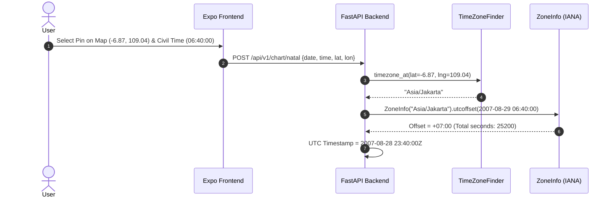

# Technical Design Document & System Architecture (TDD)

**Project Name:** Astrology-Interpreter Engine  
**Document ID:** ARCH-ASTRO-001  
**Version:** 1.0.0  
**Status:** Approved for Implementation  
**Companion Document:** [PRD.md](./PRD.md)  

---

## 1. System Topology & Architecture Pattern

The system implements a **Decoupled Client-Server Clean Architecture**:
1. **Compute & Storage Tier (Backend):** Built with **Python (FastAPI)**. Encapsulates astronomical computation, ephemeris retrieval, geospatial timezone resolution, and deterministic interpretation logic. Stateless, horizontal-scale ready.
2. **Presentation & Interaction Tier (Universal Client):** Built with **React Native (Expo)**. Targets Android, iOS, and Web (SPA/PWA) using `react-native-web`.
3. **Data Tier:** Relational persistence via **PostgreSQL** (production) and **SQLite** (local development) through SQLAlchemy ORM.

```
+-----------------------------------------------------------------------+
|                 PRESENTATION TIER (Expo Universal Client)             |
|                                                                       |
|  [ Mobile: iOS / Android ]             [ Modern Web: Chrome/Safari ]  |
|               \                                     /                 |
|                +-----------------+-----------------+                  |
|                                  |                                    |
|                       [ Feature Modules ]                             |
|       - LocationPicker (expo-location + react-native-maps)            |
|       - ChartCanvas (react-native-svg: Vedic / Western)               |
|       - DomainBarometer (Color-coded quantitative visualizer)         |
|       - State & Cache (TanStack Query + Zustand)                      |
+----------------------------------+------------------------------------+
                                   | HTTPS / REST JSON
                                   v
+----------------------------------+------------------------------------+
|                   COMPUTE TIER (FastAPI Python Backend)               |
|                                                                       |
|  [ API Layer (v1 Routes) ]                                            |
|     /geo/resolve-timezone | /chart/natal | /transits | /interpret     |
|                                  |                                    |
|  [ Domain Service Layer ]        |                                    |
|     +-- GeoTimeService (timezonefinder + zoneinfo)                    |
|     +-- EphemerisService (pyephem / pyswisseph)                       |
|     +-- JyotishEngine (Nakshatra, Pada, KP Sub-Lord, Dignity)         |
|     +-- DashaEngine (Vimshottari 4-Tier Hierarchical Traversal)       |
|     +-- TransitEngine (Angular Aspects + Exponential Decay Weights)   |
|     +-- InterpretationEngine (5-Domain Quantitative Scoring Matrix)   |
|                                  |                                    |
|  [ Data Access Layer (SQLAlchemy ORM + Alembic Migrations) ]          |
+----------------------------------+------------------------------------+
                                   |
                                   v
+-----------------------------------------------------------------------+
|                    PERSISTENCE TIER (PostgreSQL / SQLite)             |
|                                                                       |
|   - users                     - saved_charts                          |
|   - hourly_transit_cache      - interpretation_audit_logs             |
+-----------------------------------------------------------------------+
```

---

## 2. Directory Layout & Module Decomposition

### 2.1 Backend Codebase Layout (`backend/`)
```text
backend/
├── app/
│   ├── api/
│   │   ├── deps.py                  # Dependency injection (DB session, auth)
│   │   └── v1/
│   │       ├── router.py            # Aggregated v1 route registration
│   │       ├── endpoints/
│   │       │   ├── geo.py           # Coordinate & Timezone resolution
│   │       │   ├── chart.py         # Natal chart calculations
│   │       │   ├── transits.py      # Real-time planetary transits
│   │       │   └── interpret.py     # 5-Domain transit-to-natal interpretation
│   ├── core/
│   │   ├── config.py                # Pydantic BaseSettings (env configs)
│   │   ├── constants.py             # Astronomical constants & zodiac matrices
│   │   └── exceptions.py            # Domain-specific typed exceptions
│   ├── engine/                      # PURE ASTRONOMICAL LOGIC (Zero web dependencies)
│   │   ├── __init__.py
│   │   ├── ephemeris.py             # Planetary lon/lat/speed & retrograde logic
│   │   ├── ayanamsha.py             # Lahiri, KP, Raman, Fagan-Bradley formulas
│   │   ├── angles.py                # RAMC, Ascendant, MC, House Cusps (Placidus/Whole)
│   │   ├── jyotish.py               # Nakshatras, Padas, KP Sub-Lords, Dignities
│   │   ├── dasha.py                 # Vimshottari MD/AD/PD/SD calculations
│   │   ├── aspects.py               # Angular aspect separation & exponential weighting
│   │   └── scoring.py               # 5-Domain quantitative scoring matrix
│   ├── models/                      # SQLAlchemy ORM Data Models
│   │   ├── user.py
│   │   ├── chart.py
│   │   └── transit_cache.py
│   ├── schemas/                     # Pydantic Request & Response DTOs
│   │   ├── geo.py
│   │   ├── chart.py
│   │   ├── transit.py
│   │   └── interpret.py
│   └── services/                    # Orchestration & Integration Layer
│       ├── geo_service.py
│       └── astro_service.py
├── tests/
│   ├── conftest.py
│   ├── benchmark_vectors/           # Historical astronomical ground truth JSONs
│   ├── test_ephemeris.py
│   ├── test_dasha.py
│   ├── test_timezone.py
│   └── test_scoring.py
├── alembic/                         # Database schema migrations
├── Dockerfile
├── requirements.txt
└── main.py                          # FastAPI ASGI entrypoint
```

### 2.2 Universal Client Codebase Layout (`frontend/`)
```text
frontend/
├── src/
│   ├── api/                         # Axios / Fetch client & query hooks
│   │   ├── client.ts
│   │   ├── chartApi.ts
│   │   └── transitApi.ts
│   ├── components/                  # Shared Primitive UI Elements
│   │   ├── Button.tsx
│   │   ├── Card.tsx
│   │   ├── Modal.tsx
│   │   └── Typography.tsx
│   ├── features/                    # Domain-Driven Functional Modules
│   │   ├── location-picker/
│   │   │   ├── MapPickerModal.tsx   # react-native-maps + draggable pin
│   │   │   ├── GpsButton.tsx        # expo-location trigger
│   │   │   └── useLocation.ts
│   │   ├── chart-viewer/
│   │   │   ├── VedicSouthChart.tsx  # react-native-svg (Square Rashi)
│   │   │   ├── VedicNorthChart.tsx  # react-native-svg (Diamond Rashi)
│   │   │   ├── WesternWheel.tsx     # react-native-svg (360° Circle)
│   │   │   └── PlanetGlyph.tsx
│   │   ├── domain-barometer/
│   │   │   ├── BarometerGauge.tsx   # Color-coded progress & score badge
│   │   │   ├── DomainDetailList.tsx
│   │   │   └── UnvarnishedVerdict.tsx
│   │   └── natal-form/
│   │       ├── BirthForm.tsx
│   │       └── ZodiacToggle.tsx     # Sidereal vs Tropical switch
│   ├── navigation/                  # Expo Router / React Navigation configuration
│   ├── store/                       # Client state management (Zustand)
│   │   └── chartStore.ts
│   ├── types/                       # Shared TypeScript Interfaces & DTOs
│   │   └── api.d.ts
│   └── utils/                       # Mathematical & formatting helpers
│       ├── degreeFormatters.ts
│       └── aspectSymbols.ts
├── app/                             # Expo Router file-based route definitions
│   ├── _layout.tsx
│   ├── index.tsx                    # Landing / Natal input screen
│   ├── chart/
│   │   └── [id].tsx                 # Detailed chart view
│   └── transits/
│       └── today.tsx                # Real-time transit barometer
├── app.json                         # Expo configuration (Web, iOS bundle, Android APK)
├── package.json
└── tsconfig.json
```

---

## 3. Algorithmic Data Processing Pipelines

### 3.1 Pipeline A: Ingestion to Normalized UTC


### 3.2 Pipeline B: Natal Coordinate Calculation
1. **Julian Ephemeris Conversion:**
   $$JD = \text{to\_julian\_date}(UTC)$$
   $$T = \frac{JD - 2451545.0}{36525.0}$$
2. **Local Sidereal Time (RAMC):**
   Compute Greenwich Sidereal Time ($GST$), then adjust for geographic longitude:
   $$\theta_L = (GST + \text{longitude}) \pmod{360^\circ}$$
3. **Ascendant ($Lagna$) Determination:**
   $$\tan(\text{Asc}) = \frac{\cos(\theta_L)}{-\sin(\theta_L)\cos(\epsilon) - \tan(\phi)\sin(\epsilon)}$$
   Where $\epsilon = 23.4392911^\circ$ (obliquity) and $\phi = \text{latitude}$.
4. **Sidereal Coordinate Translation:**
   $$\lambda_{\text{sidereal}} = (\lambda_{\text{tropical}} - \text{Ayanamsha}(T)) \pmod{360^\circ}$$
5. **Divisional Rashi & Navamsha (D9) Resolution:**
   * $D1 = \lfloor \lambda_{\text{sidereal}} / 30^\circ \rfloor$
   * $D9 = \lfloor \lambda_{\text{sidereal}} / (3^\circ 20') \rfloor \pmod{12}$

### 3.3 Pipeline C: Vimshottari Dasha Engine Traversal
1. Extract Moon's Sidereal Longitude ($\lambda_{\text{Moon}}$).
2. Determine active Nakshatra index $N_i = \lfloor \lambda_{\text{Moon}} / (13^\circ 20') \rfloor$.
3. Compute fraction passed $F = \frac{\lambda_{\text{Moon}} - (N_i \times 13^\circ 20')}{13^\circ 20'}$.
4. Calculate birth ruler period $Y_{\text{ruler}}$ and remaining years:
   $$Y_{\text{rem}} = Y_{\text{ruler}} \times (1 - F)$$
5. Calculate target elapsed age:
   $$\Delta Y = \frac{\text{target\_utc} - \text{birth\_utc}}{365.2425 \text{ days}}$$
6. Step cumulatively across Vimshottari cycle array `[Ketu, Venus, Sun, Moon, Mars, Rahu, Jupiter, Saturn, Mercury]` to isolate MD, AD, PD, and SD boundaries.

---

## 4. Transit Interpretation & Scoring Engine Architecture

### 4.1 Continuous Exponential Weighting Formulation
The weight $W$ of any transit-to-natal aspect with angular separation difference $\delta$ (orb) is computed as:
$$W(\delta) = 10.0 \times \exp(-1.4 \times \delta)$$

If the natal point or transit body is currently active as either the **Mahadasha** or **Antardasha** planetary lord:
$$W_{\text{effective}} = W(\delta) \times 1.5$$

### 4.2 Domain Score Accumulation Rules
```python
# Baseline Dasha Enmity Adjustment:
if md_ad_relationship == "Bitter Mutual Enemies (Maha Shatru)":
    scores["emotional_psychological"] -= 35
    scores["career_situational"] -= 20

# Transit Aspect Accumulators:
for aspect in aspects:
    weight = compute_weight(aspect.orb)
    if aspect.is_hard:  # Square, Opposition, Quincunx, Sesquiquadrate
        if aspect.involves("mercury", "uranus"):
            scores["mental_cognitive"] -= int(weight * 2.0)
        if aspect.involves("saturn", "moon", "ketu"):
            scores["emotional_psychological"] -= int(weight * 2.5)
        if aspect.involves("sun", "uranus"):
            scores["physiological_vitality"] -= int(weight * 2.0)
    elif aspect.is_soft:  # Trine, Sextile
        if aspect.involves("mercury", "sun"):
            scores["mental_cognitive"] += int(weight * 2.0)
            scores["career_situational"] += int(weight * 1.5)
        if aspect.involves("venus", "saturn"):
            scores["emotional_psychological"] += int(weight * 1.5)
```

---

## 5. Security, Resilience & Cross-Platform Considerations

1. **Deterministic Execution:** The calculation engine contains zero network I/O during execution; all ephemeris and timezone resolution occurs in-memory.
2. **Precision Floating-Point Stability:** All angular math utilizes 64-bit IEEE 754 floats, normalized via modulo $360.0$ arithmetic to eliminate angle wrap-around drift.
3. **Platform Fallbacks (Web Compatibility):** On Web targets where native mobile maps (`react-native-maps`) are unavailable, the client dynamically resolves to an OpenStreetMap/Leaflet canvas via `react-native-web` conditional imports.
