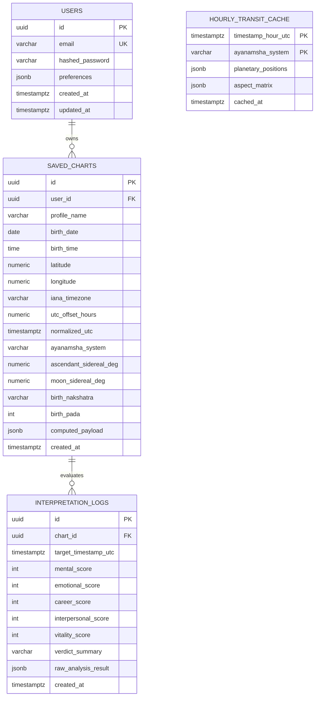

# Database Schema & Data Models Specification

**Project Name:** Astrology-Interpreter  
**Document ID:** DATA-ASTRO-001  
**Version:** 1.0.0  
**Status:** Approved for Implementation  
**Database Engine:** PostgreSQL 16+ (Production) | SQLite 3 (Development/Testing)  
**ORM:** SQLAlchemy 2.0 (Typed Declarative Mapping)  

---

## 1. Entity-Relationship Diagram (ERD)



---

## 2. Table Definitions & Column Specifications

### 2.1 Table: `users`
Manages user accounts, authentication credentials, and client application preferences.

| Column | Type | Constraints | Description |
| :--- | :--- | :--- | :--- |
| `id` | `UUID` | `PRIMARY KEY, DEFAULT gen_random_uuid()` | Unique user identifier. |
| `email` | `VARCHAR(255)` | `UNIQUE, NOT NULL` | Verified login email address. |
| `hashed_password`| `VARCHAR(255)` | `NOT NULL` | Argon2id / bcrypt password hash. |
| `preferences` | `JSONB` | `DEFAULT '{"default_ayanamsha": "lahiri", "chart_style": "south_indian"}'::jsonb` | User display and calculation settings. |
| `created_at` | `TIMESTAMPTZ` | `NOT NULL, DEFAULT NOW()` | Account creation timestamp. |
| `updated_at` | `TIMESTAMPTZ` | `NOT NULL, DEFAULT NOW()` | Last update timestamp. |

---

### 2.2 Table: `saved_charts`
Stores physical birth ingestion inputs and high-precision pre-calculated natal coordinates.

| Column | Type | Constraints | Description |
| :--- | :--- | :--- | :--- |
| `id` | `UUID` | `PRIMARY KEY, DEFAULT gen_random_uuid()` | Unique natal chart record ID. |
| `user_id` | `UUID` | `REFERENCES users(id) ON DELETE CASCADE` | Owner user ID (nullable for guest sessions). |
| `profile_name` | `VARCHAR(100)` | `NOT NULL` | Label/Name for this profile. |
| `birth_date` | `DATE` | `NOT NULL` | Local civil birth date (`YYYY-MM-DD`). |
| `birth_time` | `TIME` | `NOT NULL` | Local civil birth time (`HH:MM:SS`). |
| `latitude` | `NUMERIC(8, 4)`| `NOT NULL` | Geographic latitude in WGS84 coordinates. |
| `longitude` | `NUMERIC(8, 4)`| `NOT NULL` | Geographic longitude in WGS84 coordinates. |
| `iana_timezone` | `VARCHAR(64)` | `NOT NULL` | Resolved IANA string (e.g. `Asia/Jakarta`). |
| `utc_offset_hours`| `NUMERIC(4, 2)`| `NOT NULL` | Exact civil offset applied at birth. |
| `normalized_utc`| `TIMESTAMPTZ` | `NOT NULL` | Canonical UTC birth timestamp. |
| `ayanamsha_system`| `VARCHAR(32)` | `NOT NULL, DEFAULT 'lahiri'` | Ayanamsha used for sidereal calculations. |
| `ascendant_sidereal_deg`| `NUMERIC(6, 4)` | `NOT NULL` | Absolute Sidereal Ascendant $[0^\circ, 360^\circ)$. |
| `moon_sidereal_deg` | `NUMERIC(6, 4)` | `NOT NULL` | Absolute Sidereal Moon $[0^\circ, 360^\circ)$. |
| `birth_nakshatra`| `VARCHAR(32)` | `NOT NULL` | Janma Nakshatra name (e.g., `Shatabhisha`). |
| `birth_pada` | `SMALLINT` | `CHECK (birth_pada BETWEEN 1 AND 4)` | Nakshatra quarter/pada index. |
| `computed_payload` | `JSONB` | `NOT NULL` | Complete serialized natal chart positions. |
| `created_at` | `TIMESTAMPTZ` | `NOT NULL, DEFAULT NOW()` | Record persistence timestamp. |

---

### 2.3 Table: `hourly_transit_cache`
Optimizes real-time performance by caching global planetary coordinates per hour.

| Column | Type | Constraints | Description |
| :--- | :--- | :--- | :--- |
| `timestamp_hour_utc` | `TIMESTAMPTZ` | `PRIMARY KEY` | Truncated UTC hour (`YYYY-MM-DD HH:00:00Z`). |
| `ayanamsha_system` | `VARCHAR(32)` | `PRIMARY KEY` | Zodiac Ayanamsha mode. |
| `planetary_positions`| `JSONB` | `NOT NULL` | Map of all 10 planets + Rahu/Ketu positions. |
| `aspect_matrix` | `JSONB` | `NOT NULL` | Pre-calculated transit-to-transit aspects. |
| `cached_at` | `TIMESTAMPTZ` | `NOT NULL, DEFAULT NOW()` | Record creation timestamp. |

---

### 2.4 Table: `interpretation_logs`
Stores historical domain score snapshots for timeline charting and trend inspection.

| Column | Type | Constraints | Description |
| :--- | :--- | :--- | :--- |
| `id` | `UUID` | `PRIMARY KEY, DEFAULT gen_random_uuid()` | Audit log identifier. |
| `chart_id` | `UUID` | `REFERENCES saved_charts(id) ON DELETE CASCADE` | Associated natal chart. |
| `target_timestamp_utc`| `TIMESTAMPTZ` | `NOT NULL` | Moment evaluated. |
| `mental_score` | `INTEGER` | `NOT NULL` | Mental/Cognitive domain score delta. |
| `emotional_score` | `INTEGER` | `NOT NULL` | Emotional/Psychological domain score. |
| `career_score` | `INTEGER` | `NOT NULL` | Career/Situational domain score. |
| `interpersonal_score`| `INTEGER` | `NOT NULL` | Interpersonal/Relational domain score. |
| `vitality_score` | `INTEGER` | `NOT NULL` | Physiological/Vitality domain score. |
| `verdict_summary` | `VARCHAR(255)` | `NOT NULL` | Unvarnished core dynamic phrase. |
| `raw_analysis_result` | `JSONB` | `NOT NULL` | Full aspect and influence breakdown. |
| `created_at` | `TIMESTAMPTZ` | `NOT NULL, DEFAULT NOW()` | Evaluation timestamp. |

---

## 3. Indexing & Query Optimization Strategy

```sql
-- 1. Accelerate chart lookups per user:
CREATE INDEX idx_saved_charts_user_id ON saved_charts(user_id);

-- 2. Geospatial spatial index for nearby chart clustering:
CREATE INDEX idx_saved_charts_lat_lon ON saved_charts(latitude, longitude);

-- 3. Composite index for instant chart name uniqueness per user:
CREATE UNIQUE INDEX uq_user_chart_name ON saved_charts(user_id, profile_name);

-- 4. Fast lookup for transit cache:
CREATE INDEX idx_hourly_transit_lookup ON hourly_transit_cache(timestamp_hour_utc, ayanamsha_system);

-- 5. Timeseries indexing for user interpretation timeline:
CREATE INDEX idx_interpretation_timeline ON interpretation_logs(chart_id, target_timestamp_utc DESC);
```
