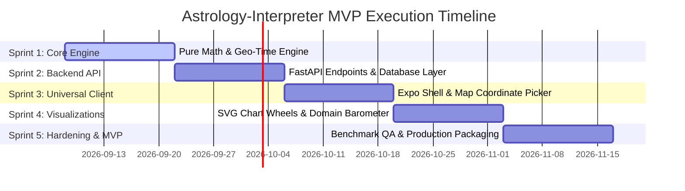

# Product Roadmap & Developer Task Backlog

**Project Name:** Astrology-Interpreter  
**Document ID:** RDM-ASTRO-001  
**Version:** 1.0.0  
**Status:** Approved for Implementation  
**Methodology:** Agile / 2-Week Sprint Cadence  

---

## 1. High-Level Release Milestones

---

## 2. Granular Task Backlog & User Stories

### Epic 1: Astronomical Engine & Geospatial Temporal Ingestion (Sprint 1)

* [ ] **TASK-1.1: Project Skeleton & Environment Setup**
  * *Description:* Initialize Python 3.11+ virtual environment with `ruff`, `mypy`, `pytest`, `ephem`, `timezonefinder`.
  * *Deliverable:* Working virtual environment with baseline CI config.
* [ ] **TASK-1.2: Offline Geo-Time Ingestion Service**
  * *Description:* Implement `GeoTimeService` wrapping `timezonefinder` and Python `zoneinfo` for arbitrary lat/lon coordinates.
  * *DoD:* Resolves test matrix of 50 global coordinates to correct IANA strings and UTC timestamps in $\le 10\text{ ms}$.
* [ ] **TASK-1.3: Ephemeris & Ayanamsha Core**
  * *Description:* Implement `EphemerisService` calculating apparent geocentric longitude, speed, and retrograde flag for 10 planets + Nodes across Lahiri, KP, Raman, and Fagan-Bradley.
  * *DoD:* All longitudes match Swiss Ephemeris ground truth vectors to within $\pm 0.001^\circ$.
* [ ] **TASK-1.4: Vedic Divisional Engine**
  * *Description:* Implement Nakshatra, Pada, KP Sub-Lord proportional arc, and D1/D9 divisional mapping.
  * *DoD:* 100% test coverage against classical Nakshatra boundary tables.
* [ ] **TASK-1.5: 4-Tier Vimshottari Dasha Engine**
  * *Description:* Implement `DashaEngine` calculating MD, AD, PD, SD from natal Moon longitude and elapsed civil time.
  * *DoD:* Correctly identifies Saturn-Saturn-Ketu-Saturn for reference vector `2007-08-29 06:40 WIB`.
* [ ] **TASK-1.6: Geometric Aspect & 5-Domain Scoring Engine**
  * *Description:* Implement exponential decay weighting ($W = 10 \cdot e^{-1.4 \cdot \text{orb}}$) and the 5-domain score accumulator.
  * *DoD:* Zero flattery text emitted; deterministic integer scores.

---

### Epic 2: FastAPI Service & Data Persistence (Sprint 2)

* [ ] **TASK-2.1: Database Schemas & Alembic Migration**
  * *Description:* Create SQLAlchemy 2.0 declarative models for `users`, `saved_charts`, `hourly_transit_cache`, and `interpretation_logs`.
  * *DoD:* `alembic upgrade head` executes cleanly on PostgreSQL and SQLite.
* [ ] **TASK-2.2: Pydantic DTO Schema Contracts**
  * *Description:* Implement strict request/response validation schemas according to [API_SPEC.md](./API_SPEC.md).
  * *DoD:* Malformed latitude/longitude/date inputs rejected with typed 422 errors.
* [ ] **TASK-2.3: Natal Chart Calculation Endpoint**
  * *Description:* Expose `POST /api/v1/chart/natal`.
  * *DoD:* Response latency $\le 150\text{ ms}$; outputs validated against JSON schema.
* [ ] **TASK-2.4: Real-time Transit Cache Worker**
  * *Description:* Implement background caching service computing current hourly celestial positions.
  * *DoD:* `GET /api/v1/transits/current` serves from memory cache in $\le 15\text{ ms}$.
* [ ] **TASK-2.5: Dynamic Interpretation Endpoint**
  * *Description:* Expose `POST /api/v1/interpret/dynamic`.
  * *DoD:* Combines natal chart record with transit cache, returns 5-domain score breakdown.

---

### Epic 3: Universal Client Foundation & Map Ingestion (Sprint 3)

* [ ] **TASK-3.1: Universal Expo Project Scaffold**
  * *Description:* Initialize Expo SDK 51+ with TypeScript and Expo Router configured for Android, iOS, and Web.
  * *DoD:* App compiles and serves on iOS Simulator, Android Emulator, and Web browser.
* [ ] **TASK-3.2: Native GPS Location Service**
  * *Description:* Implement `GpsButton` utilizing `expo-location` with permission handling.
  * *DoD:* Gracefully handles permission denial with actionable UI modal.
* [ ] **TASK-3.3: Interactive Map Pin Drop Component**
  * *Description:* Implement `MapPickerModal` supporting draggable markers and cross-platform web fallback.
  * *DoD:* Moving pin updates coordinate state in real time with 4 decimal places precision.
* [ ] **TASK-3.4: Natal Ingestion Form Screen**
  * *Description:* Date/Time pickers, coordinate readout, and Zodiac toggle (Sidereal vs Tropical).
  * *DoD:* Submits valid JSON payload to `/api/v1/chart/natal`.
* [ ] **TASK-3.5: Client-Side State Management**
  * *Description:* Setup Zustand store and TanStack Query client for offline chart caching.

---

### Epic 4: Chart Visualization & Domain Barometer (Sprint 4)

* [ ] **TASK-4.1: Vedic South Indian Chart Component**
  * *Description:* Render square Rashi grid with 12 fixed sign houses and dynamic planet glyph placement via `react-native-svg`.
  * *DoD:* Scales crisply from mobile screens (320px) to desktop web (1080px).
* [ ] **TASK-4.2: Vedic North Indian Diamond Chart Component**
  * *Description:* Render diamond Rashi chart with fixed Lagna house and rotating signs.
* [ ] **TASK-4.3: Western Circular Wheel Component**
  * *Description:* Render 360-degree circular wheel with exact degree markings and aspect chords.
* [ ] **TASK-4.4: 5-Domain Barometer Gauge Card**
  * *Description:* Implement quantitative progress gauges and indicator cards reflecting domain friction/flow status.
  * *DoD:* Color spectrum reflects score boundaries ($\le -40$ crimson, $-39$ to $-10$ amber, $-9$ to $+9$ slate, $\ge +10$ emerald).

---

### Epic 5: Production Packaging & Release Gate (Sprint 5)

* [ ] **TASK-5.1: End-to-End Test Suite Execution**
  * *Description:* Run complete verification harness across Python backend and Expo client.
  * *DoD:* 100% passing test vectors in CI pipeline.
* [ ] **TASK-5.2: Docker Containerization & Deployment Spec**
  * *Description:* Production multi-stage Dockerfile for FastAPI backend with Gunicorn/Uvicorn workers.
* [ ] **TASK-5.3: Production Web Build & Mobile Compilation**
  * *Description:* Produce optimized Web PWA bundle and staging Android APK.
* [ ] **TASK-5.4: Production Launch Checklist Audit**
  * *Description:* Verify zero-telemetry privacy adherence and API rate limits.

---

## 3. Definition of Done (DoD) Criteria

A backlog task is only considered **DONE** when:
1. All functional requirements specified in the task are implemented.
2. Unit test coverage for new code meets or exceeds $90\%$.
3. Static typing checks (`mypy --strict` and `tsc --noEmit`) pass with 0 errors.
4. Linter checks (`ruff` and `eslint`) pass with 0 warnings.
5. Corresponding API contracts or UI components have been verified on Android, iOS, and Web.
6. Documentation in `docs/` is updated to reflect any technical delta.
