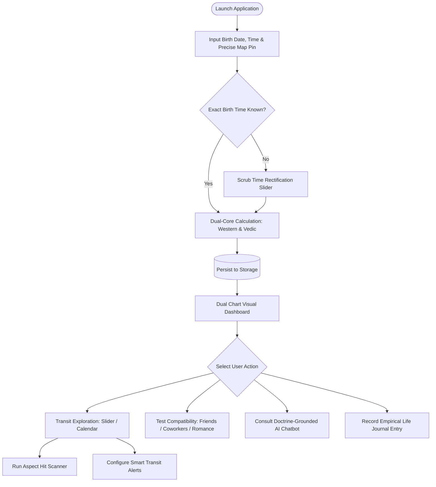

# Product Requirements Document (PRD)

**Product Name:** Astrology-Interpreter Engine & Universal Platform  
**Document ID:** PRD-ASTRO-001  
**Version:** 2.0.0  
**Status:** Approved for Implementation  

---

## 1. Context & Problem Statement (Why)

### 1.1 Problem Statement
1. **Geospatial Inaccuracy & Coordinate Misrepresentation:** Most commercial astrology applications only rely on approximate city centroids, completely ignoring the exact physical coordinates (precise longitude and latitude) of birthplaces. Consequently, Ascendant (Lagna) degrees and house cusps drift by several degrees, invalidating chart interpretations.
2. **Exploitation of the Barnum / Forer Effect:** The commercial astrology industry is saturated with generic horoscopes, flattery bias, and ambiguous platitudes designed to fit anyone. There is virtually no demonstrable astronomical causality linking real celestial mechanics to the interpretations offered.
3. **Tradition Fragmentation (Western vs. Vedic):** Enthusiasts and practitioners are forced to jump between disparate tools because few platforms natively offer both Western (*Tropical*) and Indian (*Vedic/Sidereal*) calculations side-by-side with equal mathematical rigor.
4. **Absence of Empirical Validation:** Users lack structured tools to empirically cross-reference and validate astrological claims against documented real-life events in their own history.

### 1.2 Business Value & Urgency
* **Radical Market Differentiation:** Position the platform as the premier *"No-Bullshit Astrology"* system—strictly data-grounded, mathematically audited, and completely rejecting superficial generic horoscopes.
* **Sustained Retention through Empirical Proof:** The interactive transit time-travel engine and empirical life journal transform passive horoscope consumers into active empirical researchers of their own life patterns.
* **Unified Cross-Tradition Audience:** Captures both the Western psychological astrology community and serious Indian Jyotish practitioners within a single cohesive platform.

---

## 2. Goals & Success Metrics (Goals & KPIs)

### 2.1 Primary Goals
* Deliver a deterministic, sub-arcsecond precision, cross-platform (Mobile & Web) astronomical and astrological calculation engine that eliminates the Barnum effect and empowers users to explore celestial dynamics across past, present, and future timelines.

### 2.2 Quantitative KPIs
| Metric | Target | Measurement Method |
| :--- | :--- | :--- |
| **Ephemeris Accuracy** | $\le 0.001^\circ$ (3.6 arcseconds) | Automated regression test suite against NASA JPL Horizons / Swiss Ephemeris vectors. |
| **Location Resolution Latency** | $\le 10\text{ ms}$ | In-process offline `timezonefinder` polygon lookup benchmark without network calls. |
| **API Response Latency** | $\le 150\text{ ms}$ | Full dual natal chart computation endpoint response time on FastAPI backend. |
| **RAG Hallucination Rate** | **0% Hallucination** | Evaluation of AI chatbot outputs against strictly injected classical domain literature. |
| **Active User Retention** | $\ge 35\%$ at Month 3 | Cohort percentage actively logging in the Empirical Journal or monitoring Transit Alerts. |

---

## 3. Target Users & Personas (Who)

### 3.1 User Personas
1. **Persona A: "The Skeptical Analyst" (Rian, 24 years old)**
   * *Profile:* Software developer / data enthusiast.
   * *Pain Point:* Intriguingly drawn to astrological concepts but utterly repelled by generic social media horoscopes that read like cheap psychological tricks.
   * *Use Case:* Uses the platform to track objective correlations between planetary transits and work performance, stress cycles, and focus using the Empirical Journal.
2. **Persona B: "The Serious Astrological Researcher" (Siti, 30 years old)**
   * *Profile:* Astrological practitioner and student studying both Western and Vedic traditions simultaneously.
   * *Pain Point:* Exhausted by switching between archaic desktop programs just to compare Tropical and Sidereal placements side-by-side.
   * *Use Case:* Demands synchronized dual visual charts (Western Wheel + Vedic Grid), precise planetary degree tables, dynamic transit scrubbing, and an interactive birth time rectification slider.
3. **Persona C: "The Strategic Collaborator" (Budi, 28 years old)**
   * *Profile:* Business professional / startup founder.
   * *Pain Point:* Seeks objective insights into interpersonal communication patterns and work ethics without romantic fluff or generic matchmaking tropes.
   * *Use Case:* Leverages the multi-archetype compatibility engine to examine working dynamics and communication friction with co-founders and team members.

---

## 4. Scope

### 4.1 In-Scope (11 Core Features)
1. **Dual Complete Birth Chart Analysis:** Comprehensive calculations across Western (*Tropical*) and Indian (*Vedic/Sidereal*) traditions.
2. **Dual Visual Chart Rendering:** 360-degree Western Circular Wheel & Traditional Vedic Grid Chart (*South/North Indian*).
3. **Persistent Birth Chart Storage:** Local and server-side database storage to manage multi-user profiles.
4. **Dynamic Birth Time Adjuster (*Rectification Slider*):** Real-time time-shift slider to inspect instant shifts in Lagna and house cusps.
5. **Time-Traveling Transit Engine:** Bidirectional navigation across today, past history, and future dates via Slider, Calendar, and Aspect Hit Scanner.
6. **Smart Transit Alerts:** Automated notifications triggered when tight-orb transits hit sensitive natal points.
7. **Empirical Astro-Journal:** Event logging anchored to specific transit dates to empirically validate personal life correlations.
8. **Share Feature:** Export high-resolution chart graphics and analytical summaries.
9. **Multi-Archetype Compatibility (*Synastry*):** Compatibility assessments for Romantic, Friend, and Coworker archetypes (via Phone Contacts, Nearby Proximity, and Strangers with full analysis displayed).
10. **Privacy Controls & Ghost Mode:** Nearby visibility toggles and sensitive raw birth data masking.
11. **AI Chatbot with RAG:** Dense astronomical data translated into clear, doctrine-grounded explanations with zero hallucination.

### 4.2 Out-of-Scope (Deferred to Subsequent Phases)
* Third-party calendar synchronization (Google Calendar / Apple Calendar sync).
* In-app purchase payment gateway integration.
* High-order harmonic vargas automation (D60 Shastiamsa computation).

---

## 5. Functional Requirements (What & How)

### User Stories & Acceptance Criteria

#### Feature 1: Complete Birth Chart Analysis (Dual-Method)
* **User Story:** *As a user, I want to calculate my birth chart using both Western and Indian systems simultaneously, so that I can gain holistic psychological and archetypal perspectives.*
* **Acceptance Criteria:**
  - [ ] System computes 10 principal celestial bodies + Rahu/Ketu with high-precision ecliptic longitudes.
  - [ ] Computes Ascendant (Lagna) and house systems (Placidus & Whole Sign).
  - [ ] Computes Nakshatra, Pada, KP Sub-Lord, and 4-tier Vimshottari Dasha hierarchy (MD, AD, PD, SD) on the Sidereal side.
  - [ ] Provides an instant toggle between Tropical and Sidereal (Lahiri) calculation baselines.

#### Feature 2: Dual Visual Chart Rendering
* **User Story:** *As a user, I want to view my birth chart in clean, interactive graphical formats, so that I can easily grasp planetary geometry.*
* **Acceptance Criteria:**
  - [ ] Renders a 360° Circular Western Wheel featuring internal aspect connection lines.
  - [ ] Renders a traditional Vedic Square Chart (South Indian and/or North Indian diamond format).
  - [ ] Interactive tapping on any planetary glyph displays detailed coordinates, speed, and retrograde status.

#### Feature 3: Birth Chart Storage
* **User Story:** *As a user, I want to permanently save my profile and friends\x27 profiles, so that I do not have to re-enter birth data upon each app launch.*
* **Acceptance Criteria:**
  - [ ] Profile data persists securely in local/remote storage.
  - [ ] Users can create, edit, categorize, and delete chart profiles seamlessly.

#### Feature 4: Dynamic Birth Time Adjuster (*Rectification Slider*)
* **User Story:** *As a user with an uncertain birth time, I want to scrub an interactive time slider on the chart view, so that I can immediately observe changes in Ascendant and house placements.*
* **Acceptance Criteria:**
  - [ ] Interactive slider provides adjustable time offsets (e.g., $\pm 30$ to $\pm 60$ minutes).
  - [ ] Moving the slider instantaneously recalculates and updates Lagna degrees and house boundaries without reloading the screen.

#### Feature 5: Time-Traveling Transit Engine
* **User Story:** *As a user, I want to explore planetary transit positions across past and future dates, so that I can study historical life milestones or anticipate upcoming celestial configurations.*
* **Acceptance Criteria:**
  - [ ] Slider Mode: Allows fluid back-and-forth daily time scrubbing with smooth planetary coordinate transitions.
  - [ ] Calendar Mode: Monthly calendar view color-coded by the density and significance of active transits.
  - [ ] Aspect Hit Scanner: Search tool allowing users to pick a transit (e.g., "Saturn Opposition Sun") and immediately jump to its exact culmination date.

#### Feature 6: Smart Transit Alerts
* **User Story:** *As a user, I want to receive proactive notifications when significant exact transits occur, so that I stay informed without checking the app daily.*
* **Acceptance Criteria:**
  - [ ] Triggers automated notifications when tight-orb transits ($\le 0.25^\circ$) aspect sensitive natal points.
  - [ ] Notification content states objective astronomical data and impacted life themes without sensationalist predictions.

#### Feature 7: Empirical Astro-Journal (*Event Diary*)
* **User Story:** *As a user, I want to log real-life events on specific transit dates, so that I can objectively cross-reference astrological patterns against my lived reality.*
* **Acceptance Criteria:**
  - [ ] Users can record timestamped text notes linked to specific transit dates.
  - [ ] Journal entries remain attached to the exact celestial configuration snapshot of that day.

#### Feature 8: Share Feature
* **User Story:** *As a user, I want to export and share my chart graphics and transit summaries, so that I can discuss them with peers and practitioners.*
* **Acceptance Criteria:**
  - [ ] Ability to export chart visual assets to image formats (PNG/SVG) or generate shareable deep-links.

#### Feature 9: Multi-Archetype Compatibility (*Synastry*)
* **User Story:** *As a user, I want to evaluate relational dynamics across romantic partners, friends, and business colleagues, so that I understand communication and collaboration tendencies.*
* **Acceptance Criteria:**
  - [ ] Supports distinct relational archetypes: Romance, Friendship, and Business / Coworker.
  - [ ] Profile ingestion sources: Phone Contacts, Nearby Users, and Strangers.
  - [ ] For Unknown / Stranger profiles, all compatibility dimensions and metrics are computed and displayed in full without omitting any analytical dimensions.

#### Feature 10: Privacy Controls & Ghost Mode
* **User Story:** *As a user, I want to shield my exact birth coordinates and discovery status when using social features, so that my personal privacy remains intact.*
* **Acceptance Criteria:**
  - [ ] Users can toggle Nearby discovery visibility on or off at will.
  - [ ] Allows sharing compatibility synastry with others without revealing underlying raw birth times or coordinates.

#### Feature 11: AI Chatbot with RAG
* **User Story:** *As a user, I want to ask questions about my raw planetary positions and receive in-depth, grounded interpretations without generic horoscopes.*
* **Acceptance Criteria:**
  - [ ] Chatbot is powered by a RAG architecture indexing verified classical literature.
  - [ ] Answers strictly reference the user\x27s computed astronomical positions and verified source texts, rejecting hallucinations and Barnum generalizations.

---

### Core User Flow Diagram

---

## 6. Non-Functional Requirements (NFR)

* **NFR-PERF-01 (Performance & Latency):** Full natal chart calculation + Dasha hierarchy execution $\le 150\text{ ms}$. In-process offline timezone lookup $\le 10\text{ ms}$.
* **NFR-ACC-01 (Astronomical Precision):** Planetary ecliptic longitudes must conform to Swiss Ephemeris / NASA JPL reference ephemerides within a tolerance of $\pm 0.001^\circ$ (3.6 arcseconds).
* **NFR-DET-01 (Strict Determinism):** Identical input coordinates and timestamps must yield bit-for-bit identical mathematical outputs across repeated executions.
* **NFR-COMPAT-01 (Universal Compatibility):** A unified codebase (React Native Expo) must build and run consistently across iOS, Android, and modern Web browsers.
* **NFR-SEC-01 (Security & Privacy):** GPS coordinates and birth timestamps must never be exposed to third parties or advertising trackers. Ghost Mode must completely cease location broadcasting when active.

---

## 7. Dependencies, Risks, & Release Plan

### 7.1 Technical Dependencies
* **Backend:** Python 3.11+, FastAPI, `ephem` / `pyswisseph`, `timezonefinder`, `zoneinfo`, SQLAlchemy 2.0.
* **Frontend:** Expo SDK 51+, React Native, `react-native-maps`, `expo-location`, `react-native-svg`, Zustand, TanStack Query.
* **AI/RAG:** Local or managed Vector database indexing classical astrological doctrine, LLM inference runtime.

### 7.2 Risk Mitigation
| Potential Risk | Impact | Mitigation Strategy |
| :--- | :---: | :--- |
| **Approximate or Unknown Birth Time** | High | Integrate an interactive *Birth Time Rectification Slider* so users can dynamically observe Lagna transitions. |
| **AI Chatbot Hallucinations** | Critical | Enforce strict RAG grounding limited to curated classical source texts + strict anti-Barnum system prompt guardrails. |
| **High CPU Overhead on Continuous Transit Scrubbing** | Medium | Implement *Hourly Discrete Caching* in memory/database for daily planetary positions. |

### 7.3 Release Phases
* **Phase 1 (Core Foundation / MVP):** Map Pin Ingestion + Dual-Core Calculation Engine (Western & Vedic) + Chart Storage + Dual Visual Rendering + Rectification Slider.
* **Phase 2 (Time Dynamics & Community):** Time-Traveling Transit Engine (Slider, Calendar, Scanner) + Smart Transit Alerts + Empirical Astro-Journal + Share Feature.
* **Phase 3 (Social Dynamics & AI Intelligence):** Multi-Archetype Compatibility (Contacts, Nearby, Strangers) + Privacy Ghost Mode + Doctrine-Grounded AI Chatbot with RAG.
