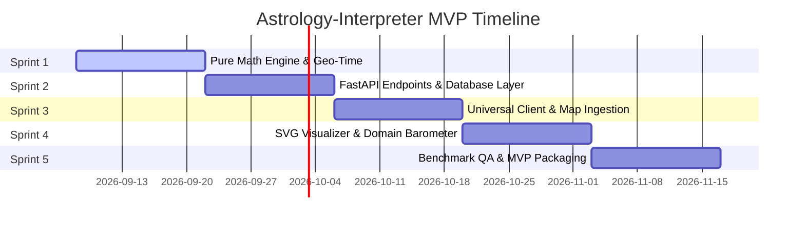

# Product Roadmap & Task Backlog

## 1. Release Timeline

---

## 2. Sprint Backlog

### Sprint 1: Mathematical Engine & Geo-Time
- [ ] Setup Python 3.11+ virtual environment (`ruff`, `mypy`, `pytest`).
- [ ] Implement `GeoTimeService` with `timezonefinder` and `zoneinfo` (historical DST).
- [ ] Implement `EphemerisService` (10 planets + Nodes across Lahiri, KP, Raman).
- [ ] Implement Vedic division engine (27 Nakshatras, 108 Padas, KP Sub-Lords).
- [ ] Implement 4-tier Vimshottari Dasha engine (MD, AD, PD, SD).
- [ ] Implement aspect engine with exponential decay weighting ($W = 10 \cdot e^{-1.4 \cdot \text{orb}}$).

### Sprint 2: FastAPI & Data Persistence
- [ ] SQLAlchemy models & Alembic migrations (`users`, `saved_charts`, `hourly_transit_cache`).
- [ ] Strict Pydantic v2 schemas for all requests/responses.
- [ ] Endpoints: `POST /chart/natal`, `GET /transits/current`, `POST /interpret/dynamic`.
- [ ] Background worker for hourly transit caching.

### Sprint 3: Universal Client Foundation (Expo)
- [ ] Expo SDK 51+ project scaffold (iOS, Android, Web).
- [ ] Native GPS location button (`expo-location`).
- [ ] Draggable map pin picker (`react-native-maps` with web fallback).
- [ ] Natal input form with Sidereal / Tropical toggle.
- [ ] Zustand store and TanStack Query client.

### Sprint 4: Visualizations & Dashboard
- [ ] Vedic South Indian chart component (`react-native-svg`).
- [ ] Vedic North Indian diamond chart component.
- [ ] Western 360° circular wheel component.
- [ ] 5-Domain barometer cards with color-coded status gauges.

### Sprint 5: Hardening & Packaging
- [ ] Complete CI pipeline with benchmark verification harness.
- [ ] Multi-stage production Dockerfile for FastAPI backend.
- [ ] Production Web PWA build and Android APK compilation.
