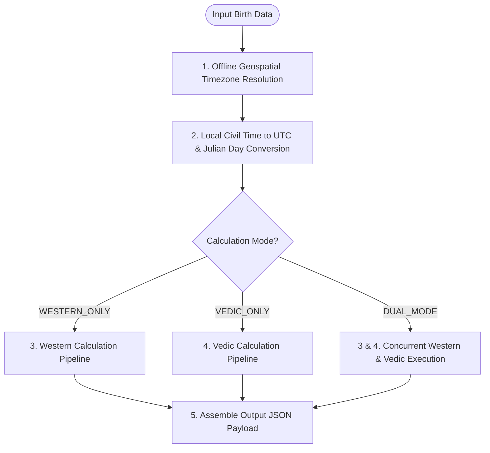

# Feature Specification 01: Flexible Birth Chart Calculation (Western, Indian, or Both)

**Feature Code:** FEAT-01  
**Category:** Core Calculation Engine  
**Status:** Approved  

---

## 1. Description & User Value

This feature provides a deterministic celestial calculation engine with complete methodological flexibility:
* Users can selectively compute **Western Only (*Tropical*)**, **Indian Only (*Vedic/Sidereal*)**, or **Both Simultaneously (*Dual Mode*)**.
* Ensures UI clarity: users focusing strictly on Western psychological astrology avoid unfamiliar Vedic terminology, while Vedic Jyotish practitioners can dive straight into Sidereal grids without tropical wheel clutter.

---

## 2. Atomic Input Data Decomposition

| Parameter | Data Type | Format / Unit | Validation Bounds | Description & Rules |
| :--- | :--- | :--- | :--- | :--- |
| `latitude` | `float` | Decimal Degrees ($^\circ$) | $-90.000000 \le \text{lat} \le +90.000000$ | 6-decimal sub-meter precision. Polar bounds strictly checked. |
| `longitude` | `float` | Decimal Degrees ($^\circ$) | $-180.000000 \le \text{lon} \le +180.000000$ | 6-decimal precision. Supports West ($-$) and East ($+$). |
| `local_datetime` | `string` | ISO-8601 (`YYYY-MM-DDTHH:MM:SS`) | `1800-01-01T00:00:00` to `2100-12-31T23:59:59` | Local civil birth timestamp. Seconds optional (default `:00`). |
| `calculation_mode` | `enum` | String | `WESTERN_ONLY`, `VEDIC_ONLY`, `DUAL_MODE` | Active methodology mode. |
| `house_system` | `enum` | String | `PLACIDUS`, `WHOLE_SIGN`, `PORPHYRY` | Western house system (default: `PLACIDUS`). |
| `ayanamsha` | `enum` | String | `LAHIRI`, `KP`, `RAMAN`, `FAGAN_BRADLEY` | Sidereal precession offset (default: `LAHIRI`). |

---

## 3. Step-by-Step Computational Algorithm



### Step 1: Offline Spatial Resolution & Canonical Epoch
1. Pass `(latitude, longitude)` to in-process `timezonefinder.TimezoneFinder()`.
2. Spatial ray-casting returns canonical IANA string (e.g., `"Asia/Jakarta"`).
3. Instantiate local `datetime` bound to `zoneinfo.ZoneInfo("Asia/Jakarta")`.
4. Convert to canonical UTC: `utc_datetime = local_datetime.astimezone(zoneinfo.ZoneInfo("UTC"))`.
5. Compute astronomical Julian Day ($JD$) including $\Delta T = TT - UT$ ephemeris time correction.

### Step 2: Western Ecliptic Computation Pipeline
1. Compute Greenwich Mean Sidereal Time ($GMST$) and Local Sidereal Time ($LST$).
2. Calculate Right Ascension of Midheaven ($RAMC = LST$).
3. Derive Midheaven ($MC$) and Ascendant ($ASC$) using spherical trigonometry.
4. Calculate Placidus 12 house cusps via diurnal and nocturnal semi-arc trisection.
5. Compute apparent geocentric ecliptic coordinates (longitude $\lambda$, latitude $\beta$, daily speed $\frac{d\lambda}{dt}$) for 10 bodies + True Lunar Nodes.
   *Flag `is_retrograde = true` if $\frac{d\lambda}{dt} < 0$.*
6. Evaluate geometric inter-aspect matrix applying continuous exponential decay: $W(\delta) = 10.0 \times \exp(-1.4 \times \delta)$.

### Step 3: Vedic Sidereal Computation Pipeline
1. Compute astronomical Lahiri Ayanamsha $\theta_{\text{Ayanamsha}}$ at target epoch.
2. Deduce Sidereal longitudes: $\lambda_{\text{sidereal}} = (\lambda_{\text{tropical}} - \theta_{\text{Ayanamsha}}) \pmod{360^\circ}$.
3. Map into 12 Rashi signs ($30^\circ$ increments).
4. Map Moon into 27 Nakshatras ($13^\circ 20^\prime$ spans) and 4 Padas ($3^\circ 20^\prime$).
5. Compute Krishnamurti Padhdhati (KP) Sub-Lords proportional to Vimshottari period lengths.
6. Evaluate Planetary Dignity (Exaltation, Debilitation, Moolatrikona, Swakshetra, Temporal Friendship).
7. Execute recursive 4-tier Vimshottari Dasha tree projection (Mahadasha, Antardasha, Pratyantardasha, Sookshmadasha).

---

## 4. Business Rules & Edge Case Handling

1. **Polar Latitudes ($|\text{latitude}| > 66.5^\circ$):**
   * Placidus houses collapse near polar circles. System automatically applies Whole Sign fallback and appends warning flag `"house_system_fallback": "WHOLE_SIGN_POLAR_OVERRIDE"`.
2. **Circular Boundary Discontinuity ($0^\circ \leftrightarrow 360^\circ$):**
   * Strict modular normalization applied: $\text{norm}(\theta) = ((\theta \pmod{360}) + 360) \pmod{360}$.
3. **Instant Zero-Recompute UI Toggle:**
   * Backend returns complete decoupled payloads; client can instantaneously switch views between Western and Vedic without secondary network overhead.

---

## 5. JSON Contract Specification

### Endpoint: `POST /api/v1/chart/calculate`

#### Request Body
```json
{
  "latitude": -6.175392,
  "longitude": 106.827153,
  "local_datetime": "2007-08-29T06:40:00",
  "calculation_mode": "DUAL_MODE",
  "house_system": "PLACIDUS",
  "ayanamsha": "LAHIRI"
}
```

#### Response Body (`HTTP 200 OK`)
```json
{
  "status": "success",
  "meta": {
    "calculation_mode": "DUAL_MODE",
    "iana_timezone": "Asia/Jakarta",
    "utc_timestamp": "2007-08-28T23:40:00Z",
    "julian_day": 2454341.486111,
    "ayanamsha_used": "LAHIRI",
    "ayanamsha_degrees": 23.96314
  },
  "western": {
    "ascendant": 156.421,
    "midheaven": 66.184,
    "houses": [156.42, 185.12, 214.33, 246.18, 278.45, 308.12, 336.42, 5.12, 34.33, 66.18, 98.45, 128.12],
    "planets": {
      "Sun": {"longitude": 155.12, "sign": "Virgo", "house": 12, "speed": 0.965, "is_retrograde": false},
      "Moon": {"longitude": 342.48, "sign": "Pisces", "house": 7, "speed": 13.12, "is_retrograde": false}
    },
    "aspects": [
      {"body1": "Sun", "body2": "Moon", "aspect": "OPPOSITION", "orb": 7.36, "weight": 0.33}
    ]
  },
  "vedic": {
    "lagna": {"longitude": 132.458, "sign": "Leo", "nakshatra": "Purva Phalguni", "pada": 1},
    "planets": {
      "Sun": {"longitude": 131.157, "sign": "Leo", "nakshatra": "Magha", "pada": 4, "dignity": "Swakshetra"},
      "Moon": {"longitude": 318.517, "sign": "Aquarius", "nakshatra": "Shatabhisha", "pada": 4, "dignity": "Neutral"}
    },
    "active_dasha_hierarchy": {
      "mahadasha": "Saturn",
      "antardasha": "Saturn",
      "pratyantardasha": "Mercury",
      "sookshmadasha": "Venus"
    }
  }
}
```
