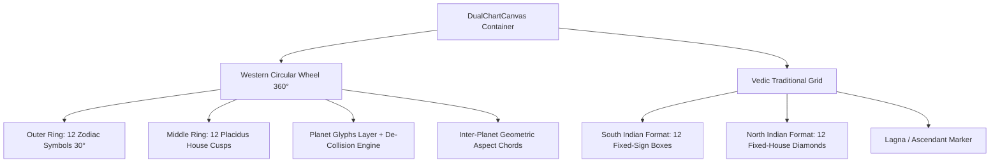

# Feature Specification 02: Flexible Visual Chart Rendering (Western Wheel, Vedic Grid, or Both)

**Feature Code:** FEAT-02  
**Category:** User Interface & Vector Graphics (SVG)  
**Status:** Approved  

---

## 1. Description & User Value

This feature delivers crisp, resolution-independent SVG vector visual charts with interactive inspections:
* Adapts dynamically to the user's selected tradition: displays Western 360° Circular Wheel only, traditional Vedic Grid (*South / North Indian*) only, or Both simultaneously.
* Every graphic element (glyphs, house cusps, aspect chords) supports touch/click events to open an interactive data inspector sheet.

---

## 2. Atomic Visual Component Decomposition

### A. Western 360° Circular Wheel Components
1. **Outer Zodiac Ring ($R_1$ to $R_2$):**
   * Continuous $360^\circ$ circle segmented into 12 equal $30^\circ$ arcs.
   * Houses SVG vector signs at arc centers ($15^\circ, 45^\circ, \dots, 345^\circ$).
   * Radial degree tick marks drawn at $1^\circ$ and $5^\circ$ intervals.
2. **House Cusp Ring ($R_2$ to $R_3$):**
   * Radial division lines demarcating cusps 1 through 12.
   * Primary axes emphasized with bold weight: Ascendant-Descendant horizontal axis and Midheaven-Imum Coeli vertical axis.
   * Roman/Arabic numerals placed within each house sector.
3. **Planet Glyphs Layer ($R_3$):**
   * Polar to Cartesian transformation:
     $$X = X_{\text{center}} + R \cdot \cos(\theta_{\text{screen}})$$
     $$Y = Y_{\text{center}} - R \cdot \sin(\theta_{\text{screen}})$$
   * **Collision Avoidance:** If angular difference between adjacent bodies $\le 4^\circ$, radius of the secondary body is offset radially inwards by $\Delta R = -14\text{ px}$ to prevent glyph overlap.
4. **Internal Aspect Chords ($0$ to $R_3$):**
   * Color-coded semantic chords:
     * *Harmonious:* Trines ($120^\circ$) & Sextiles ($60^\circ$) $\rightarrow$ Blue (#2563EB).
     * *Tension/Friction:* Squares ($90^\circ$) & Oppositions ($180^\circ$) $\rightarrow$ Red (#DC2626).
     * *Intensity:* Conjunctions ($0^\circ$) $\rightarrow$ Amber (#D97706).
   * Stroke width scales inversely with orb tighteness: $T = \max(1, 3.5 - 0.5 \times \text{orb})$.

### B. Traditional Vedic Chart Components
1. **South Indian Style (Fixed-Sign Grid):**
   * 4x4 matrix with a hollow 2x2 center (12 perimeter boxes).
   * Signs remain stationary: Pisces top-left-inner, Aries top-second, etc.
   * Lagna box marked with diagonal cross-lines and `"ASC"` badge.
2. **North Indian Style (Fixed-House Diamond):**
   * Diamond Kendra houses (1, 4, 7, 10) surrounded by 8 triangle houses.
   * House positions remain stationary: House 1 is always the top center diamond.
   * Zodiac sign numbers (1 to 12) annotated in box corners.

---

## 3. Responsive Layout Logic

| Viewport / Mode | Western Only | Vedic Only | Both (Dual Mode) |
| :--- | :--- | :--- | :--- |
| **Mobile Portrait** | Fullscreen Western wheel. | Fullscreen Vedic grid (South/North toggle). | Top segmented tabs (`[Western | Vedic]`) for instant zero-recompute switching. |
| **Tablet / Desktop Landscape** | Western wheel centered with side data tables. | Vedic grid centered with Dasha hierarchy table. | Side-by-side 50:50 split screen: Western wheel on left, Vedic grid on right. |

---

## 4. Micro-Interactivity & Hit-Testing

1. **Touch Targets:**
   * Minimum touch target of 44x44 dp centered on each glyph.
2. **Inspector Bottom Sheet:**
   * Tapping a body triggers an inspector modal detailing:
     * Planetary Name and Glyphic Symbol.
     * Exact coordinates ($^\circ$, $^\prime$, $^{\prime\prime}$) and current sign.
     * Daily motion velocity and Retrograde state.
     * Western House placement & Vedic Nakshatra/Pada/KP Sub-Lord.
     * Planetary Dignity (*Exalted, Debilitated, Swakshetra*).
     * List of active aspect connections to other bodies.

---

## 5. Atomic Acceptance Criteria

* [ ] Glyphs remain legible and non-overlapping during tight conjunctions ($0.1^\circ$ orb).
* [ ] Ascendant axis is fixed horizontally at the 9 o'clock position (traditional Western format).
* [ ] SVG render frame times stay under $16\text{ ms}$ (smooth 60 FPS) on mid-tier mobile hardware.
