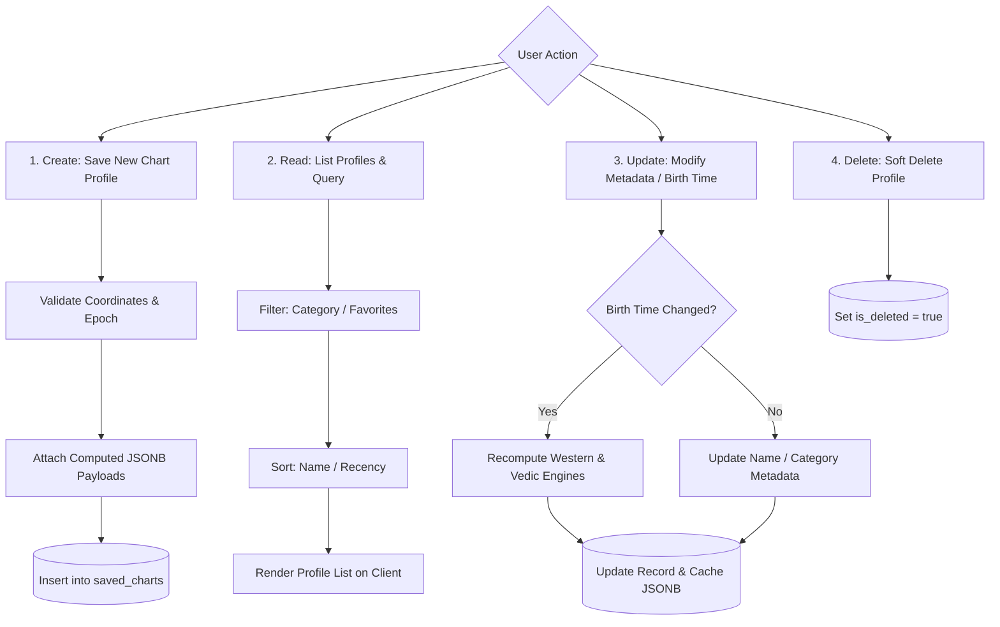

# Feature Specification 03: Persistent Birth Chart Storage & Profile Management

**Feature Code:** FEAT-03  
**Category:** Data Persistence & Profile Management  
**Status:** Approved  

---

## 1. Description & User Value

This feature provides permanent, secure storage for multi-user astrological chart profiles:
* Allows users to store charts for themselves, family members, friends, or coworkers, eliminating repetitive inputs.
* Supports category tagging, fast offline-first retrieval, and instant client filtering.

---

## 2. Atomic Entity Schema Decomposition

### Database Table: `saved_charts`
| Column | Data Type | Constraints | Description |
| :--- | :--- | :--- | :--- |
| `id` | `UUID` | Primary Key, Default `uuid_generate_v4()` | Unique chart profile ID. |
| `user_id` | `UUID` | Foreign Key `users.id`, Indexed | Owner account identifier. |
| `profile_name` | `VARCHAR(100)` | Not Null | Profile name / alias (e.g., "Rian Pramana"). |
| `category` | `VARCHAR(20)` | Not Null, Default `'OTHER'` | Enum: `SELF`, `FAMILY`, `FRIEND`, `COWORKER`, `PARTNER`, `OTHER`. |
| `latitude` | `NUMERIC(9,6)` | Not Null | Sub-meter precision latitude ($-90.000000$ to $+90.000000$). |
| `longitude` | `NUMERIC(9,6)` | Not Null | Sub-meter precision longitude ($-180.000000$ to $+180.000000$). |
| `location_name` | `VARCHAR(255)` | Nullable | Human-readable reverse-geocoded location name. |
| `local_datetime` | `TIMESTAMP` | Not Null | Local civil birth timestamp. |
| `iana_timezone` | `VARCHAR(50)` | Not Null | Canonical IANA timezone string (e.g., `"Asia/Jakarta"`). |
| `utc_timestamp` | `TIMESTAMPTZ` | Not Null, Indexed | Standardized canonical UTC timestamp. |
| `julian_day` | `DOUBLE PRECISION`| Not Null | Astronomical Julian Day epoch. |
| `cached_western`| `JSONB` | Nullable | Pre-computed Western chart cache for instant retrieval. |
| `cached_vedic` | `JSONB` | Nullable | Pre-computed Vedic chart cache for instant retrieval. |
| `is_favorite` | `BOOLEAN` | Default `FALSE`, Indexed | Starred profile flag for quick home dashboard access. |
| `is_deleted` | `BOOLEAN` | Default `FALSE`, Indexed | Soft delete flag. |
| `created_at` | `TIMESTAMPTZ` | Default `NOW()` | Record creation timestamp. |
| `updated_at` | `TIMESTAMPTZ` | Default `NOW()` | Last modification timestamp. |

---

## 3. Step-by-Step CRUD Operations & Business Logic



### Operation 1: Profile Creation (Create)
1. Client submits verified geographic coordinates, local timestamp, and pre-computed payload.
2. Backend validates schema and boundary conditions.
3. Inserts a new record into `saved_charts` with JSONB cache to eliminate future CPU recalculation overhead.

### Operation 2: Profile Retrieval & Search (Read)
1. Endpoint `GET /api/v1/chart/profiles`:
   * Case-insensitive search query parameter `?q=rian`.
   * Filters: `?category=COWORKER` and `?is_favorite=true`.
   * Pagination: `limit=20`, `offset=0`.
2. Response payload delivers lightweight summary cards (Sun, Moon, Ascendant/Lagna signs) to preserve mobile bandwidth.

### Operation 3: Modification (Update)
1. Metadata-only updates (name/category) skip astronomical recalculation.
2. Changes to `local_datetime` or coordinates automatically trigger backend recalculations, refreshing JSONB snapshots.

---

## 4. Offline-First Synchronization Architecture

1. **Client-Side Persistence:**
   * Mobile client caches profiles locally (SQLite via WatermelonDB or Expo SQLite).
   * Users can view and inspect saved charts without an active internet connection.
2. **Conflict Resolution:**
   * Two-way sync executes when internet connectivity restores.
   * Resolves conflicts via a deterministic *Last-Write-Wins (LWW)* strategy keyed to `updated_at`.

---

## 5. JSON Contract Specification

### Endpoint: `POST /api/v1/chart/profiles`
```json
{
  "profile_name": "Rian Pramana",
  "category": "SELF",
  "latitude": -6.175392,
  "longitude": 106.827153,
  "location_name": "Jakarta Pusat, DKI Jakarta",
  "local_datetime": "2007-08-29T06:40:00",
  "is_favorite": true
}
```

### Response Body (`HTTP 201 Created`)
```json
{
  "status": "success",
  "profile": {
    "id": "c7a84091-28cf-4351-b8d1-580a6b7d532a",
    "profile_name": "Rian Pramana",
    "category": "SELF",
    "sun_sign": "Virgo",
    "moon_sign": "Pisces",
    "ascendant_sign": "Virgo",
    "lagna_sign": "Leo",
    "created_at": "2026-09-08T10:07:00Z"
  }
}
```
