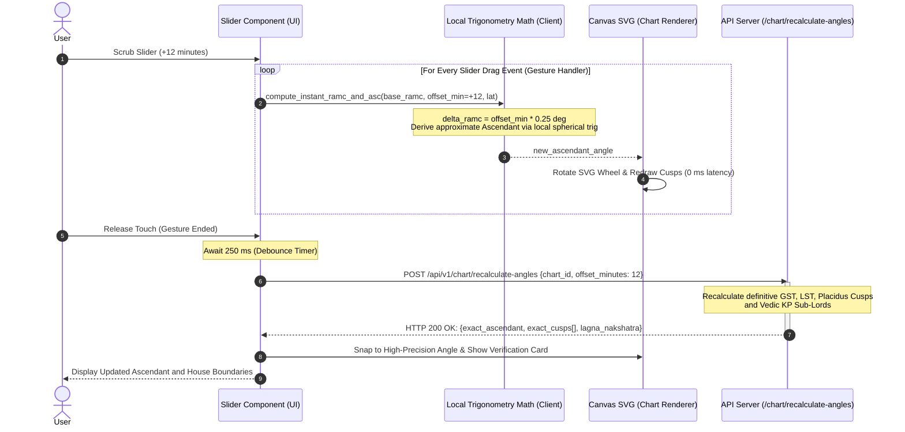

# Feature Specification 04: Birth Time Rectification Slider

**Feature Code:** FEAT-04  
**Category:** Interactive Chart Manipulation & Time Scrubbing  
**Status:** Approved  

---

## 1. Description & User Value

A significant proportion of users only know their birth time approximately (e.g., "around 6:00 AM" or "at dawn"). Because the Ascendant (Lagna) advances by $1^\circ$ every 4 minutes and changes zodiac signs approximately every 2 hours, an uncertainty of just 15 minutes can shift the Ascendant sign and house cusps entirely.

The **Birth Time Rectification Slider** empowers users to scrub their birth time dynamically ($\pm 30$ to $\pm 120$ minutes) and observe instantaneous real-time recalculations (60 FPS) of Lagna degrees and house boundaries directly on the visual chart.

---

## 2. Atomic Slider Component Parameters

| Parameter | Data Type | Default Value | Value Range | Step Increment |
| :--- | :--- | :--- | :--- | :--- |
| `time_offset_minutes` | `integer` | `0` | $-60$ to $+60$ mins (expandable to $\pm 120$) | $1$ minute per tick |
| `reference_utc` | `string` | Base birth timestamp | ISO-8601 UTC | Fixed base |
| `debounce_interval` | `integer` | `250` ms | $150$ to $500$ ms | Network request delay |

---

## 3. Dual-Path Architecture: 60 FPS Client Interpolation & Server Sync

To eliminate network lag while scrubbing, the system executes a **Dual-Path Strategy**:



### Client-Side Trigonometric Math (Path 1)
Earth rotates $360^\circ$ in 1440 minutes:
$$\text{Rotation Speed} = \frac{360^\circ}{1440\text{ mins}} = 0.25^\circ \text{ per minute} = 15^\prime \text{ arc per minute}$$
For an offset of $\Delta t$ minutes:
$$\Delta RAMC = \Delta t \times 0.25^\circ$$
$$RAMC_{\text{new}} = (RAMC_{\text{base}} + \Delta RAMC) \pmod{360^\circ}$$
New Ascendant is calculated directly on the JS/Native thread:
$$\tan(ASC_{\text{new}}) = \frac{\cos(RAMC_{\text{new}})}{-\sin(RAMC_{\text{new}})\cos(\epsilon) - \tan(\text{lat})\sin(\epsilon)}$$

---

## 4. Confirmation & Reset Workflows

1. **"Apply New Time Permanently":**
   * Persists the rectified timestamp to the database, updating the user's saved chart profile.
2. **"Reset to Original Time":**
   * Resets offset to `0` and restores the original recorded birth time.

---

## 5. JSON Contract Specification

### Request: `POST /api/v1/chart/recalculate-angles`
```json
{
  "chart_id": "c7a84091-28cf-4351-b8d1-580a6b7d532a",
  "offset_minutes": 12,
  "house_system": "PLACIDUS"
}
```

### Response Body (`HTTP 200 OK`)
```json
{
  "status": "success",
  "adjusted_datetime_local": "2007-08-29T06:52:00",
  "adjusted_utc": "2007-08-28T23:52:00Z",
  "western": {
    "ascendant": 159.42,
    "ascendant_sign": "Virgo",
    "midheaven": 69.18,
    "cusps": [159.42, 188.12, 217.33, 249.18, 281.45, 311.12, 339.42, 8.12, 37.33, 69.18, 101.45, 131.12]
  },
  "vedic": {
    "lagna": 135.45,
    "lagna_sign": "Leo",
    "nakshatra": "Purva Phalguni",
    "pada": 2
  }
}
```
