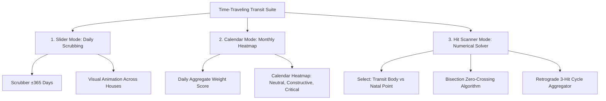

# Feature Specification 05: Time-Traveling Transit Engine (Slider, Calendar, Hit Scanner)

**Feature Code:** FEAT-05  
**Category:** Time-Travel Ephemeris & Numerical Root-Finding  
**Status:** Approved  

---

## 1. Description & User Value

This feature shifts user interaction from passive horoscope reading into an empirical, bidirectional astrological time-machine. Users can explore:
1. **Present Day (*Real-Time*):** Active planetary weather and current aspects.
2. **Historical Milestones (*Past Retrospective*):** Inspecting exact cosmic alignments during critical life events (graduations, accidents, promotions, relational turning points).
3. **Future Foresight (*Predictive Planning*):** Anticipating long-term developmental cycles for strategic planning.

Equipped with three interaction modes: **Daily Scrubber Slider**, **Monthly Heatmap Calendar**, and **Aspect Hit Scanner** (automated culmination point solver).

---

## 2. Atomic Tri-Modal Interaction Decomposition



---

## 3. Aspect Hit Scanner: Numerical Root-Finding Algorithm

To isolate the exact minute and second of exact aspect culmination ($0.000^\circ$ orb):

### Step 1: Angular Difference Function
Define angular deviation at Julian Day epoch $t$:
$$f(t) = (\lambda_{\text{transit}}(t) - \lambda_{\text{natal}}) - \theta_{\text{target}}$$
where $\theta_{\text{target}} \in \{0^\circ, 60^\circ, 90^\circ, 120^\circ, 180^\circ\}$.

### Step 2: Coarse Sampling Scan
* Sample $f(t)$ at $\Delta t = 3\text{ days}$ intervals across the query window (e.g., 2026-01-01 to 2026-12-31).
* Detect sign changes (*zero-crossings*): $f(t_k) \times f(t_{k+1}) \le 0$ identifies a culmination bracket.

### Step 3: Fine Bisection Refinement
Run bisection solver down to temporal tolerance $\epsilon_t \le 60\text{ seconds}$:
1. $t_{\text{mid}} = \frac{t_{\text{low}} + t_{\text{high}}}{2}$.
2. Evaluate ephemeris coordinates at $t_{\text{mid}}$.
3. Update search interval bounds based on sign of $f(t_{\text{mid}})$.
4. Terminate when $|f(t_{\text{mid}})| \le 0.0005^\circ$ (1.8 arcseconds).

### Step 4: Tri-Hit Retrograde Cycle Aggregation
Slow outer planets (Saturn, Jupiter, Uranus, Neptune, Pluto) transit an exact degree three times:
1. **Hit 1 (Direct Motion):** Thematic initiation / preliminary challenge.
2. **Hit 2 (Retrograde Motion):** Deep introspection, revision, peak tension.
3. **Hit 3 (Direct Motion):** Permanent resolution and structural integration.
*The engine groups these three events into a unified "Transit Milestone Card" in the UI.*

---

## 4. Calendar Mode: Daily Celestial Heatmap Score

Each calendar day receives an aggregate celestial impact score $S_{\text{day}}$:
$$S_{\text{day}} = \sum_{i=1}^{N} W(\delta_i) \times P_{\text{planet}} \times M_{\text{aspect}}$$
* $W(\delta_i) = 10.0 \times \exp(-1.4 \times \delta_i)$ (exponential decay).
* $P_{\text{planet}}$: Planet multiplier (Saturn = 1.5, Pluto = 1.4, Mars = 1.2, Mercury = 0.8).
* $M_{\text{aspect}}$: Aspect multiplier (Conjunction/Opposition = 1.5, Square = 1.3, Trine = 1.0).

**Heatmap Thresholds:**
* $S_{\text{day}} < 15$: Quiet / Grounded (Muted Gray).
* $15 \le S_{\text{day}} < 35$: Moderate / Flow (Teal/Green).
* $S_{\text{day}} \ge 35$: High Intensity / Critical Crossroads (Amber/Crimson).

---

## 5. JSON Contract Specification

### Request: `POST /api/v1/transit/scan-hit`
```json
{
  "chart_id": "c7a84091-28cf-4351-b8d1-580a6b7d532a",
  "transit_body": "Saturn",
  "natal_body": "Sun",
  "aspect_angle": 180.0,
  "start_date": "2026-01-01",
  "end_date": "2027-12-31"
}
```

### Response Body (`HTTP 200 OK`)
```json
{
  "status": "success",
  "event_name": "Transit Saturn Opposition Natal Sun",
  "is_tri_hit_cycle": true,
  "cycle_hits": [
    {
      "hit_phase": 1,
      "exact_timestamp_utc": "2026-04-12T11:20:00Z",
      "motion": "DIRECT",
      "orb_degrees": 0.0002
    },
    {
      "hit_phase": 2,
      "exact_timestamp_utc": "2026-08-14T03:22:15Z",
      "motion": "RETROGRADE",
      "orb_degrees": 0.0001
    },
    {
      "hit_phase": 3,
      "exact_timestamp_utc": "2027-01-05T19:45:00Z",
      "motion": "DIRECT",
      "orb_degrees": 0.0003
    }
  ]
}
```
