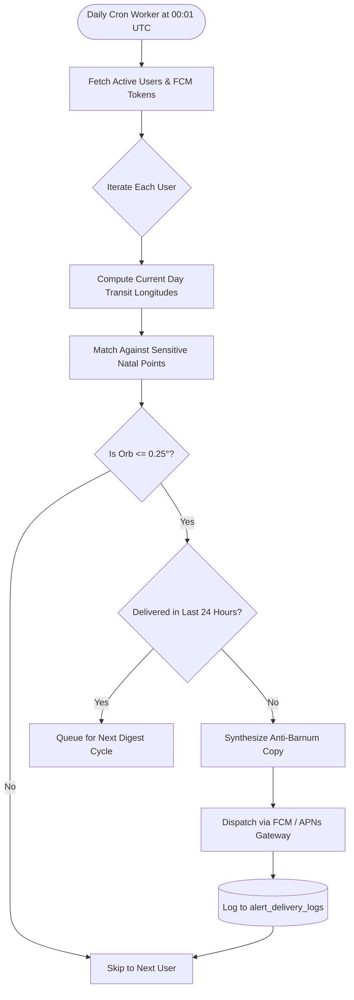

# Feature Specification 06: Smart Transit Alerts (Critical Transit Notifications)

**Feature Code:** FEAT-06  
**Category:** Push Notification Engine & Background Evaluation  
**Status:** Approved  

---

## 1. Description & User Value

Unlike conventional commercial astrology apps that spam generic flattery ("Today is your lucky day!"), **Smart Transit Alerts** functions as a rigorous, objective astronomical notification system:
* Only fires when high-impact transits reach exceptionally tight orbs ($\le 0.25^\circ$) against sensitive natal chart points.
* Delivers purely objective celestial mechanics data and impacted life sectors devoid of sensationalist fortune-telling.

---

## 2. Trigger Matrix & Boundaries

| Component | Boundary / Rule | Operational Notes |
| :--- | :--- | :--- |
| **Orb Threshold** | $\text{Orb} \le 0.25^\circ$ (15 arcminutes) | Strict culmination filter. |
| **Monitored Transit Bodies** | Saturn, Jupiter, Mars, Uranus, Neptune, Pluto, Lunar Nodes, and Solar/Lunar Eclipses. | Fast inner bodies (Moon/Mercury) excluded to prevent notification spam. |
| **Sensitive Natal Points** | Natal Sun, Natal Moon, Ascendant (Lagna) degree, Midheaven (MC) degree, and Active Dasha Lords. | High-leverage psychological & situational anchors. |
| **Rate Limit** | Maximum 1 alert digest per 24 hours per user. | Concurrent hits aggregated into a single cohesive digest. |
| **Local Dispatch Window** | Scheduled at 07:00 AM local civil time. | Driven by recorded `iana_timezone`. |

---

## 3. Background Batch Evaluation Pipeline



---

## 4. Anti-Barnum Copywriting Standards

* **STRICTLY FORBIDDEN:** Platitudes such as *"Great luck ahead!", "Beware of impending doom!", "Your zodiac sign is glowing!"*.
* **MANDATORY:**
  1. State exact transit body and aspect geometry (e.g., *"Transit Saturn Opposition Natal Sun"*).
  2. State exact numerical orb (e.g., *"Exact Culmination (Orb $0.03^\circ$)"*).
  3. Map directly to tangible life sectors (e.g., *"Themes: Physical endurance boundaries, workload testing, and structural reprioritization"*).

---

## 5. FCM/APNs Notification Contract Payload

```json
{
  "to": "fcm_token_device_abc123",
  "notification": {
    "title": "Critical Transit: Saturn Opposition Natal Sun",
    "body": "Exact culmination today (orb 0.03°). Themes: Physical endurance boundaries and structural workload reprioritization."
  },
  "data": {
    "type": "CRITICAL_TRANSIT_ALERT",
    "chart_id": "c7a84091-28cf-4351-b8d1-580a6b7d532a",
    "transit_body": "Saturn",
    "natal_point": "Sun",
    "aspect_type": "OPPOSITION",
    "orb_degrees": 0.032,
    "affected_domains": ["Career/Situational", "Somatic/Physiological"],
    "deep_link": "astrology://transit/detail?event=saturn_opp_sun"
  }
}
```
