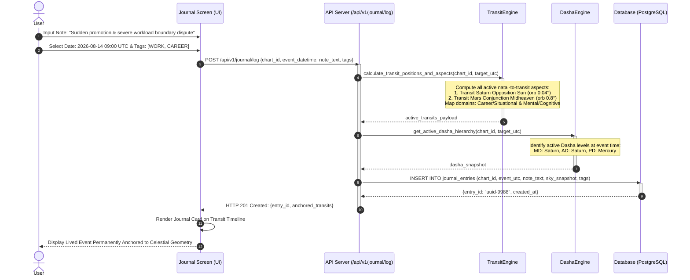

# Feature Specification 07: Empirical Astro-Journal & Event Anchoring

**Feature Code:** FEAT-07  
**Category:** Empirical Tracking & Event Anchoring  
**Status:** Approved  

---

## 1. Description & User Value

The **Empirical Astro-Journal** serves as a personal research instrument:
* Transforms astrology from uncritical belief into an empirical study of personal life patterns.
* Users log documented lived events on specific dates, and the system permanently binds an exact astronomical snapshot (*celestial snapshot*), empowering users to test correlations between planetary mechanics and their lived experiences.

---

## 2. Atomic Data Schema Decomposition

### Database Table: `journal_entries`
| Column | Data Type | Constraints | Description |
| :--- | :--- | :--- | :--- |
| `id` | `UUID` | Primary Key | Unique journal entry ID. |
| `chart_id` | `UUID` | Foreign Key `saved_charts.id`, Indexed | Reference natal birth chart profile. |
| `event_utc` | `TIMESTAMPTZ` | Not Null, Indexed | Exact UTC timestamp of the recorded life event. |
| `note_text` | `TEXT` | Not Null (Max 5000 chars) | User description of the real-world lived event. |
| `subjective_tags`| `VARCHAR(50)[]`| Nullable | User-selected tags (`WORK`, `HEALTH`, `RELATIONSHIP`, `EMOTIONAL`, `FINANCE`). |
| `sky_snapshot` | `JSONB` | Not Null | Immutable astronomical snapshot at event time (aspects, orbs, Dasha). |
| `alignment_score`| `NUMERIC(3,2)` | Nullable | Computed correlation score between transit domains and user tags. |
| `created_at` | `TIMESTAMPTZ` | Default `NOW()` | Timestamp entry created. |

---

## 3. Celestial Snapshot Anchoring Pipeline



---

## 4. Timeline View & Empirical Validation Analytics

1. **Integrated Transit Timeline:**
   * Days possessing journal entries display an edit badge on both the *Daily Scrubber* and *Calendar Heatmap*.
   * Tapping any entry displays an objective side-by-side comparison: **Your Real-World Event** vs **Cosmic Mechanics at That Hour**.
2. **Correlation Metrics:**
   * Analytics compute frequency distributions correlating specific tags (e.g. `HEALTH`) against 6th house tensions or Mars/Saturn hard aspects to the Ascendant.

---

## 5. JSON Contract Specification

### Request: `POST /api/v1/journal/log`
```json
{
  "chart_id": "c7a84091-28cf-4351-b8d1-580a6b7d532a",
  "event_datetime_local": "2026-08-14T16:00:00",
  "iana_timezone": "Asia/Jakarta",
  "note_text": "Received a major unexpected promotion accompanied by intense disputes regarding team task delegation.",
  "subjective_tags": ["WORK", "CAREER", "STRESS"]
}
```

### Response Body (`HTTP 201 Created`)
```json
{
  "status": "success",
  "entry_id": "8b9e6c2d-88f1-432a-bc91-912837264819",
  "anchored_astronomy": {
    "utc_timestamp": "2026-08-14T09:00:00Z",
    "dominant_transit": "Saturn Opposition Sun (Orb 0.04°)",
    "secondary_transit": "Mars Conjunction Midheaven (Orb 0.81°)",
    "active_dasha": "Saturn - Saturn - Mercury",
    "calculated_domains": ["Career/Situational", "Mental/Cognitive"]
  }
}
```
