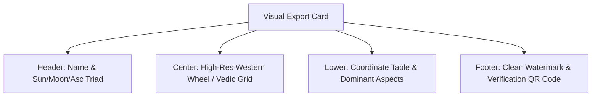

# Feature Specification 08: Share Feature & High-Resolution Export

**Feature Code:** FEAT-08  
**Category:** Export, Social Sharing & Deep-Linking  
**Status:** Approved  

---

## 1. Description & User Value

This feature enables users to export or share their birth chart visualizations, transit configurations, and analytical insights with external peers:
* Generates high-resolution graphical assets (300 DPI PNG / scalable SVG) formatted for social platforms or practitioner consultations.
* Creates secure, interactive deep-links protected by default privacy filters (*privacy-safe defaults*).

---

## 2. Atomic Export Formats & Dimensions

| Format | Aspect Ratio | Dimensions / File Size | Primary Target Use Case |
| :--- | :--- | :--- | :--- |
| **PNG (Square Card)** | `1:1` | $1080 \times 1080\text{ px}$ (300 DPI) | Instagram Feed, Twitter/X, direct messaging. |
| **PNG (Story Card)** | `9:16` | $1080 \times 1920\text{ px}$ (300 DPI) | Instagram Stories, WhatsApp Status. |
| **SVG (Vector Asset)**| Responsive Vector | Compact ($< 150\text{ KB}$) | High-end physical printing or web embedding. |
| **Shareable URL** | Short URL | String (`https://astro.io/s/xyz`) | Interactive browser view with interactive tooltips. |

---

## 3. Visual Layout Decomposition



### Privacy Protection Rules on Public Assets
1. **Masking Exact Birth Year & Timestamp:**
   * Export cards display birth month and day (e.g., "August 29") while redacting birth year and exact minute by default to protect personal identity (*anti-doxxing*).
2. **Exclusion of Personal Journal Notes:**
   * Freeform Empirical Journal reflections are strictly omitted from public graphical assets.

---

## 4. Native OS Share Sheet Integration

1. User taps *"Share"* on any chart or transit screen.
2. Selects desired format: `PNG (Story)`, `PNG (Square)`, or `Copy Link`.
3. Expo invokes `expo-sharing` to launch native platform dialogs (iOS UIActivityViewController / Android Intent Chooser).
4. Direct routing to WhatsApp, Instagram Stories, AirDrop, or local gallery save.

---

## 5. JSON Contract Specification

### Request: `POST /api/v1/share/generate-link`
```json
{
  "chart_id": "c7a84091-28cf-4351-b8d1-580a6b7d532a",
  "hide_birth_year": true,
  "hide_birth_time": true,
  "theme": "DARK_NEBULA"
}
```

### Response Body (`HTTP 200 OK`)
```json
{
  "status": "success",
  "share_code": "c7a840",
  "share_url": "https://astro.io/s/c7a840",
  "rendered_card_png": "https://storage.astro.io/cards/c7a840_sq.png",
  "expires_at": "2026-10-08T10:00:00Z"
}
```
