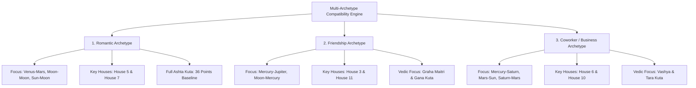

# Feature Specification 09: Multi-Archetype Compatibility (Synastry)

**Feature Code:** FEAT-09  
**Category:** Relational Dynamics & Multi-Archetype Synastry  
**Status:** Approved  

---

## 1. Description & User Value

Astrological compatibility is often narrowly commodified into generic romance matchmaking. This feature expands relational synastry into **Three Real-World Relational Archetypes**:
1. **Romance (Romantic Partners):** Evaluates emotional resonance, erotic attraction, and long-term commitment.
2. **Friendship (Social Peers):** Evaluates intellectual rapport, humor, and mutual emotional support.
3. **Coworker (Business & Team Collaboration):** Evaluates task discipline, communication agility, execution ethics, and authority division.

Supports 3 ingestion sources: **Phone Contacts**, **Nearby Proximity**, and **Unknown / Stranger Profiles**.
> **Core Mandate:** For Unknown / Stranger Profiles, **all compatibility dimensions and metrics are calculated and displayed in full without omitting any analytical dimensions or houses.**

---

## 2. Atomic Relational Archetype Decomposition



### Archetype Weighting Matrix

| Dimension | Romantic Partner | Friendship | Coworker / Business |
| :--- | :---: | :---: | :---: |
| **Emotional Resonance (Moon-Moon)** | $35\%$ | $20\%$ | $5\%$ |
| **Attraction & Passion (Venus-Mars)**| $30\%$ | $0\%$ | $0\%$ |
| **Communication Flow (Mercury)** | $15\%$ | $40\%$ | $35\%$ |
| **Work Ethic & Discipline (Saturn-Mars)**| $5\%$ | $10\%$ | $35\%$ |
| **Ego & Leadership Balance (Sun-Mars)**| $15\%$ | $30\%$ | $25\%$ |

---

## 3. Ingestion Sources & Stranger Profile Handling

1. **Phone Contacts (`CONTACTS`):**
   * Imported via `expo-contacts` device address book integration.
2. **Nearby Proximity (`NEARBY`):**
   * PostGIS spatial radius queries ($\le 5\text{ km}$) across users who opt into social discovery.
3. **Unknown / Stranger Profiles (`STRANGER`):**
   * User enters a stranger profile (city and approximate date known).
   * **Full Dimensional Integrity:** No dimensions are stripped. Communication rapport, execution discipline, leadership friction, and Vedic Ashta Kuta are fully evaluated. If the partner's exact birth time is missing, solar/lunar houses are adopted with transparent diagnostic indicators.

---

## 4. Dual-Core Synastry Algorithms (Western + Vedic)

1. **Western Cross-Aspects:**
   * Angular separation $\Delta\theta = |\lambda_{A, i} - \lambda_{B, j}|$ evaluated with exponential decay weighting $W(\delta)$.
2. **Vedic Ashta Kuta (36 Points):**
   * Varna (1 pt), Vashya (2 pts), Tara (3 pts), Yoni (4 pts), Graha Maitri (5 pts), Gana (6 pts), Bhakoot (7 pts), Nadi (8 pts).
   * In Coworker mode, child-health Nadi weighting is redirected into Graha Maitri (planetary ruler friendship).

---

## 5. JSON Contract Specification

### Request: `POST /api/v1/compatibility/evaluate`
```json
{
  "user_chart_id": "c7a84091-28cf-4351-b8d1-580a6b7d532a",
  "target_type": "STRANGER",
  "target_data": {
    "city_name": "Bandung",
    "approximate_date": "2005-03-15",
    "approximate_time": "12:00"
  },
  "archetype": "COWORKER"
}
```

### Response Body (`HTTP 200 OK`)
```json
{
  "status": "success",
  "archetype": "COWORKER",
  "overall_score": 78,
  "verdict": "High Operational Synergy",
  "dimensions": {
    "communication_flow": {
      "score": 85,
      "verdict": "Agile & Conceptual",
      "key_aspect": "Mercury Trine Mercury (Orb 1.2°)"
    },
    "work_ethic_and_discipline": {
      "score": 72,
      "verdict": "Structured & Disciplined",
      "key_aspect": "Saturn Sextile Mars (Orb 0.5°)"
    },
    "ego_and_authority_balance": {
      "score": 68,
      "verdict": "Requires Explicit Scope Boundaries",
      "key_aspect": "Sun Square Mars (Orb 2.1°)"
    }
  },
  "vedic_kuta_points": {
    "earned": 26,
    "max": 36,
    "rashi_harmony": "Full Graha Maitri"
  },
  "actionable_takeaway": "Communication flow is swift and conceptual. Explicitly delineate task ownership upfront to prevent authority friction under tight deadlines."
}
```
