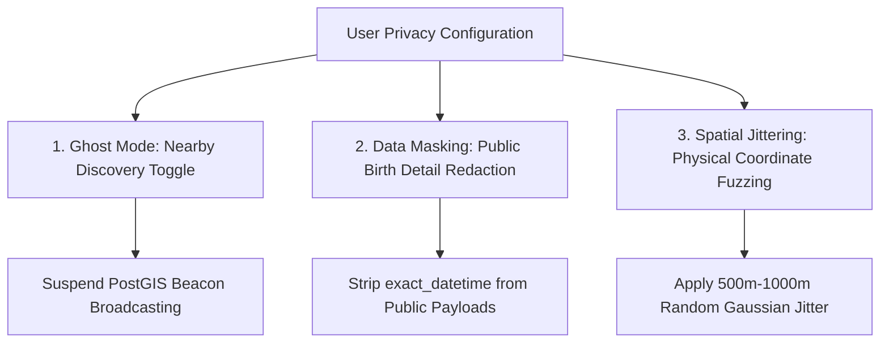

# Feature Specification 10: Privacy Controls & Ghost Mode

**Feature Code:** FEAT-10  
**Category:** Privacy, Security & Social Anonymity  
**Status:** Approved  

---

## 1. Description & User Value

Birth metadata (date, minute of birth, and geographic coordinates) represents sensitive personally identifiable information. Inadvertent exposure could invite identity misuse or physical location tracking (*stalking*).

**Privacy Controls & Ghost Mode** grants users absolute sovereignty:
* Instant shutdown of Nearby discovery beacon broadcasts.
* Enables relational synastry evaluations without disclosing raw birth times or precise birth coordinates (*data masking*).
* Preserves complete mathematical calculation depth on the isolated server while sanitizing outbound client payloads.

---

## 2. Tri-Layer Privacy Protection (Atomic Decomposition)



### A. Layer 1: Ghost Mode (Total Anonymity Toggle)
* Primary toggle in user profile settings: `is_ghost_mode_enabled`.
* **When Active:**
  * Purges the user's active coordinate record from `nearby_active_beacons`.
  * The user is invisible to all nearby proximity scanners.
  * The user retains access to query other consenting profiles.

### B. Layer 2: Data Masking (Synastry Privacy Redaction)
* When two users perform a compatibility check:
  * Backend calculates inter-aspects using high-precision data in isolation.
  * Before payload dispatch, sanitization middleware replaces:
    * `birth_time` $\rightarrow$ `"HIDDEN_BY_USER"`.
    * `birth_year` $\rightarrow$ `XXXX`.
    * `exact_coordinates` $\rightarrow$ General city name only (e.g., `"Jakarta"`).
  * **Crucial:** Compatibility scores, planetary dynamics, and domain verdicts remain 100% complete and unreduced.

### C. Layer 3: Spatial Jittering (Coordinate Fuzzing)
* When Nearby discovery is permitted (Ghost Mode Disabled):
  * Exact physical GPS coordinates are never exposed publicly.
  * The system applies random Gaussian fuzzing:
    $$Lat_{\text{public}} = Lat_{\text{real}} + \Delta Lat_{\text{random}} \quad (\text{radius } 500\text{m} - 1000\text{m})$$
    $$Lon_{\text{public}} = Lon_{\text{real}} + \Delta Lon_{\text{random}}$$

---

## 3. Data Protection & Ad Tracker Zero-Tolerance

1. **Zero Ad Trackers:**
   * Advertising SDKs (Google AdMob, Meta Audience Network) are prohibited from accessing birth timestamps or GPS coordinates.
2. **Encryption at Rest:**
   * Sensitive birth coordinates in database tables are encrypted with AES-256 (PostgreSQL pgcrypto).

---

## 4. JSON Contract Specification

### Request: `PATCH /api/v1/user/privacy-settings`
```json
{
  "ghost_mode_enabled": true,
  "allow_nearby_discovery": false,
  "mask_birth_time_in_synastry": true,
  "mask_birth_year_in_synastry": true
}
```

### Response Body (`HTTP 200 OK`)
```json
{
  "status": "success",
  "privacy_settings": {
    "ghost_mode_enabled": true,
    "allow_nearby_discovery": false,
    "mask_birth_time_in_synastry": true,
    "mask_birth_year_in_synastry": true,
    "beacon_status": "OFFLINE",
    "updated_at": "2026-09-08T10:09:00Z"
  }
}
```
