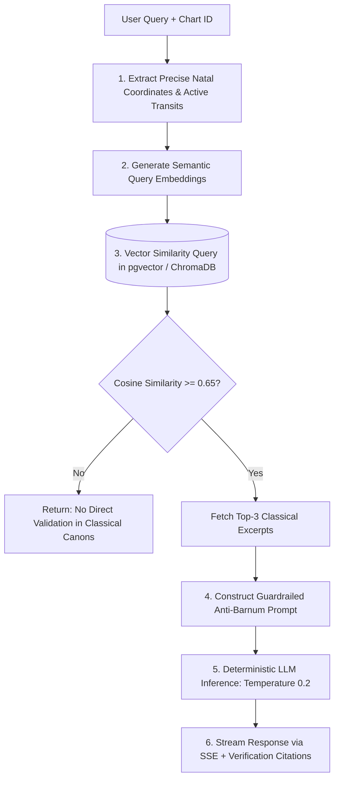

# Feature Specification 11: AI Chatbot with RAG & Anti-Barnum Grounding

**Feature Code:** FEAT-11  
**Category:** AI Engine, Classical Doctrine Retrieval & Anti-Barnum Synthesis  
**Status:** Approved  

---

## 1. Description & User Value

Generic commercial AI chatbots tend to generate flattering Barnum platitudes or fabricate astrological assertions (*hallucinations*).

The **RAG AI Chatbot** operates within a closed, verifiable retrieval architecture anchored strictly in:
1. **The User's Real Mathematical Coordinates:** Exact planetary degrees, houses, and active transit orbs.
2. **Authoritative Classical Literature:** Verified text passages (*Brihat Parashara Hora Shastra*, *Jataka Parijata*, *Phaladeepika*, Hellenistic Ptolemaic canons).
3. **Zero-Tolerance Hallucination Standard:** If a queried celestial pattern lacks validation in indexed classical scriptures, the AI transparently declines to speculate.

---

## 2. Atomic RAG Pipeline Decomposition



---

## 3. Classical Corpus Indexing Strategy (*Vector Store*)

* **Chunking Granularity:** 300 to 500 tokens per classical doctrinal segment.
* **Structured Metadata Schema:**
  * `source_canon`: Name of scripture (e.g., `"Brihat Parashara Hora Shastra"`).
  * `chapter_ref`: Chapter and verse citation (e.g., `"Chapter 24, Sloka 14-16"`).
  * `tradition`: `"VEDIC"` or `"WESTERN_HELLENISTIC"`.
  * `planetary_tags`: `["Saturn", "Sun", "Opposition"]`.
  * `house_tags`: `["House_1", "House_7"]`.
  * `life_domains`: `["Career/Situational", "Somatic/Physiological"]`.

---

## 4. Strict Anti-Barnum System Prompt Guardrails

The LLM is enveloped in strict operational constraints:
1. **ZERO SPECULATION:** Rely strictly and exclusively on the injected doctrinal passages.
2. **NO FLATTERY BIAS:** Statements like *"You possess enormous hidden potential waiting to bloom"* or deterministic fatalism are blocked.
3. **MANDATORY SCRIPTURAL CITATIONS:** Every thematic claim must explicitly cite its book, chapter, and verse source.
4. **5-DOMAIN OBJECTIVE MAPPING:** Classical terms are translated into 5 quantifiable real-world life domains:
   * Mental / Cognitive (focus, stress, analytical rigor).
   * Emotional / Psychological (boundaries, somatic anxiety).
   * Career / Situational (structural duties, authority friction).
   * Interpersonal / Relational (collaboration friction, communication flow).
   * Somatic / Physiological (physical endurance, energy rhythms, fatigue).

---

## 5. Streaming Contract Specification (Server-Sent Events)

### Endpoint: `POST /api/v1/chat/inquire`

#### Request Body
```json
{
  "chart_id": "c7a84091-28cf-4351-b8d1-580a6b7d532a",
  "query": "Why have I been experiencing severe physical exhaustion during work projects lately?",
  "stream": true
}
```

#### Stream Responses (SSE)
```text
event: metadata
data: {"active_transits_identified": ["Saturn Opposition Natal Sun (Orb 0.04°)"], "active_dasha": "Saturn-Saturn"}

event: token
data: {"text": "According to current ephemeris calculations, transit Saturn at 151°12' forms an exact angular opposition (180°02', orb 0.04°) to your natal Sun at 155°12'. "}

event: token
data: {"text": "In Somatic and Career domains, a Saturn-Sun opposition marks a phase testing physical endurance boundaries and mandating structural workload reprioritization. "}

event: citation
data: {
  "source_canon": "Brihat Parashara Hora Shastra",
  "chapter": 24,
  "sloka": "14-16",
  "classical_quote": "When Shani aspects Surya with hard angularity, physical endurance is tested and structural responsibilities demand disciplined restraint."
}

event: finish
data: {"status": "completed"}
```
