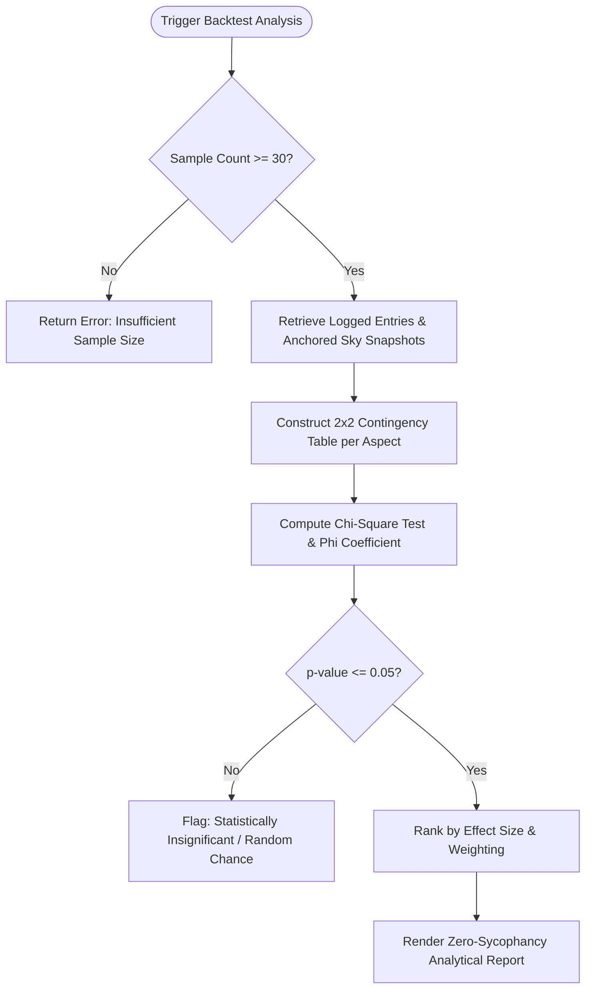

# Feature Specification 12: Personal Backtesting & Correlation Engine (Data Mining)

**Feature Code:** FEAT-12  
**Category:** Data Science & Empirical Validation  
**Status:** Approved  

---

## 1. Description & User Value

This feature provides an advanced personal analytics engine that mines chronological entries from [FEAT-07 (Empirical Astro-Journal)](./07_empirical_astro_journal.md) to mathematically evaluate astronomical correlations:
* Eliminates confirmation bias and subjective impression by applying formal statistical hypothesis testing (Chi-Square Test of Independence & Pearson Correlation Coefficient).
* Delivers evidence-based personal insights: objectively discovers which transit configurations, Dasha periods, or planetary aspects statistically correlate ($p < 0.05$) with user-logged real-world states (such as acute work stress, creative flow, or interpersonal friction).

---

## 2. Atomic Data Decomposition & Schema

### Database Entity: `backtest_runs`
| Column | Data Type | Constraints | Description |
| :--- | :--- | :--- | :--- |
| `id` | `UUID` | Primary Key | Unique run identifier. |
| `chart_id` | `UUID` | Foreign Key `saved_charts.id`, Indexed | Reference natal chart. |
| `min_sample_size` | `INTEGER` | Not Null, Default `30` | Minimum required logged journal records. |
| `analyzed_tag` | `VARCHAR(50)` | Not Null | User tag under investigation (`BURNOUT`, `FOCUS`, `CONFLICT`). |
| `p_value_threshold`| `NUMERIC(4,3)`| Default `0.050` | Standard scientific significance threshold ($p \le 0.05$). |
| `correlation_matrix`| `JSONB` | Not Null | Computed coefficients, contingency tables, and effect sizes. |
| `created_at` | `TIMESTAMPTZ` | Default `NOW()` | Timestamp of run execution. |

---

## 3. Step-by-Step Computational Algorithm



### Mathematical Formulation:
1. **Contingency Matrix ($2 \times 2$):**
   * $O_{11}$: Tag present while transit active (orb $\le 2.0^\circ$).
   * $O_{12}$: Tag present while transit inactive.
   * $O_{21}$: Tag absent while transit active.
   * $O_{22}$: Tag absent while transit inactive.

2. **Chi-Square Test ($\chi^2$):**
   $$\chi^2 = \sum_{i=1}^2 \sum_{j=1}^2 \frac{(O_{ij} - E_{ij})^2}{E_{ij}}$$
   Where expected frequencies are:
   $$E_{ij} = \frac{R_i \times C_j}{N}$$

3. **Phi Coefficient ($\phi$):**
   $$\phi = \sqrt{\frac{\chi^2}{N}}$$

---

## 4. Edge Cases & Data Integrity

1. **Sample Underflow ($N < 30$):** Rejects statistical processing to avoid spurious small-sample correlations.
2. **Confounded Transits:** Multivariate logistic regression isolates co-occurring transits to prevent misattributing causal weight.
3. **Anti-Pseudosains Guardrail:** If no transit achieves $p \le 0.05$, the system explicitly declares: *"No statistically significant correlation found for this tag."*

---

## 5. JSON Contract Structure

### Request: `POST /api/v1/analytics/backtest`
```json
{
  "chart_id": "c7a84091-28cf-4351-b8d1-580a6b7d532a",
  "target_tag": "BURNOUT",
  "min_samples": 30,
  "confidence_level": 0.95
}
```

### Response Body (`HTTP 200 OK`)
```json
{
  "status": "success",
  "sample_size": 42,
  "target_tag": "BURNOUT",
  "statistically_significant_correlations": [
    {
      "transit_signature": "Transit Mars Square Natal Saturn",
      "p_value": 0.0184,
      "is_significant": true,
      "correlation_strength": 0.472,
      "relative_risk_ratio": 3.0,
      "summary": "Burnout occurrences are 3x more probable statistically when transit Mars squares natal Saturn."
    }
  ],
  "null_hypotheses_accepted": [
    {
      "transit_signature": "Transit Moon Opposition Sun",
      "p_value": 0.642,
      "is_significant": false,
      "summary": "No statistically verifiable correlation between Moon opposition and burnout."
    }
  ]
}
```
