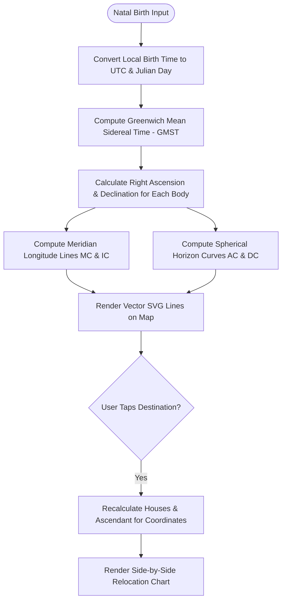

# Feature Specification 13: Deterministic Astro-Cartography & Relocation Map

**Feature Code:** FEAT-13  
**Category:** Geodetic Mechanics & Relocational Astrology  
**Status:** Approved  

---

## 1. Description & User Value

This feature projects a user's natal celestial geometry onto an interactive geodetic world map:
* Accurately calculates and renders planetary angularity lines (planets exactly situated on Ascendant/AC, Midheaven/MC, Descendant/DC, or Imum Coeli/IC) across Earth's surface.
* Enables users to evaluate relocational geographical impact (career focus along MC lines, interpersonal dynamics along DC lines, personal identity on AC lines, and home/internal roots along IC lines).
* Provides on-demand **Relocated Chart Calculation** when tapping any coordinate pin worldwide, recalculating houses and Lagna while maintaining absolute natal UTC celestial coordinates.

---

## 2. Atomic Parameter Decomposition

| Parameter | Data Type | Units / Format | Validation Range | Description |
| :--- | :--- | :--- | :--- | :--- |
| `chart_id` | `UUID` | UUIDv4 | Must exist in DB | Reference natal birth profile. |
| `projection_type` | `enum` | String | `MERCATOR`, `EQUIRECTANGULAR` | Visual map projection format. |
| `target_latitude` | `float` | Decimal Degrees ($^\circ$) | $-90.000000 \le \text{lat} \le +90.000000$ | Destination relocation latitude. |
| `target_longitude`| `float` | Decimal Degrees ($^\circ$) | $-180.000000 \le \text{lon} \le +180.000000$| Destination relocation longitude. |
| `active_planets` | `array` | String[] | `["SUN", "MOON", "MARS", ...]` | Planetary filter subset. |

---

## 3. Geodetic Algorithm & Spherical Trigonometry



### Mathematical Formulas:
1. **Meridian Lines (MC & IC):**
   Longitude $\lambda_{MC}$ for planet $P$ with Right Ascension $\alpha_P$:
   $$\lambda_{MC} = (\alpha_P - GMST) \pmod{360^\circ}$$
   $$\lambda_{IC} = (\lambda_{MC} + 180^\circ) \pmod{360^\circ}$$

2. **Horizon Curves (AC & DC):**
   For latitude $\phi \in [-66^\circ, +66^\circ]$, compute Local Hour Angle ($LHA$):
   $$\cos(LHA) = -\tan(\phi) \cdot \tan(\delta_P)$$
   $$\lambda_{AC} = (\alpha_P - LHA - GMST) \pmod{360^\circ}$$
   $$\lambda_{DC} = (\alpha_P + LHA - GMST) \pmod{360^\circ}$$

---

## 4. Edge Cases & Polar Limits

1. **Polar Latitudes ($|\phi| > 66.5^\circ$):** Horizon calculations become circumpolar; lines terminate smoothly at polar thresholds without triggering numerical division errors.
2. **UTC Invariance:** Relocation modifies solely the local horizon (Ascendant, Midheaven, and House Cusps); absolute celestial longitudes and Vimshottari Dasha periods remain completely unchanged.

---

## 5. JSON Contract Structure

### Request: `POST /api/v1/relocation/calculate`
```json
{
  "chart_id": "c7a84091-28cf-4351-b8d1-580a6b7d532a",
  "target_latitude": 35.6762,
  "target_longitude": 139.6503,
  "target_label": "Tokyo, Japan"
}
```

### Response Body (`HTTP 200 OK`)
```json
{
  "status": "success",
  "relocated_profile": {
    "location": "Tokyo, Japan",
    "coordinates": {"lat": 35.6762, "lon": 139.6503},
    "iana_timezone": "Asia/Tokyo",
    "relocated_ascendant": {
      "sign": "Scorpio",
      "degree": 14.821,
      "sign_index": 8
    },
    "relocated_midheaven": {
      "sign": "Leo",
      "degree": 21.340,
      "sign_index": 5
    },
    "angular_planetary_proximities": [
      {
        "planet": "JUPITER",
        "angular_point": "MIDHEAVEN",
        "distance_degrees": 1.15,
        "orb_influence": "VERY_STRONG",
        "interpretation_focus": "Career expansion and public leadership visibility in this region."
      }
    ]
  }
}
```
