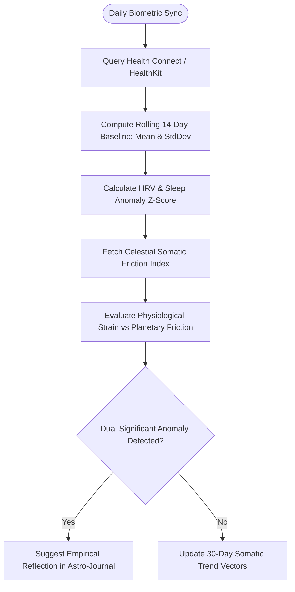

# Feature Specification 14: Biometric Sync & Somatic HRV Tracker

**Feature Code:** FEAT-14  
**Category:** Physiological Anchoring & Health Telemetry  
**Status:** Approved  

---

## 1. Description & User Value

This feature anchors the **Somatic / Physiological** domain of the 5-domain matrix directly to real-world biometric health telemetry:
* Integrates objective physical health metrics from **Android Health Connect** and **Apple HealthKit** (Heart Rate Variability - HRV RMSSD, Resting Heart Rate - RHR, and Deep Sleep duration).
* Computes mathematical correlation between real-time celestial transit friction and physiological nervous system autonomic stress without reliance on subjective perceptions.
* **Strict Local-First Architecture:** Raw biometric health telemetry is stored exclusively on the user's local device database (*Local SQLite*), safeguarding privacy.

---

## 2. Atomic Data Decomposition & Schema

### Local Database Entity: `biometric_daily_logs`
| Column | Data Type | Constraints | Description |
| :--- | :--- | :--- | :--- |
| `id` | `UUID` | Primary Key | Daily biometric record identifier. |
| `chart_id` | `UUID` | Foreign Key `saved_charts.id` | Profile owner identifier. |
| `log_date` | `DATE` | Not Null, Unique per `chart_id` | Calendar date of metric. |
| `hrv_rmssd_ms` | `FLOAT` | $> 0$ | Root Mean Square of Successive Differences (ms). |
| `resting_heart_rate`| `INTEGER` | $30 \le \text{RHR} \le 220$ | Resting heart rate (bpm). |
| `deep_sleep_minutes`| `INTEGER` | $\ge 0$ | Slow-wave restorative sleep (minutes). |
| `rem_sleep_minutes` | `INTEGER` | $\ge 0$ | Rapid Eye Movement sleep (minutes). |
| `somatic_z_score` | `NUMERIC(4,2)`| Nullable | Standardized deviation against rolling 14-day baseline. |
| `transit_somatic_score`| `NUMERIC(4,2)`| Nullable | Astrological transit somatic strain index for the date. |

---

## 3. Step-by-Step Computational Algorithm



### Mathematical Anomaly Formulation:
1. **HRV Baseline Deviation ($Z$-Score):**
   $$Z_{HRV} = \frac{\text{HRV}_{\text{today}} - \mu_{14}}{\sigma_{14}}$$
   *(Values $Z_{HRV} \le -1.5$ represent statistically significant autonomic stress).*

2. **Celestial Somatic Friction Index ($F_{\text{somatic}}$):**
   $$F_{\text{somatic}} = \sum_{k=1}^{M} W(\delta_k) \cdot I_k(\text{Somatic})$$
   Where $W(\delta) = 10.0 \times \exp(-1.4 \times \delta)$ is continuous exponential decay weighting.

---

## 4. Edge Cases & Privacy Protection

1. **Missing HRV Sensor:** Defaults gracefully to sleep duration and sleep stage proportions without failing.
2. **Local Processing Guarantee:** Biometric records are evaluated in-engine on the mobile device client; raw health parameters are never transmitted across the network.

---

## 5. JSON Contract Structure (Client Local Processing)

### Response Payload: `GET /local/analytics/somatic-correlation`
```json
{
  "chart_id": "c7a84091-28cf-4351-b8d1-580a6b7d532a",
  "period_days": 30,
  "correlation_coefficient_r": -0.612,
  "interpretation": "Moderate-strong negative correlation: drops in autonomic nervous recovery (low HRV) correlate consistently with high friction transits to natal 6th house ruler.",
  "significant_events": [
    {
      "date": "2026-08-28",
      "hrv_rmssd": 32.4,
      "z_score": -2.14,
      "dominant_sky_friction": "Transit Saturn Conjunction Natal Mars (Orb 0.12°)",
      "somatic_score": 8.84
    }
  ]
}
```
