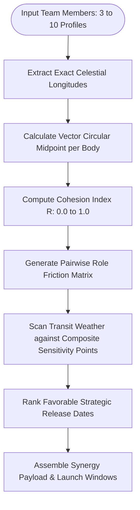

# Feature Specification 15: Team Composite & Group Synergy Matrix (B2B Dynamics)

**Feature Code:** FEAT-15  
**Category:** Multi-Entity Astrodynamics & B2B Strategy  
**Status:** Approved  

---

## 1. Description & User Value

This feature extends 1-on-1 synastry from [FEAT-09 (Multi-Archetype Compatibility)](./09_multi_archetype_compatibility.md) into **Group / Team Dynamics (3 to 10 Members)**:
* Generates a **Group Vector Midpoint Composite Chart** tailored for startups, executive boards, and specialized project teams.
* Quantitatively measures internal team friction and cohesion across distinct operating vectors: communication clarity (Mercury), executive authority/initiative (Sun & Mars), and stress resilience (Moon & Saturn).
* **Launch Window Scanner:** Scans forward-looking timelines (30–90 days) to identify optimal strategic windows (product releases, funding rounds, contract signing) with lowest aggregate team transit friction.

---

## 2. Atomic Parameter Decomposition

| Parameter | Data Type | Format / Units | Validation Range | Description |
| :--- | :--- | :--- | :--- | :--- |
| `team_name` | `string` | UTF-8 String | 1 to 100 characters | Name of organization/team. |
| `member_chart_ids` | `array` | UUID[] | $3 \le \text{members} \le 10$ | List of persisted chart profile identifiers. |
| `member_roles` | `map` | `UUID -> ENUM` | `LEAD`, `ENGINEERING`, `PRODUCT`, `OPERATIONS` | Functional role mapping. |
| `target_horizon_days`| `integer` | Calendar Days | $7 \le \text{days} \le 180$ | Forward timeline scan boundary. |

---

## 3. Vector Midpoint Computational Algorithm



### Circular Vector Formulations:
For $K$ team members with longitudinal angles $\theta_1, \theta_2, \dots, \theta_K$:
1. **Cartesian Coordinates:**
   $$X = \frac{1}{K} \sum_{i=1}^K \cos(\theta_i), \quad Y = \frac{1}{K} \sum_{i=1}^K \sin(\theta_i)$$

2. **Composite Longitude ($\bar{\theta}$):**
   $$\bar{\theta} = \text{atan2}(Y, X) \pmod{2\pi}$$

3. **Team Cohesion Metric ($R$):**
   $$R = \sqrt{X^2 + Y^2} \quad (0 \le R \le 1)$$
   * $R \ge 0.85$: High internal alignment and shared intuitive cadence.
   * $R \le 0.40$: High dispersion requiring explicit operational protocols.

---

## 4. Edge Cases

1. **Diametric Opposition Equidistance:** If symmetric vectors cancel to $(0,0)$, $R$ evaluates to 0 and the midpoint defaults to the primary project lead's cardinal axis.
2. **Team Roster Changes:** Adding or removing members dynamically updates vector midpoints while preserving historical project milestones.

---

## 5. JSON Contract Structure

### Request: `POST /api/v1/teams/synergy-analysis`
```json
{
  "team_name": "Antigravity Core Engineering",
  "member_chart_ids": [
    "c7a84091-28cf-4351-b8d1-580a6b7d532a",
    "f2b81092-12af-4819-a1d2-990a1b2c3d4e",
    "3c7719ab-8991-4e29-b631-1029384756ab"
  ],
  "scan_days_ahead": 60
}
```

### Response Body (`HTTP 200 OK`)
```json
{
  "status": "success",
  "team_name": "Antigravity Core Engineering",
  "overall_cohesion_index": 0.78,
  "communication_friction_risk": "LOW",
  "execution_alignment_score": 8.4,
  "optimal_launch_windows": [
    {
      "start_date": "2026-10-12",
      "end_date": "2026-10-16",
      "aggregate_friction_score": 1.2,
      "favorable_aspects": "Transit Jupiter Trine Team Composite Sun (Orb 0.3°)",
      "recommendation": "Lowest transit resistance period; optimal for public launch or key stakeholder negotiations."
    }
  ]
}
```
