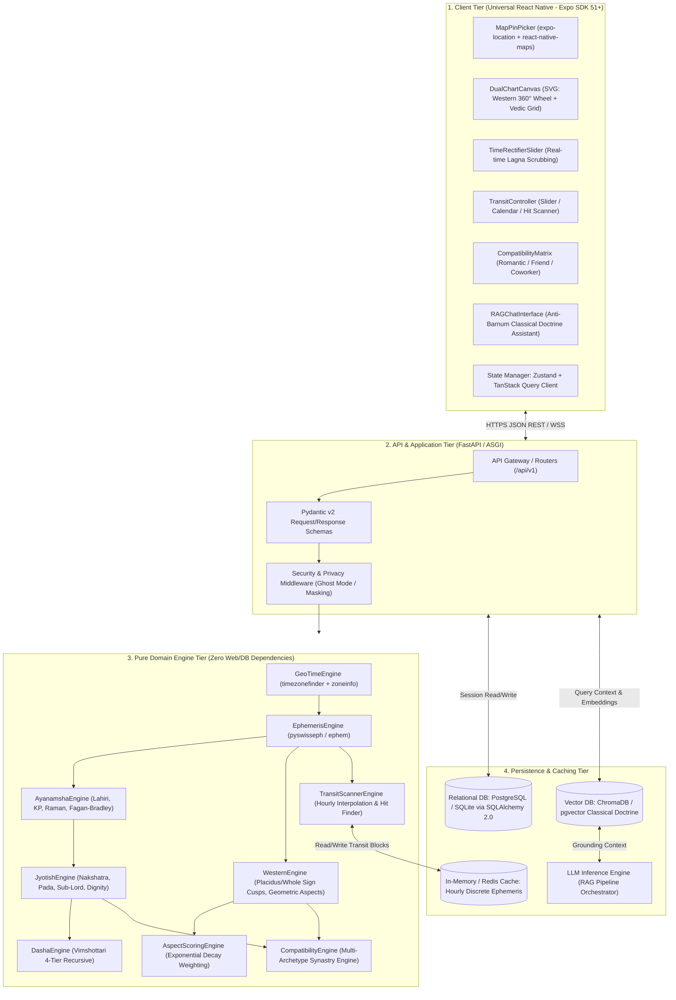

# Technical Design Document (TDD) - Part 1: System Architecture

**Document ID:** TDD-ASTRO-001  
**Version:** 1.0.0  
**Status:** Approved for Detailed Design  
**References:** PRD-ASTRO-001 (PRD v2.0.0), ADR 0001–0006  

---

## 1. Executive Summary & Design Philosophy

The **Astrology-Interpreter Engine** is designed as a high-precision, cross-platform astronomical and astrological computing system (supporting iOS, Android, and Web SPA). The architecture is constructed on **Clean Hexagonal Architecture** principles, strictly decoupling pure mathematical astronomical algorithms (*Domain Core*) from web frameworks, persistence layers, and external network services.

### Core Architectural Principles
1. **Strict Determinism:**
   Every computation in the *Domain Core* is a pure function: identical geographic coordinates, birth dates, and timestamps invariably produce bit-for-bit identical astronomical data matrices without pseudo-random variances.
2. **Dual-Core Ecliptic Separation:**
   Celestial bodies are computed in apparent ecliptic longitude coordinates. The Western (*Tropical*) and Indian (*Sidereal*) calculation pipelines are cleanly separated using an explicit Ayanamsha parameter (defaulting to Lahiri / Chitra Paksha) without state leakage (ADR-0004).
3. **Offline-First Geospatial Resolution:**
   Local civil timezones and historical Daylight Saving Time (DST) shifts are resolved 100% offline via in-process spatial polygon lookups, eliminating reliance on third-party geocoding web services (ADR-0003).
4. **Anti-Barnum Grounding:**
   Textual explanations are synthesized using a RAG (*Retrieval-Augmented Generation*) pipeline strictly bound to mathematically verified positions and authoritative classical literature, rejecting flattering or generic horoscopic statements.

---

## 2. System Topology & Architecture Diagram

The system adopts a high-performance **Modular Monolith** architecture with asynchronous request handling and multi-tiered caching:



---

## 3. Component Decomposition & Responsibilities

### 3.1 Client Tier (Universal Expo React Native)
* **MapPinPicker Component:** Interactive map UI enabling pinpoint coordinate selection to capture sub-meter geographic coordinates, eliminating the inaccuracy of city centroids.
* **DualChartCanvas Component:** SVG-based vector rendering engine producing:
  1. *Western Circular Wheel:* 360° continuous wheel with Placidus/Whole Sign houses and color-coded aspect chords (trine/sextile = harmony, square/opposition = tension).
  2. *Vedic Traditional Square:* South Indian fixed-sign and/or North Indian fixed-house diamond layouts.
* **TimeRectifierSlider Component:** Interactive control allowing users with uncertain birth times to scrub offsets ($\pm 30$ to $\pm 60$ minutes) and observe immediate recalculations of Lagna and house cusps.
* **TransitController Component:** Interactive time-travel suite providing a scrubbable *Time Slider*, *Calendar Heatmap*, and *Aspect Hit Scanner Form*.
* **State Management:** Zustand manages local UI and session state; TanStack Query manages server cache invalidation, deduplication, and background updates.

### 3.2 API & Application Tier (FastAPI)
* **Router & Controller Layer:** Exposes RESTful v1 endpoints (`/api/v1/chart`, `/api/v1/transit`, `/api/v1/compatibility`, `/api/v1/journal`, `/api/v1/chat`).
* **Validation Layer:** Enforces Pydantic v2 schemas with strict bounds on coordinates ($-90^\circ \le 	ext{lat} \le +90^\circ$, $-180^\circ \le 	ext{lon} \le +180^\circ$) and ISO-8601 UTC timestamps.
* **Privacy & Ghost Mode Middleware:** Intercepts outgoing data when Ghost Mode is enabled: truncates decimal precision for public views, masks sensitive birth timestamps, and disables nearby discovery beacons.

### 3.3 Pure Domain Engine Tier (Python)
Strictly independent of HTTP frameworks or ORMs:
* **`GeoTimeEngine`:**
  * Ingests $(Lat, Lon)$ coordinates.
  * Queries offline geospatial polygons via `timezonefinder.TimezoneFinder()`.
  * Returns canonical IANA timezone strings (e.g., `"Asia/Jakarta"`, `"America/New_York"`).
  * Converts civil local time to canonical UTC via `zoneinfo.ZoneInfo`, deterministically resolving historical DST shifts.
* **`EphemerisEngine` & `AyanamshaEngine`:**
  * Calculates apparent geocentric positions for Sun, Moon, Mercury, Venus, Mars, Jupiter, Saturn, Uranus, Neptune, Pluto, and True Rahu/Ketu.
  * Computes instantaneous daily motion speeds and sets retrograde flags.
  * Computes astronomical Ayanamsha at target Julian Date epochs (defaulting to Lahiri).
* **`AnglesAndHousesEngine`:**
  * Computes Greenwich Sidereal Time ($GST$) and Local Sidereal Time ($LST$).
  * Calculates RAMC, MC, and Ascendant (Lagna).
  * Generates 12 house cusps according to Placidus and Whole Sign house division algorithms.
* **`JyotishEngine` & `DashaEngine`:**
  * Maps longitudes to 27 Nakshatras ($13^\circ 20^\prime$), 4 Padas ($3^\circ 20^\prime$), and KP Sub-Lords.
  * Computes planetary dignity (Exaltation, Moolatrikona, Swakshetra, Debilitation, and *Panchadha Maitri* temporal friendship).
  * Recursively computes 4-tier Vimshottari Dasha periods (Mahadasha, Antardasha, Pratyantardasha, Sookshmadasha).
* **`WesternAspectEngine` & `AspectScoringEngine`:**
  * Calculates angular separation across major aspects: Conjunction ($0^\circ$), Opposition ($180^\circ$), Trine ($120^\circ$), Square ($90^\circ$), Sextile ($60^\circ$).
  * Applies continuous exponential decay weighting (ADR-0005):
    $$W(\delta) = 10.0 	imes \exp(-1.4 	imes \delta)$$
* **`TransitScannerEngine`:**
  * Interpolates transit positions from discrete hourly ephemeris cache blocks (ADR-0006).
  * Executes root-finding algorithms (bisection / Newton-Raphson) to locate exact aspect culmination dates ($0.00^\circ$ orb).
* **`CompatibilityEngine`:**
  * Evaluates synastry across three distinct archetypes: Romance, Friendship, and Business / Coworker.
  * Fully computes and returns all analytical dimensions for unknown / stranger profiles without stripping data.
* **`RAGDoctrineEngine`:**
  * Retrieves verified classical passages (*Brihat Parashara Hora Shastra*, *Jataka Parijata*, Ptolemaic texts) from vector embeddings matching user placements, supplying hallucination-free contextual explanations.

---

## 4. Project Directory Structure

```text
astrology-interpreter/
├── backend/
│   ├── app/
│   │   ├── api/
│   │   │   └── v1/
│   │   │       ├── endpoints/
│   │   │       │   ├── chart.py           # Full natal chart calculation endpoint
│   │   │       │   ├── geo.py             # Offline coordinate & timezone resolution
│   │   │       │   ├── transit.py         # Transit slider, calendar & hit scanner
│   │   │       │   ├── compatibility.py   # Multi-archetype synastry endpoint
│   │   │       │   ├── journal.py         # Empirical user event notes endpoint
│   │   │       │   ├── alerts.py          # Smart transit alert management
│   │   │       │   └── chat.py            # RAG chatbot endpoint
│   │   │       └── router.py              # API v1 route aggregator
│   │   ├── core/
│   │   │   ├── config.py                  # Pydantic BaseSettings & Environment Vars
│   │   │   ├── constants.py               # Zodiac, nakshatra & orb constants
│   │   │   └── exceptions.py              # Centralized domain & HTTP exception handlers
│   │   ├── engine/                        # DOMAIN CORE (Pure Mathematical Engine)
│   │   │   ├── geotime.py                 # TimezoneFinder & ZoneInfo resolution
│   │   │   ├── ephemeris.py               # Swiss Ephemeris / PyEphem interface
│   │   │   ├── ayanamsha.py               # Lahiri / KP precession calculations
│   │   │   ├── angles.py                  # Ascendant, MC, Placidus & Whole Sign cusps
│   │   │   ├── jyotish.py                 # Nakshatra, Pada, Sub-Lord, Dignity
│   │   │   ├── dasha.py                   # Recursive 4-tier Vimshottari engine
│   │   │   ├── aspects.py                 # Angular separation & exponential decay weighting
│   │   │   ├── transit_scanner.py         # Aspect hit finder & time-travel interpolator
│   │   │   ├── compatibility.py           # Multi-archetype synastry evaluator
│   │   │   └── rag_synthesizer.py         # Vector context builder & prompt generator
│   │   ├── db/
│   │   │   ├── base.py                    # SQLAlchemy declarative base
│   │   │   ├── session.py                 # Engine & SessionLocal factory
│   │   │   └── init_db.py                 # Schema initialization
│   │   ├── models/                        # SQLAlchemy 2.0 ORM models
│   │   │   ├── user.py                    # User & Account table
│   │   │   ├── chart.py                   # Saved chart profiles
│   │   │   ├── journal.py                 # Empirical journal entries
│   │   │   ├── alert.py                   # Transit alert configurations
│   │   │   └── transit_cache.py           # Discrete ephemeris cache table
│   │   ├── schemas/                       # Pydantic schemas
│   │   │   ├── chart.py
│   │   │   ├── transit.py
│   │   │   ├── compatibility.py
│   │   │   └── journal.py
│   │   └── services/                      # Orchestration services between DB & Engine
│   ├── tests/                             # Unit tests & golden ephemeris benchmarks
│   ├── pyproject.toml                     # Dependency management (Poetry/pip)
│   └── Dockerfile                         # Backend containerization
│
├── frontend/
│   ├── app/                               # Expo Router pages
│   │   ├── (tabs)/
│   │   │   ├── index.tsx                  # Dashboard: Dual Chart View
│   │   │   ├── transit.tsx                # Transit: Slider, Calendar, Scanner
│   │   │   ├── compatibility.tsx          # Compatibility: Friends/Coworkers/Romance
│   │   │   ├── journal.tsx                # Empirical Life Journal & Timeline
│   │   │   └── profile.tsx                # Profile & Privacy Ghost Mode Settings
│   │   ├── chart/
│   │   │   └── [id].tsx                   # Saved Chart Detail View
│   │   └── _layout.tsx                    # Root layout & providers
│   ├── src/
│   │   ├── api/                           # Axios client & TanStack Query hooks
│   │   ├── components/
│   │   │   ├── charts/                    # SVG Western Wheel & Vedic Grid renderers
│   │   │   ├── controls/                  # Time Rectifier Slider & Transit Scrubbers
│   │   │   ├── maps/                      # Map Pin Drop Selector
│   │   │   └── common/                    # Button, Card, Modal, Typography
│   │   ├── store/                         # Zustand global state (session, theme, prefs)
│   │   └── types/                         # TypeScript interfaces matching API schemas
│   ├── package.json
│   └── app.json                           # Expo configuration
│
└── docs/                                  # Documentation suite (id & en)
    ├── id/
    │   └── tdd/
    │       ├── 01_arsitektur_sistem.md
    │       ├── 02_sequence_diagram.md
    │       ├── 03_adr.md
    │       └── 04_penanganan_kegagalan_dan_skalabilitas.md
    └── en/
        └── tdd/
            ├── 01_system_architecture.md  # THIS DOCUMENT
            ├── 02_sequence_diagrams.md    # (Step 2)
            ├── 03_adr.md                  # (Step 3)
            └── 04_failure_and_scalability.md # (Step 4)
