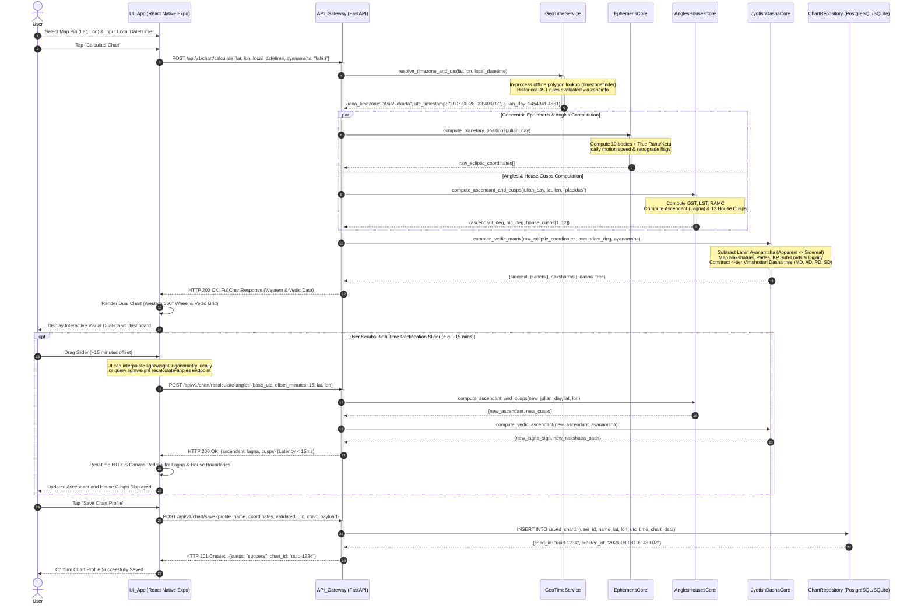

# Sequence Diagram 01: Complete Natal Chart Calculation & Birth Time Rectification Slider

**Document ID:** SD-ASTRO-001  
**Related Features:** Feature 1 (Dual-Method Birth Chart), Feature 2 (Dual Visual Chart), Feature 3 (Chart Storage), Feature 4 (Rectification Slider)  
**Status:** Approved  

---

## 1. Scenario Description

This sequence diagram details the end-to-end execution flow when:
1. The user inputs their birth date, approximate time, and drops a precise map pin $(Lat, Lon)$.
2. The system resolves local civil IANA timezones and converts the timestamp to canonical UTC 100% offline.
3. The *Domain Core* calculates astronomical data in parallel across Western (*Tropical*) and Indian (*Sidereal* Lahiri) frameworks.
4. Users with uncertain birth times scrub the *Rectification Slider* interactively on screen to observe instantaneous shifting of Ascendant (Lagna) degrees and house cusps.
5. The validated profile is permanently stored in the repository.

---

## 2. System Participants

* **User:** End user interacting with the mobile/web interface.
* **UI_App (Expo React Native Client):** Client interface (Input Form, Pin-drop Map, SVG Canvas, Time Slider).
* **API_Gateway (FastAPI Router):** RESTful endpoints `/api/v1/chart/calculate` and `/api/v1/chart/save`.
* **GeoTimeService:** In-process offline spatial polygon lookup via `timezonefinder` and historical DST resolution via `zoneinfo`.
* **EphemerisCore:** High-precision astronomical library (`pyswisseph` / `ephem`) calculating apparent geocentric positions.
* **AnglesHousesCore:** Algorithmic solver for GST, LST, RAMC, Midheaven, Ascendant, and House Cusps (Placidus & Whole Sign).
* **JyotishDashaCore:** Mapping engine for Nakshatras, Padas, KP Sub-Lords, Dignity, and 4-tier Vimshottari Dasha trees.
* **ChartRepository (Database):** Persistent PostgreSQL / SQLite storage managed via SQLAlchemy 2.0.

---

## 3. Sequence Diagram (Mermaid)



---

## 4. Edge Case Handling

| Edge Case | Risk | Mitigation Mechanism |
| :--- | :--- | :--- |
| **Extreme Latitudes ($>66^\circ$)** | Placidus house division math breaks down (intercepted cusps). | Automatic fallback or user prompt to transition to *Whole Sign* or *Porphyry* house systems with explicit diagnostic messaging. |
| **DST Transition Ambiguity** | Fallback hour overlap results in dual valid UTC timestamps. | `zoneinfo` utilizes `fold=0` / `fold=1` disambiguation flags to reliably separate pre- and post-transition times. |
| **High-Frequency Slider Scrubbing** | Request flooding over mobile networks. | UI throttles/debounces network calls (100 ms) while lightweight local trigonometric math updates canvas angles locally at 60 FPS. |
| **Newborn Infant Profiles (Real-Time Julian Date)** | Future $\Delta T$ (difference between TT and UT) not yet published definitively. | Use official NASA/IERS polynomial approximations for recent $\Delta T$ values to preserve sub-arcsecond precision. |

---

## 5. Contract Data Structure

### Request: `POST /api/v1/chart/calculate`
```json
{
  "latitude": -6.175392,
  "longitude": 106.827153,
  "local_datetime": "2007-08-29T06:40:00",
  "ayanamsha": "lahiri",
  "house_system": "placidus"
}
```

### Response: `HTTP 200 OK`
```json
{
  "status": "success",
  "meta": {
    "iana_timezone": "Asia/Jakarta",
    "utc_timestamp": "2007-08-28T23:40:00Z",
    "julian_day": 2454341.486111,
    "ayanamsha_value": 23.9631
  },
  "western": {
    "ascendant": 156.421,
    "midheaven": 66.184,
    "houses": [156.421, 185.12, 214.33, 246.18, 278.45, 308.12, 336.42, 5.12, 34.33, 66.18, 98.45, 128.12],
    "planets": {
      "Sun": {"longitude": 155.12, "speed": 0.965, "is_retrograde": false, "house": 12},
      "Moon": {"longitude": 342.48, "speed": 13.12, "is_retrograde": false, "house": 7}
    }
  },
  "vedic": {
    "lagna": {"longitude": 132.458, "sign": "Leo", "nakshatra": "Purva Phalguni", "pada": 1},
    "planets": {
      "Sun": {"longitude": 131.157, "sign": "Leo", "nakshatra": "Magha", "pada": 4, "dignity": "Swakshetra"},
      "Moon": {"longitude": 318.517, "sign": "Aquarius", "nakshatra": "Shatabhisha", "pada": 4, "dignity": "Neutral"}
    },
    "vimshottari_dasha": {
      "current_mahadasha": "Saturn",
      "current_antardasha": "Saturn",
      "current_pratyantardasha": "Mercury"
    }
  }
}
```
