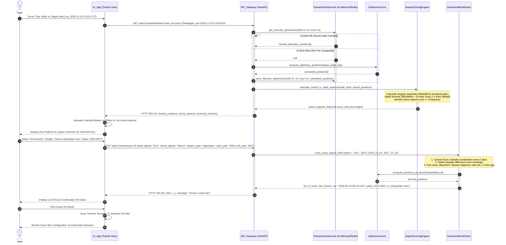

# Sequence Diagram 02: Time-Traveling Transit Engine & Aspect Hit Scanner

**Document ID:** SD-ASTRO-002  
**Related Features:** Feature 5 (Time-Traveling Transit Engine: Slider, Calendar, Aspect Hit Scanner)  
**Status:** Approved  

---

## 1. Scenario Description

This sequence diagram details two fundamental operations of the transit system:
1. **Time-Traveling Navigation (Slider & Calendar):** The user navigates backward or forward in time. The system queries the *Hourly Discrete Transit Cache* (ADR-0006) to retrieve planetary positions instantaneously with minimal CPU overhead, subsequently evaluating aspects against the user natal chart via exponential decay weighting (ADR-0005).
2. **Key Moment Finder (*Aspect Hit Scanner*):** The user selects a specific transit event (e.g., *"Transit Saturn Opposition Natal Sun"*). The system invokes a numerical root-finding solver (bisection / Newton-Raphson) to locate the exact date and second where the angular separation hits peak culmination ($0.000^\circ$ orb), smoothly updating the UI timeline directly to that milestone.

---

## 2. System Participants

* **User:** End user exploring transit timelines or seeking specific astrological milestones.
* **UI_App (Expo React Native):** `TransitController` component (Scrubber Slider, Heatmap Calendar, Scanner form).
* **API_Gateway (FastAPI):** Endpoints `/api/v1/transit/timeline` and `/api/v1/transit/scan-hit`.
* **TransitCacheService:** In-memory / Redis or database store managing discrete hourly planetary coordinates.
* **EphemerisCore:** High-precision `pyswisseph` astronomical solver computing geocentric positions and speeds.
* **AspectScoringEngine:** Exponential decay weighting algorithm $W(\delta) = 10.0 	imes \exp(-1.4 	imes \delta)$.
* **NumericalRootSolver:** Interpolative bisection algorithm locating minimum orb culmination points.

---

## 3. Sequence Diagram (Mermaid)



---

## 4. Edge Case Handling

| Edge Case | Risk | Mitigation Mechanism |
| :--- | :--- | :--- |
| **Triple Hit via Retrograde Loops** | Outer planets (Saturn/Jupiter) transit an exact point three times (direct $
ightarrow$ retrograde $
ightarrow$ direct). | The solver detects daily motion velocity sign flips and aggregates the three hits into a cohesive *"Tri-Hit Transit Cycle"*. |
| **Excessively Wide Scan Window (>50 years)** | Backend request timeout from long calculation loops. | Impose a maximum scan window of 5 years per single API call, returning continuation tokens for subsequent pagination. |
| **Circular Coordinate Discontinuity ($360^\circ \leftrightarrow 0^\circ$)** | Angle differences jumping from $359.9^\circ$ to $0.1^\circ$ (modular wrap-around). | Use minimal circular difference calculation: $\Delta	heta = \min(|	heta_1 - 	heta_2|, 360^\circ - |	heta_1 - 	heta_2|)$. |

---

## 5. Contract Data Structure

### Request: `POST /api/v1/transit/scan-hit`
```json
{
  "chart_id": "c7a84091-28cf-4351-b8d1-580a6b7d532a",
  "transit_body": "Saturn",
  "natal_body": "Sun",
  "aspect_angle": 180.0,
  "date_range": {
    "start_utc": "2026-01-01T00:00:00Z",
    "end_utc": "2027-12-31T23:59:59Z"
  }
}
```

### Response: `HTTP 200 OK`
```json
{
  "status": "success",
  "total_hits_found": 1,
  "hits": [
    {
      "hit_number": 1,
      "exact_utc": "2026-08-14T03:22:15Z",
      "transit_body_longitude": 335.1204,
      "natal_body_longitude": 155.1200,
      "exact_aspect_angle": 180.0004,
      "orb": 0.0004,
      "is_retrograde": true,
      "weight_score": 10.0,
      "affected_domains": ["Career/Situational", "Mental/Cognitive"]
    }
  ]
}
```
