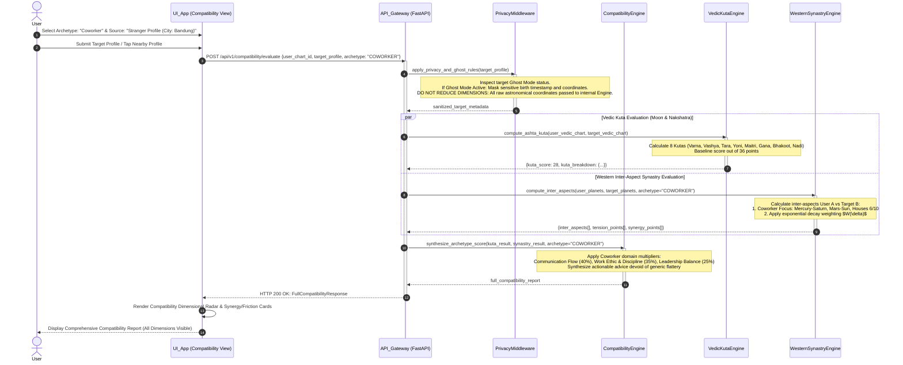

# Sequence Diagram 04: Multi-Archetype Compatibility & Stranger Profiles

**Document ID:** SD-ASTRO-004  
**Related Features:** Feature 9 (Multi-Archetype Compatibility), Feature 10 (Privacy Controls & Ghost Mode)  
**Status:** Approved  

---

## 1. Scenario Description

This sequence diagram illustrates the relational compatibility (*synastry*) pipeline between two chart profiles:
1. The user selects one of three distinct relational archetypes: **Romance**, **Friendship**, or **Coworker / Business Partner**.
2. The user ingests a partner profile from Phone Contacts, Nearby Proximity, or an **Unknown / Stranger Profile**.
3. The system enforces **Ghost Mode & Privacy Rules**: if the target profile has Ghost Mode enabled, sensitive birth dates, exact timestamps, and physical addresses are masked. However, **all analytical dimensions and compatibility metrics are calculated and displayed in full without omitting any dimensions** (explicit user requirement).
4. The *CompatibilityEngine* computes inter-chart Western aspects, Vedic Ashta Kuta scores (out of 36 points), and archetype-specific synergy matrices (e.g., Mercury-Saturn focus for coworkers).

---

## 2. System Participants

* **User:** End user initiating the compatibility check.
* **UI_App (Expo React Native):** `CompatibilityMatrix` UI and target profile ingestion selector.
* **API_Gateway (FastAPI):** Endpoint `/api/v1/compatibility/evaluate`.
* **PrivacyMiddleware:** Enforces privacy masking, coordinate fuzzing, and Ghost Mode sanitization.
* **CompatibilityEngine:** Multi-dimensional synastry engine computing composite scores.
* **VedicKutaEngine:** Computes traditional 8 Kutas (Varna, Vashya, Tara, Yoni, Graha Maitri, Gana, Bhakoot, Nadi).
* **WesternSynastryEngine:** Computes inter-chart planetary aspect chords with continuous exponential decay weighting.

---

## 3. Sequence Diagram (Mermaid)



---

## 4. Edge Case Handling

| Edge Case | Risk | Mitigation Mechanism |
| :--- | :--- | :--- |
| **Stranger Profile with Unknown Exact Time** | Ascendant and house boundaries for the partner cannot be definitively established. | Fall back to Solar/Lunar house frameworks (*Surya/Chandra Lagna*) as secondary house references, with transparent diagnostic messaging indicating moon-derived houses. |
| **Location Data Exploitation (*Stalking*)** | Malicious users weaponizing Nearby discovery to track precise user coordinates. | Physical GPS coordinates are strictly fuzzed (*geohash jitter*) to a minimum 500-meter radius; exact street addresses are never broadcast. |
| **Romantic Archetype Bias Bleeding into Coworkers** | Algorithm surfacing romantic advice in a professional workplace context. | Isolate archetype weighting logic: in the Coworker archetype, Venus-Mars romantic sexual tension vectors are weighted to zero, focusing purely on Mercury-Saturn-Mars-Jupiter collaboration dynamics. |

---

## 5. Contract Data Structure

### Request: `POST /api/v1/compatibility/evaluate`
```json
{
  "user_chart_id": "c7a84091-28cf-4351-b8d1-580a6b7d532a",
  "target_type": "STRANGER",
  "target_payload": {
    "city_name": "Bandung",
    "approximate_date": "2005-03-15",
    "is_ghost_mode": true
  },
  "archetype": "COWORKER"
}
```

### Response: `HTTP 200 OK`
```json
{
  "status": "success",
  "archetype": "COWORKER",
  "profile_display": {
    "alias": "Anonymous User (Bandung)",
    "birth_details_masked": true
  },
  "overall_score": 78,
  "dimensions": {
    "communication_flow": {"score": 85, "verdict": "High Rapport (Mercury Trine Mercury)"},
    "work_ethic_discipline": {"score": 72, "verdict": "Structured (Saturn Sextile Mars)"},
    "ego_and_leadership": {"score": 68, "verdict": "Moderate Friction (Sun Square Mars)"}
  },
  "vedic_ashta_kuta": {
    "total_points": 26,
    "max_points": 36,
    "graha_maitri": 5,
    "gana_kuta": 6
  },
  "actionable_guidance": "Communication flow is highly conceptual and agile. Clearly delineate task ownership and leadership responsibilities to avoid friction under high-pressure delivery deadlines."
}
```
