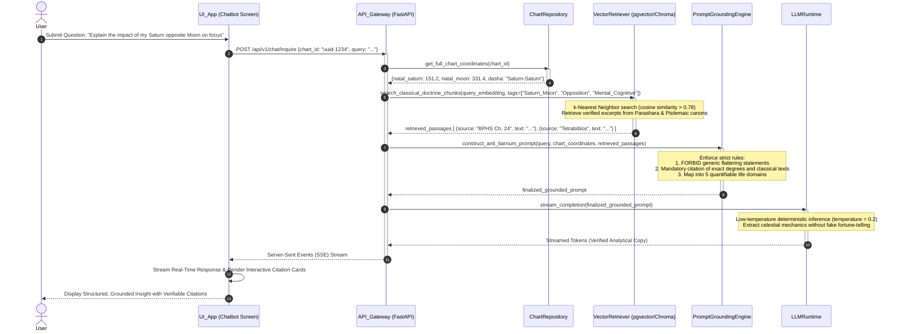

# Sequence Diagram 05: Doctrine-Grounded AI Chatbot with RAG

**Document ID:** SD-ASTRO-005  
**Related Features:** Feature 11 (AI Chatbot with RAG / Anti-Barnum Grounding)  
**Status:** Approved  

---

## 1. Scenario Description

This sequence diagram details the operational flow of the **RAG (Retrieval-Augmented Generation)** AI Chatbot:
1. The user asks an in-depth astrological question (e.g., *"How does my natal Saturn opposition Moon affect my cognitive endurance and focus?"*).
2. The system retrieves exact mathematical planetary coordinates and active Dasha cycles from the database.
3. The *Vector Retrieval Service* runs semantic similarity queries across vector stores of verified classical doctrines (*Brihat Parashara Hora Shastra*, *Phaladeepika*, Ptolemaic texts).
4. The *Prompt Assembler* constructs a grounded prompt combining exact chart metrics and classical passages bound to strict Anti-Barnum system rules.
5. The LLM engine synthesizes an objective, verifiable explanation with **0% Hallucination**.

---

## 2. System Participants

* **User:** End user interacting with the chat interface.
* **UI_App (Expo React Native):** `RAGChatInterface` component (streaming chat window & source citation viewer).
* **API_Gateway (FastAPI):** Streaming endpoint `/api/v1/chat/inquire`.
* **ChartRepository:** Database store supplying exact birth chart coordinates.
* **VectorRetriever (ChromaDB / pgvector):** Semantic similarity search engine matching classical texts.
* **PromptGroundingEngine:** Orchestrator enforcing Anti-Barnum rules and system prompt guardrails.
* **LLMRuntime (Gemini API / Local LLM):** Language model runtime executing temperature-constrained inference.

---

## 3. Sequence Diagram (Mermaid)



---

## 4. Edge Case Handling

| Edge Case | Risk | Mitigation Mechanism |
| :--- | :--- | :--- |
| **Out-of-Domain Non-Astrological Queries** | LLM providing unsolicited financial/medical diagnoses. | *Guardrail Filter*: Prompt rules immediately detect non-astrological questions and return neutral safety redirects. |
| **Demands for Definitive Fortune-Telling ("When will I get rich?")** | User seeking reckless predictive claims. | *Barnum Rejection Handler*: Programmatically intercepts fortune-telling prompts, redirecting focus to disciplined cycle dynamics and objective tension aspects. |
| **Low Vector Similarity Score ($<0.65$)** | Hallucination due to missing source doctrine. | If cosine similarity is below threshold, the engine explicitly declines to speculate and transparently notes that classical texts offer no direct validation. |

---

## 5. Contract Data Structure

### Request: `POST /api/v1/chat/inquire`
```json
{
  "chart_id": "c7a84091-28cf-4351-b8d1-580a6b7d532a",
  "query": "How does my natal Saturn opposition Moon affect my cognitive endurance and focus?",
  "stream": true
}
```

### Response Stream: `Server-Sent Events (SSE)`
```text
event: token
data: {"text": "According to celestial mechanics, your natal Saturn at 151°12' (Leo) forms an exact 180°12' opposition with your Moon at 331°24' (Aquarius)..."}

event: citation
data: {"source": "Brihat Parashara Hora Shastra, Chapter on Planetary Aspects", "chapter": 24, "doctrine_context": "Saturn aspecting the Moon induces heightened vigilance, endurance under cognitive friction..."}

event: complete
data: {"finished": true}
```
