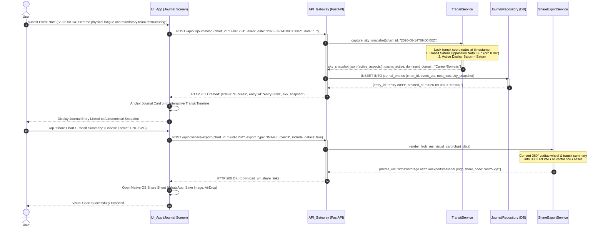

# Sequence Diagram 06: Empirical Journal Logging & Share Feature

**Document ID:** SD-ASTRO-006  
**Related Features:** Feature 7 (Empirical Astro-Journal), Feature 8 (Share Feature)  
**Status:** Approved  

---

## 1. Scenario Description

This sequence diagram illustrates personal event logging anchored to celestial mechanics:
1. The user logs a real-world lived event on a specific date and time (e.g. acute physical fatigue, promotion, major interpersonal friction).
2. The system captures and locks an astronomical snapshot (transit positions, active aspects with exponential weights $W(\delta)$, and current Dasha hierarchy) at that exact moment.
3. The journal entry persists permanently linked to the transit timeline.
4. The user exports or shares high-resolution chart graphics or transit cards (PNG/SVG or secure link).

---

## 2. System Participants

* **User:** End user recording empirical observations or sharing charts.
* **UI_App (Expo React Native):** Journal Screen & native Share action sheet.
* **API_Gateway (FastAPI):** Endpoints `/api/v1/journal/log` and `/api/v1/share/export`.
* **TransitService:** Astronomical provider computing sky snapshots and active aspect weights.
* **JournalRepository (Database):** PostgreSQL / SQLite `journal_entries` table.
* **ShareExportService:** High-resolution SVG/PNG renderer and deep-link generator.

---

## 3. Sequence Diagram (Mermaid)



---

## 4. Edge Case Handling

| Edge Case | Risk | Mitigation Mechanism |
| :--- | :--- | :--- |
| **Historical Childhood Event Logging (e.g., Year 1995)** | Missing hourly cache for distant past dates. | *On-Demand Ephemeris Execution*: Seamlessly invokes `pyswisseph` directly to compute past coordinates on the fly. |
| **Overly Large File Export** | Failure during sharing over messaging platforms. | Image optimization pipeline enforcing aggressive PNG palette quantization (target $\le 2\text{ MB}$ per card). |
| **Private Journal Data Exposure** | Sensitive personal diary notes leaking when sharing charts publicly. | Public export templates strictly exclude freeform user journal text by default, exposing only pure celestial geometry and transit metrics. |

---

## 5. Contract Data Structure

### Request: `POST /api/v1/journal/log`
```json
{
  "chart_id": "c7a84091-28cf-4351-b8d1-580a6b7d532a",
  "event_date": "2026-08-14T09:00:00Z",
  "note": "Experienced acute physical exhaustion and major structural demands at work.",
  "subjective_tags": ["Work", "Fatigue", "Restructure"]
}
```

### Response: `HTTP 201 Created`
```json
{
  "status": "success",
  "entry_id": "8b9e6c2d-88f1-432a-bc91-912837264819",
  "anchored_astronomy": {
    "target_utc": "2026-08-14T09:00:00Z",
    "primary_transit": "Saturn Opposition Sun (Orb 0.04°)",
    "active_dasha": "Saturn-Saturn",
    "affected_domains": ["Career/Situational", "Somatic/Physiological"]
  }
}
```
