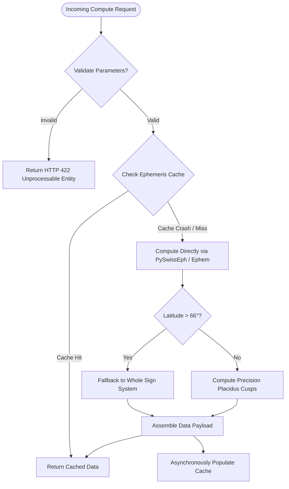

# Technical Design Document (TDD) - Part 4: Failure Handling & Fault Tolerance

**Document ID:** TDD-ASTRO-004  
**Version:** 1.0.0  
**Status:** Approved  
**References:** PRD-ASTRO-001, ADR 0001–0008  

---

## 1. Resilience Philosophy

The **Astrology-Interpreter** system is engineered on principles of **Graceful Degradation** and **Zero Single Point of Failure (SPOF)**. Failures in non-core external dependencies (such as cloud LLM endpoints or push notification gateways) must never compromise core astronomical mathematical calculations.

---

## 2. Failure Taxonomy & Mitigation Matrix

| Failure Domain | Failure Mode | Impact | Mitigation Pattern |
| :--- | :--- | :---: | :--- |
| **Ephemeris Engine** | Trigonometric singularity at polar latitudes ($>66^\circ$) during Placidus house division. | Medium | *Automatic House Fallback*: If Placidus cusp calculation fails (ecliptic parallel to horizon), the engine automatically falls back to *Whole Sign* house division with status `DEGRADED_HOUSE_FALLBACK` and diagnostic messaging. |
| **Ephemeris Engine** | Date inputs beyond Swiss Ephemeris coverage ($< 5401\text{ BCE}$ or $> 5402\text{ CE}$). | High | *Input Boundary Guard*: Pydantic schemas enforce a safe epoch window between 1800 and 2100 CE to guarantee sub-arcsecond ($0.001^\circ$) precision. |
| **Geospatial & Time** | Coordinates located in open maritime waters lacking official IANA timezone polygons (`timezonefinder` returns `None`). | Low | *Nautical Timezone Fallback*: Calculate solar maritime timezone based on longitude: $\text{Offset} = \text{round}(Lon / 15^\circ)$, returning `Etc/GMT[±X]`. |
| **Geospatial & Time** | Civil time ambiguity when clocks are set back during Daylight Saving Time (DST) transitions. | Medium | *Deterministic DST Disambiguation*: Default to `fold=0` (pre-transition standard time) with an explicit `is_dst_fold` flag allowing users to select post-transition time. |
| **Caching Layer** | Redis / In-Memory cache crashes or encounters out-of-memory errors. | Low | *Fail-Safe Bypass*: The application catches cache connection errors and falls back directly to pure in-process astronomical computation. Latency increases by $\sim 20\text{ ms}$, but service remains 100% operational. |
| **Database RDBMS** | PostgreSQL connection pool saturation under peak burst loads. | High | *Connection Pooler & Circuit Breaker*: SQLAlchemy configured with pool size 20, max overflow 30, with PgBouncer connection multiplexing. |
| **AI RAG Pipeline** | External LLM provider returns Rate Limit (HTTP 429) or Timeout (HTTP 504). | Medium | *Exponential Backoff & Fallback Engine*: 3 retries with jitter ($1\text{s}, 2\text{s}, 4\text{s}$). Upon persistent exhaustion, fallback to a deterministic static classical doctrine matrix (*Deterministic Doctrine Fallback*). |
| **AI RAG Pipeline** | Vector similarity score for classical literature falls below threshold ($< 0.65$). | Critical | *Anti-Hallucination Guardrail*: System programmatically refuses to speculate and informs the user that classical scriptures provide no direct validation for the queried pattern. |
| **Push Notification** | Expired device push token or user uninstalls app. | Low | *Stale Token Deactivation*: Worker catches `UNREGISTERED` errors from FCM/APNs and deactivates the corresponding token record in the database. |

---

## 3. Resilience Architecture Flow

---

## 4. Disaster Recovery & Data Integrity

1. **Database Backup Strategy:**
   * *Point-In-Time Recovery (PITR)* utilizing PostgreSQL Write-Ahead Logs (WAL) streamed to detached cloud object storage every 10 minutes.
   * *Daily Full Snapshots* executed at 02:00 UTC with 30-day retention policies.
2. **Health Check & Self-Healing Endpoints:**
   * `/healthz/live`: Validates that the FastAPI ASGI server process is alive.
   * `/healthz/ready`: Verifies database connectivity, Swiss Ephemeris data files (`.se1`), and Vector DB index availability.
   * Orchestration platforms (Docker/Kubernetes) automatically restart unhealthy containers after 3 consecutive failed health probes.
