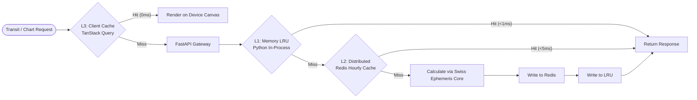

# Technical Design Document (TDD) - Part 5: Scalability & Performance Architecture

**Document ID:** TDD-ASTRO-005  
**Version:** 1.0.0  
**Status:** Approved  
**References:** PRD-ASTRO-001, ADR 0001–0008  

---

## 1. Workload Profiling

The astrological calculation platform exhibits three distinct workload characteristics:
1. **CPU-Bound (Ephemeris & Aspect Geometry):** Computing apparent planetary positions, bisection root-finding in the *Aspect Hit Scanner*, and Placidus house division involves high-density floating-point operations.
2. **I/O-Bound (AI RAG & Push Notifications):** Vector similarity retrieval across classical scriptures and executing batch dispatch for millions of daily transit alerts.
3. **Memory-Bound (Offline Geospatial Polygons):** In-process spatial tree structures of `timezonefinder` reside directly in server RAM to guarantee lookup latencies $\le 10\text{ ms}$.

---

## 2. 3-Tier Caching Architecture

To guarantee end-to-end API response latencies below $150\text{ ms}$ under concurrent global traffic, the system implements a layered multi-tier caching topology:

* **Level 1 (In-Process LRU Cache):**
  Utilizes `functools.lru_cache(maxsize=16384)` to store common Julian Date epochs, annual Ayanamsha precession offsets, and trigonometric lookup tables.
* **Level 2 (Distributed Redis Cache - ADR-0006):**
  Stores discrete hourly ephemeris celestial coordinate blocks. An entire calendar year requires:
  $$365.25 \times 24 = 8,766 \text{ hours} \times 1\text{ KB} \approx 8.76\text{ MB RAM}$$
  The entire 21st-century celestial timeline (2000–2100 CE) can comfortably reside in Redis RAM using only $\sim 876\text{ MB}$.
* **Level 3 (Client-Side Persistent Cache):**
  TanStack Query on Expo mobile/web caches calculated natal charts locally with indefinite *staleTime* (*immutable birth charts*), completely eliminating redundant network calls for previously viewed charts.

---

## 3. Horizontal Scaling & Statelessness

1. **Stateless Compute Nodes:**
   FastAPI compute workers maintain zero session state. Every incoming request carries all necessary parameters or references persistent `chart_id` records. Compute pods scale out automatically via Kubernetes Horizontal Pod Autoscaler (HPA) when average CPU utilization exceeds $70\%$.
2. **Worker Concurrency Tuning:**
   FastAPI container images launch with Uvicorn workers behind Gunicorn utilizing the production standard:
   $$\text{Workers} = (2 \times \text{vCPU}) + 1$$
3. **Background Worker Isolation:**
   Daily batch scans for *Smart Transit Alerts* are completely isolated from interactive HTTP API pods, managed via dedicated worker queues (Celery / ARQ backed by Redis) to ensure zero impact on end-user response times.

---

## 4. Database Scaling & Partitioning Strategy

1. **Time-Range Partitioning:**
   The `journal_entries` and `alert_delivery_logs` tables are partitioned by calendar year (`PARTITION BY RANGE (event_utc)`), bounding B-tree index depths and preserving $O(\log N)$ query performance as history grows.
2. **Spatial Indexing for Nearby User Discovery:**
   Utilizes **PostGIS GIST** indexes on the `geom_point` column for proximity discovery, resolving $\le 5\text{ km}$ radius queries within $\le 5\text{ ms}$.
3. **Read Replicas:**
   Heavy read operations (such as multi-decade transit timeline scans and journal lookups) are routed to *PostgreSQL Read Replicas*, leaving the primary database instance dedicated to low-latency chart saves and user profile writes.
