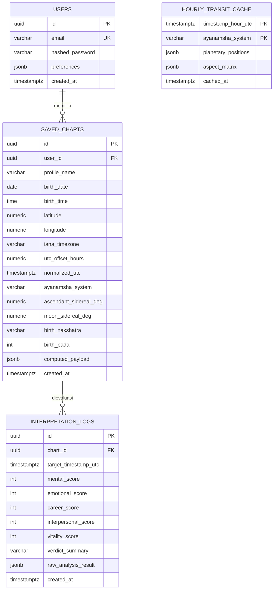

# Skema Basis Data & Model Data

**Target:** PostgreSQL 16+ (Produksi) / SQLite 3 (Dev) | **ORM:** SQLAlchemy 2.0

---

## 1. Diagram Relasi Entitas (ERD)



---

## 2. Indeks Esensial

```sql
CREATE INDEX idx_saved_charts_user_id ON saved_charts(user_id);
CREATE INDEX idx_saved_charts_lat_lon ON saved_charts(latitude, longitude);
CREATE UNIQUE INDEX uq_user_chart_name ON saved_charts(user_id, profile_name);
CREATE INDEX idx_hourly_transit_lookup ON hourly_transit_cache(timestamp_hour_utc, ayanamsha_system);
CREATE INDEX idx_interpretation_timeline ON interpretation_logs(chart_id, target_timestamp_utc DESC);
```
