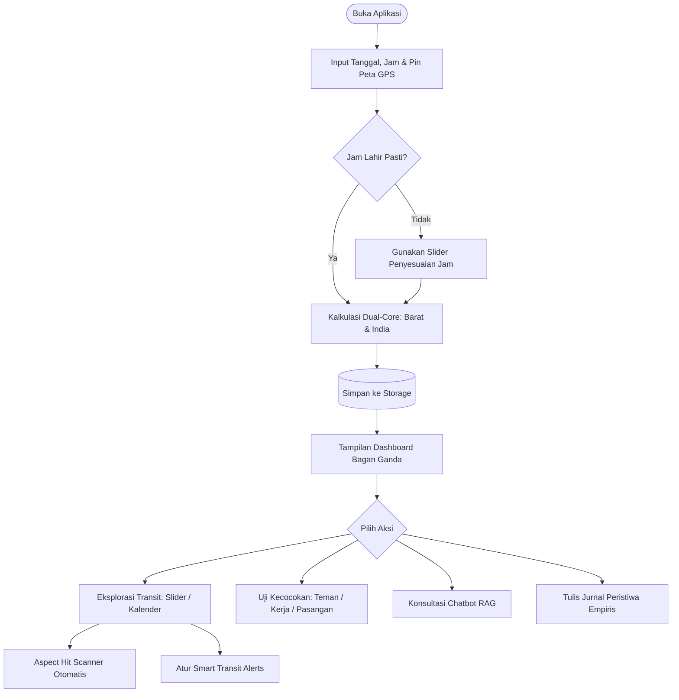

# Product Requirements Document (PRD)

**Nama Produk:** Astrology-Interpreter Engine & Universal Platform  
**Dokumen ID:** PRD-ASTRO-001  
**Versi:** 2.0.0  
**Status:** Siap Diimplementasikan (*Approved for Implementation*)  

---

## 1. Konteks & Masalah (Why)

### 1.1 Pernyataan Masalah (*Problem Statement*)
1. **Inakurasi Geospatial & Manipulasi Koordinat:** Sebagian besar aplikasi astrologi komersial hanya menggunakan titik tengah kota (*city centroid*), mengabaikan koordinat fisik tempat lahir (bujur/lintang presisi). Akibatnya, derajat Ascendant (Lagna) dan batas rumah (*house cusps*) meleset hingga hitungan derajat.
2. **Eksploitasi Efek Barnum / Forer:** Industri aplikasi astrologi dipenuhi oleh ramalan manis generik (*flattery bias*) dan kalimat abu-abu yang bisa cocok untuk siapa saja. Tidak ada kausalitas ilmiah antara posisi astronomis nyata dengan interpretasi yang diberikan.
3. **Fragmentasi Paradigma (Barat vs India):** Pengguna terpaksa menggunakan dua aplikasi terpisah karena jarang ada platform yang menyajikan Astrologi Barat (*Tropical*) dan Astrologi India (*Vedic/Sidereal*) secara berdampingan dengan kedalaman komputasi yang setara.
4. **Ketiadaan Validasi Empiris:** Pengguna tidak memiliki alat untuk menguji kebenaran astrologi secara empiris terhadap peristiwa nyata hidup mereka sendiri.

### 1.2 Nilai Bisnis & Urgensi (*Business Value*)
* **Diferensiasi Pasar yang Radikal:** Memposisikan diri sebagai platform *"No-Bullshit Astrology"* yang berbasis data presisi dan menolak pembodohan ramalan generik.
* **Retensi Tinggi melalui Pembuktian Nyata:** Fitur jurnal empiris dan pelacak transit bolak-balik waktu mengubah pengguna pasif menjadi pengkaji aktif atas pola hidup mereka sendiri.
* **Pasar Luas Lintas Tradisi:** Menjangkau komunitas astrologi psikologis Barat sekaligus praktisi Jyotish India dalam satu platform terpadu.

---

## 2. Tujuan & Metrik Sukses (Goals & KPIs)

### 2.1 Tujuan Utama (*Primary Goals*)
* Membangun engine komputasi astrologi lintas platform (Mobile & Web) yang deterministik, presisi sub-detik busur, bebas bias Barnum, dan mampu memetakan dinamika transit masa lalu, masa kini, serta masa depan.

### 2.2 Indikator Keberhasilan Kuantitatif (*KPIs*)
| Metrik | Target Kuantitatif | Metode Pengukuran |
| :--- | :--- | :--- |
| **Akurasi Efemeris** | $\le 0.001^\circ$ (3.6 detik busur) | Uji regresi otomatis terhadap vektor NASA JPL Horizons / Swiss Ephemeris. |
| **Latensi Resolusi Lokasi** | $\le 10\text{ ms}$ | Benchmark kueri poligon offline `timezonefinder` tanpa koneksi internet. |
| **Latensi Respon API** | $\le 150\text{ ms}$ | Waktu respon endpoint kalkulasi chart natal lengkap pada server FastAPI. |
| **Tingkat Halusinasi RAG** | **0% Hallucination** | Evaluasi respons AI Chatbot terhadap teks rujukan otoritatif yang disuntikkan. |
| **Retensi Pengguna Aktif** | $\ge 35\%$ di Bulan ke-3 | Pengguna yang aktif mencatat di Jurnal Empiris atau memantau Alert Transit. |

---

## 3. Target Pengguna & Persona (Who)

### 3.1 Persona Pengguna
1. **Persona A: "The Skeptical Analyst" (Rian, 24 tahun)**
   * *Profil:* Pengembang perangkat lunak / data enthusiast.
   * *Pain Point:* Tertarik pada astrologi tetapi muak dengan ramalan zodiak media sosial yang terasa seperti manipulasi psikologis.
   * *Use Case:* Menggunakan aplikasi untuk melacak korelasi objektif antara transit planet dengan produktivitas dan stres menggunakan Jurnal Empiris.
2. **Persona B: "The Serious Astrological Researcher" (Siti, 30 tahun)**
   * *Profil:* Praktisi astrologi yang mempelajari tradisi Barat dan Weda secara bersamaan.
   * *Pain Point:* Lelah berpindah-pindah software kuno di PC untuk melihat perbandingan bagan Tropikal dan Sidereal.
   * *Use Case:* Membutuhkan bagan visual ganda (Roda Barat + Kotak Weda) dengan data derajat presisi, navigasi transit dinamis, dan alat penyesuaian jam lahir (*rectification slider*).
3. **Persona C: "The Strategic Collaborator" (Budi, 28 tahun)**
   * *Profil:* Profesional / Founder startup.
   * *Pain Point:* Ingin mengetahui dinamika relasi kerja sama bisnis atau pertemanan tanpa embel-embel ramalan asmara.
   * *Use Case:* Menggunakan fitur kecocokan multi-relasi untuk menganalisis kecocokan gaya komunikasi dan etika kerja dengan rekan tim.

---

## 4. Ruang Lingkup (Scope)

### 4.1 In-Scope (11 Fitur Inti)
1. **Pengecekan Birth Chart Fleksibel:** Opsi metode Barat (*Tropical*), India (*Vedic/Sidereal*), atau Keduanya sekaligus.
2. **Visualisasi Bagan Fleksibel:** Opsi tampilan Roda Sirkular Barat 360°, Bagan Kotak Tradisional Weda (*South/North Indian*), atau Keduanya berdampingan.
3. **Penyimpanan Birth Chart:** Database permanen untuk menyimpan dan mengelola profil multi-pengguna.
4. **Alat Bantu Jam Lahir Kurang Pasti:** Slider dinamis untuk melihat pergeseran Lagna/Rumah secara real-time.
5. **Mesin Transit Bolak-Balik Waktu:** Navigasi hari ini, masa lalu, dan masa depan via Slider, Kalender, dan Aspect Hit Scanner.
6. **Notifikasi Transit Kritis (*Smart Alerts*):** Peringatan otomatis saat transit eksak mengenai titik natal sensitif.
7. **Jurnal Refleksi Empiris:** Pencatatan peristiwa harian nyata yang terhubung ke garis waktu transit.
8. **Fitur Bagikan (*Share*):** Ekspor grafik dan ringkasan chart ke luar aplikasi.
9. **Kecocokan Multi-Relasi (*Compatibility*):** Penilaian relasi Pasangan, Teman, dan Rekan Kerja (via Kontak, *Nearby*, dan Orang Tidak Dikenal secara menyeluruh).
10. **Kontrol Privasi & Ghost Mode:** Sakelar sembunyikan visibilitas *nearby* dan masking data kelahiran asli.
11. **Chatbot AI Berbasis RAG:** Penjelas data mentah berbasis teks klasik otoritatif tanpa halusinasi.

### 4.2 Out-of-Scope (Ditunda ke Fase Berikutnya)
* Sinkronisasi kalender pihak ketiga (Google Calendar / Apple Calendar sync).
* Integrasi pembayaran langganan in-app purchase.
* Perhitungan otomatis varga tingkat tinggi (D60 Shastiamsa).

---

## 5. Kebutuhan Fungsional (What & How)

### User Stories & Acceptance Criteria

#### Fitur 1: Pengecekan Birth Chart Fleksibel (Barat, India, atau Keduanya)
* **User Story:** *Sebagai pengguna, saya ingin bebas memilih untuk menggunakan metode Barat saja, metode India saja, atau keduanya sekaligus, agar hasil analisis dan antarmuka tepat sesuai tradisi yang saya minati.*
* **Acceptance Criteria:**
  - [ ] Pengguna disediakan sakelar/pilihan preferensi kalkulasi: **Hanya Barat (Tropical)**, **Hanya India (Vedic/Sidereal)**, atau **Keduanya (Dual Mode)**.
  - [ ] Sistem menghitung 10 planet utama + Rahu/Ketu dengan presisi bujur ekliptika tinggi.
  - [ ] Jika Barat aktif: Menghasilkan Ascendant dan sistem rumah (Placidus & Whole Sign) serta aspek geometris.
  - [ ] Jika India aktif: Menghasilkan posisi Sidereal (Ayanamsha Lahiri), Nakshatra, Pada, Sub-Lord KP, martabat planet, dan hierarki 4 lapis Vimshottari Dasha (MD, AD, PD, SD).
  - [ ] Jika Keduanya aktif: Menyajikan komputasi kedua sistem secara sinkron dan berdampingan.
  - [ ] Pengguna dapat beralih opsi metode kapan saja tanpa perlu menginput ulang data kelahiran.

#### Fitur 2: Visualisasi Bagan Fleksibel (Roda Barat, Kotak Weda, atau Keduanya)
* **User Story:** *Sebagai pengguna, saya ingin visualisasi bagan yang muncul di layar menyesuaikan dengan metode yang saya pilih (hanya roda Barat, hanya kotak Weda, atau keduanya berdampingan), agar tampilan rapi dan tidak membingungkan.*
* **Acceptance Criteria:**
  - [ ] Jika mode Barat dipilih: Merender Roda Sirkular Barat 360° interaktif dengan garis aspek geometris.
  - [ ] Jika mode India dipilih: Merender Bagan Kotak Tradisional Weda (format India Selatan atau India Utara).
  - [ ] Jika mode Keduanya dipilih: Merender kedua visualisasi bagan berdampingan atau dalam tampilan tab (*toggle view*).
  - [ ] Setiap planet pada grafik visual dapat di-klik untuk menampilkan tabel data derajat, kecepatan, dan status retrograde.

#### Fitur 3: Penyimpanan Birth Chart (*Storage*)
* **User Story:** *Sebagai pengguna, saya ingin menyimpan bagan kelahiran saya dan teman-teman saya, agar saya tidak perlu memasukkan data ulang setiap kali membuka aplikasi.*
* **Acceptance Criteria:**
  - [ ] Data profil tersimpan permanen di database lokal/server.
  - [ ] Pengguna dapat menambah, mengedit, mengelompokkan (kategori), dan menghapus profil chart.

#### Fitur 4: Alat Bantu Jam Lahir Kurang Pasti (*Rectification Slider*)
* **User Story:** *Sebagai pengguna yang tidak tahu pasti menit lahirnya, saya ingin menggeser slider waktu secara langsung di layar chart, agar saya bisa melihat perubahan Lagna dan rumah secara instan.*
* **Acceptance Criteria:**
  - [ ] Terdapat slider interaktif dengan rentang penyesuaian waktu (misal $\pm 30$ hingga $\pm 60$ menit).
  - [ ] Pergeseran slider langsung memperbarui derajat Lagna dan batas rumah pada grafik visual tanpa me-reload aplikasi.

#### Fitur 5: Mesin Transit Bolak-Balik Waktu (*Time-Traveling*)
* **User Story:** *Sebagai pengguna, saya ingin menelusuri posisi transit di masa lalu atau masa depan, agar saya bisa mempelajari peristiwa hidup lampau atau mengantisipasi cuaca langit mendatang.*
* **Acceptance Criteria:**
  - [ ] Mode Slider: Pengguna dapat menggeser waktu mundur/maju hari demi hari dengan animasi posisi planet yang mulus.
  - [ ] Mode Kalender: Tampilan bulanan dengan indikator warna tanggal-tanggal transit penting.
  - [ ] Aspect Hit Scanner: Fitur pencari otomatis yang memungkinkan pengguna memilih transit (misal: "Saturn Opposition Sun") dan sistem langsung melompat ke tanggal eksak kejadiannya.

#### Fitur 6: Notifikasi Transit Kritis (*Smart Alerts*)
* **User Story:** *Sebagai pengguna, saya ingin mendapatkan notifikasi saat ada transit eksak yang penting, agar saya tetap waspada tanpa harus membuka aplikasi setiap hari.*
* **Acceptance Criteria:**
  - [ ] Notifikasi otomatis terpicu jika ada transit dengan orb ketat ($\le 0.25^\circ$) mengenai titik sensitif natal.
  - [ ] Pesan notifikasi menyajikan fakta astronomis objektif dan area hidup yang dipengaruhi tanpa bumbu ramalan sensasional.

#### Fitur 7: Jurnal Refleksi Empiris (*Astro-Journal*)
* **User Story:** *Sebagai pengguna, saya ingin mencatat peristiwa nyata di tanggal tertentu pada garis waktu transit, agar saya bisa memvalidasi korelasi astrologi secara objektif.*
* **Acceptance Criteria:**
  - [ ] Pengguna dapat menambahkan catatan teks pada tanggal transit tertentu.
  - [ ] Catatan tersimpan dan terhubung langsung dengan snapshot konfigurasi langit pada tanggal tersebut.

#### Fitur 8: Fitur Bagikan (*Share Feature*)
* **User Story:** *Sebagai pengguna, saya ingin membagikan hasil bagan atau analisis transit saya, agar bisa didiskusikan dengan teman atau praktisi lain.*
* **Acceptance Criteria:**
  - [ ] Kemampuan mengekspor grafik bagan ke format gambar (PNG/SVG) atau tautan berbagi (*shareable link*).

#### Fitur 9: Kecocokan Multi-Relasi (*Compatibility / Synastry*)
* **User Story:** *Sebagai pengguna, saya ingin mengecek kecocokan dengan teman atau rekan kerja bisnis, agar saya memahami dinamika komunikasi dan kerja sama.*
* **Acceptance Criteria:**
  - [ ] Penilaian kecocokan mendukung kategori: Pasangan, Teman, dan Rekan Kerja/Bisnis.
  - [ ] Sumber profil: Kontak HP, Orang di Sekitar (*Nearby*), dan Orang Tidak Dikenal.
  - [ ] Untuk Orang Tidak Dikenal, seluruh dimensi kecocokan tetap dihitung dan disajikan secara lengkap.

#### Fitur 10: Kontrol Privasi & Mode Penyamaran (*Ghost Mode*)
* **User Story:** *Sebagai pengguna, saya ingin melindungi privasi jam dan tanggal lahir saya dari orang lain saat menggunakan fitur sosial, agar data sensitif saya aman.*
* **Acceptance Criteria:**
  - [ ] Pengguna dapat menyalakan/mematikan fitur deteksi *"Orang di Sekitar (*Nearby*)"*.
  - [ ] Opsi menampilkan hasil kecocokan kepada orang lain tanpa menampilkan tanggal dan jam lahir asli pengguna.

#### Fitur 11: Chatbot AI Berbasis RAG
* **User Story:** *Sebagai pengguna, saya ingin bertanya kepada chatbot tentang arti data mentah posisi planet saya, agar saya mendapatkan penjelasan mendalam tanpa ramalan palsu.*
* **Acceptance Criteria:**
  - [ ] Chatbot menggunakan sistem RAG yang menyerap teks klasik otoritatif terverifikasi.
  - [ ] Jawaban AI berlandaskan data koordinat mentah pengguna dan teks doktrin asli, menolak halusinasi dan kalimat Barnum generik.

---

### Alur Pengguna Inti (*User Flow Diagram*)

---

## 6. Kebutuhan Non-Fungsional (NFR)

* **NFR-PERF-01 (Performa & Latensi):** Kalkulasi bagan natal lengkap + Dasha $\le 150\text{ ms}$. Kueri zona waktu offline $\le 10\text{ ms}$.
* **NFR-ACC-01 (Presisi Astronomis):** Bujur planet wajib cocok dengan standar Swiss Ephemeris / NASA JPL dalam batas toleransi $\pm 0.001^\circ$ (3.6 detik busur).
* **NFR-DET-01 (Determinisme Mutlak):** Parameter masukan yang sama wajib menghasilkan keluaran data matematis yang identik tanpa variasi acak.
* **NFR-COMPAT-01 (Kompatibilitas Universal):** Satu basis kode (React Native Expo) wajib berjalan secara konsisten di iOS, Android, dan Web browser modern.
* **NFR-SEC-01 (Keamanan & Privasi):** Koordinat GPS dan data kelahiran pengguna tidak boleh dibocorkan ke pihak ketiga atau pelacak iklan. Mode penyamaran (*Ghost Mode*) wajib memblokir transmisi koordinat saat aktif.

---

## 7. Dependensi, Risiko, & Rencana Rilis

### 7.1 Dependensi Teknis
* **Backend:** Python 3.11+, FastAPI, `ephem` / `pyswisseph`, `timezonefinder`, `zoneinfo`, SQLAlchemy 2.0.
* **Frontend:** Expo SDK 51+, React Native, `react-native-maps`, `expo-location`, `react-native-svg`, Zustand, TanStack Query.
* **AI/RAG:** Vector database lokal / cloud untuk dokumen doktrin astrologi klasik, LLM runtime.

### 7.2 Mitigasi Risiko
| Risiko Potensial | Dampak | Strategi Mitigasi |
| :--- | :---: | :--- |
| **Pengguna Tidak Tahu Menit Lahir** | Tinggi | Disediakan fitur *Birth Time Adjuster Slider* agar pengguna bisa mencocokkan Lagna secara interaktif. |
| **Halusinasi pada Chatbot AI** | Kritis | RAG membatasi konteks jawaban hanya pada teks literatur yang disuntikkan + *system prompt* anti-Barnum ketat. |
| **Beban CPU Tinggi pada Perhitungan Transit** | Sedang | Menerapkan *Hourly Discrete Caching* di memori/database untuk data posisi langit harian. |

### 7.3 Tahapan Rencana Rilis (*Release Phases*)
* **Fase 1 (Fondasi Inti / MVP):** Ingesti Lokasi Peta + Engine Dual-Core (Barat & India) + Penyimpanan Storage + Visualisasi Bagan Ganda + Slider Jam Lahir.
* **Fase 2 (Dinamika Waktu & Komunitas):** Mesin Transit Bolak-Balik Waktu (Slider, Kalender, Scanner) + Smart Alerts + Jurnal Empiris + Fitur Bagikan.
* **Fase 3 (Sosial & Kecerdasan AI):** Kecocokan Multi-Relasi (Kontak, *Nearby*, Orang Asing) + Ghost Mode Privasi + Chatbot AI dengan RAG.
