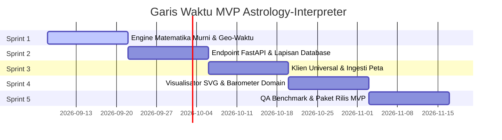

# Rencana Rilis & Task Backlog

## 1. Garis Waktu Rilis

---

## 2. Sprint Backlog

### Sprint 1: Engine Matematika & Geo-Waktu
- [ ] Setup lingkungan virtual Python 3.11+ (`ruff`, `mypy`, `pytest`).
- [ ] Implementasi `GeoTimeService` dengan `timezonefinder` dan `zoneinfo` (DST historis).
- [ ] Implementasi `EphemerisService` (10 planet + Simpul di Lahiri, KP, Raman).
- [ ] Implementasi engine divisi Weda (27 Nakshatra, 108 Pada, Sub-Lord KP).
- [ ] Implementasi engine 4 lapis Vimshottari Dasha (MD, AD, PD, SD).
- [ ] Implementasi engine aspek dengan peluruhan eksponensial ($W = 10 \cdot e^{-1.4 \cdot \text{orb}}$).

### Sprint 2: FastAPI & Persistensi Data
- [ ] Model SQLAlchemy & migrasi Alembic (`users`, `saved_charts`, `hourly_transit_cache`).
- [ ] Skema Pydantic v2 ketat untuk seluruh request/response.
- [ ] Endpoint: `POST /chart/natal`, `GET /transits/current`, `POST /interpret/dynamic`.
- [ ] Worker latar belakang untuk caching transit per jam.

### Sprint 3: Fondasi Klien Universal (Expo)
- [ ] Scaffold proyek Expo SDK 51+ (iOS, Android, Web).
- [ ] Tombol lokasi GPS native (`expo-location`).
- [ ] Pemilih pin peta geser (`react-native-maps` dengan fallback web).
- [ ] Formulir input kelahiran dengan sakelar Sidereal / Tropikal.
- [ ] Store Zustand dan klien TanStack Query.

### Sprint 4: Visualisasi & Dashboard
- [ ] Komponen bagan Weda India Selatan (`react-native-svg`).
- [ ] Komponen bagan berlian Weda India Utara.
- [ ] Komponen roda sirkular Barat 360°.
- [ ] Kartu barometer 5-Domain dengan indikator status berkode warna.

### Sprint 5: Pemadatan & Rilis
- [ ] Pipeline CI lengkap dengan harness verifikasi benchmark.
- [ ] Dockerfile produksi multi-stage untuk backend FastAPI.
- [ ] Build Web PWA produksi dan kompilasi APK Android.
