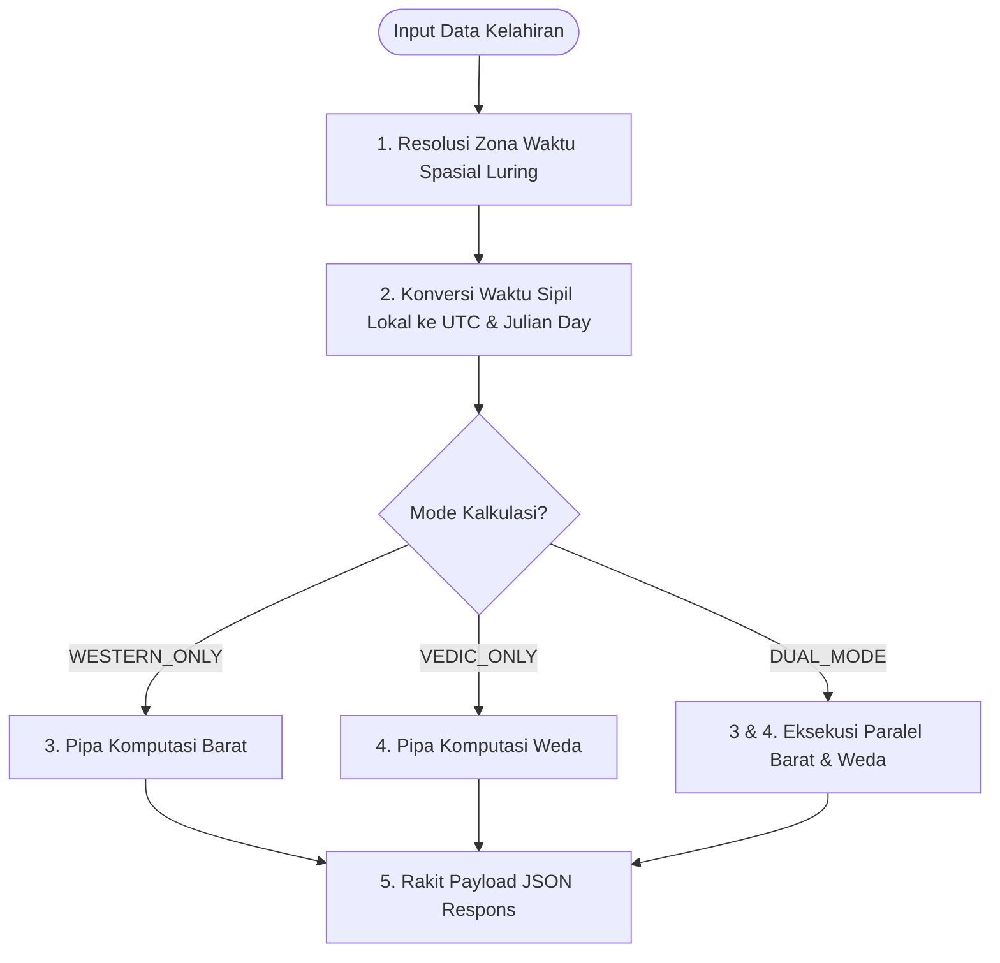

# Spesifikasi Fitur 01: Pengecekan Birth Chart Fleksibel (Barat, India, atau Keduanya)

**Kode Fitur:** FEAT-01  
**Kategori:** Core Calculation Engine  
**Status:** Disetujui  

---

## 1. Deskripsi & Nilai Pengguna

Fitur ini menyediakan mesin kalkulasi posisi kelahiran deterministik dengan fleksibilitas metodologis penuh:
* Pengguna dapat memilih untuk menghitung **Hanya Astrologi Barat (*Tropical*)**, **Hanya Astrologi India (*Vedic/Sidereal*)**, atau **Keduanya Sekaligus (*Dual Mode*)**.
* Menjamin independensi antarmuka: pengguna yang hanya ingin mempelajari astrologi psikologis Barat tidak akan dibebani istilah teknis Weda, dan praktisi Jyotish dapat langsung fokus pada bagan Sideris tanpa distraksi roda tropikal.

---

## 2. Dekomposisi Input Data (Tingkat Atomik)

| Parameter | Tipe Data | Format / Satuan | Rentang Validasi | Deskripsi & Validasi Khusus |
| :--- | :--- | :--- | :--- | :--- |
| `latitude` | `float` | Derajat Desimal ($^\circ$) | $-90.000000 \le \text{lat} \le +90.000000$ | Presisi 6 digit desimal (~0.1 meter). Menolak input di luar batas kutub. |
| `longitude` | `float` | Derajat Desimal ($^\circ$) | $-180.000000 \le \text{lon} \le +180.000000$ | Presisi 6 digit desimal. Mendukung koordinat Barat ($-$) dan Timur ($+$). |
| `local_datetime` | `string` | ISO-8601 (`YYYY-MM-DDTHH:MM:SS`) | `1800-01-01T00:00:00` s.d. `2100-12-31T23:59:59` | Waktu sipil lokal saat lahir. Detik bersifat opsional (default `:00`). |
| `calculation_mode` | `enum` | String | `WESTERN_ONLY`, `VEDIC_ONLY`, `DUAL_MODE` | Mode perhitungan yang dipilih. |
| `house_system` | `enum` | String | `PLACIDUS`, `WHOLE_SIGN`, `PORPHYRY` | Sistem rumah Barat (default: `PLACIDUS`). |
| `ayanamsha` | `enum` | String | `LAHIRI`, `KP`, `RAMAN`, `FAGAN_BRADLEY` | Nilai presesi Sideris (default: `LAHIRI` / Chitra Paksha). |

---

## 3. Algoritma & Logika Komputasi Langkah demi Langkah



### Langkah 1: Resolusi Zona Waktu & Waktu Kanonikal
1. Sistem melewatkan `(latitude, longitude)` ke `timezonefinder.TimezoneFinder()`.
2. Query poligon spasial luring menghasilkan string IANA resmi (misal: `"Asia/Jakarta"`).
3. Buat objek `datetime` sipil lokal dengan zona waktu `zoneinfo.ZoneInfo("Asia/Jakarta")`.
4. Konversi objek ke UTC kanonikal: `utc_datetime = local_datetime.astimezone(zoneinfo.ZoneInfo("UTC"))`.
5. Hitung Julian Day ($JD$) dari waktu UTC:
   $$JD = 367 \cdot Y - \left\lfloor \frac{7(Y + \lfloor (M+9)/12 \rfloor)}{4} \right\rfloor + \left\lfloor \frac{275M}{9} \right\rfloor + D + 1721013.5 + \frac{UT}{24}$$

### Langkah 2: Pipa Komputasi Zodiak Barat (*Tropical*)
1. **Greenwich Mean Sidereal Time ($GMST$):**
   $$T = \frac{JD - 2451545.0}{36525}$$
   $$GMST = 280.46061837 + 360.98564736629 \cdot (JD - 2451545.0) + 0.000387933 T^2 - \frac{T^3}{38710000} \pmod{360^\circ}$$
2. **Local Sidereal Time ($LST$) & $RAMC$:**
   $$LST = (GMST + \text{longitude}) \pmod{360^\circ}$$
   $$RAMC = LST$$
3. **Midheaven ($MC$) & Ascendant ($ASC$):**
   $$\tan(MC) = \frac{\tan(RAMC)}{\cos(\epsilon)}$$
   $$\tan(ASC) = \frac{\cos(RAMC)}{-\sin(RAMC)\cos(\epsilon) - \tan(\text{latitude})\sin(\epsilon)}$$
   di mana $\epsilon$ adalah kemiringan ekliptika sejati (*true obliquity of ecliptic*).
4. **Pembagian 12 Rumah Placidus:**
   Hitung batas rumah 11, 12, 2, 3 melalui triseksi semi-busur diurnal dan nokturnal.
5. **Posisi Planet Geosentris:**
   Hitung bujur ekliptika $\lambda$, lintang ekliptika $\beta$, jarak $R$, dan kecepatan bujur harian $\frac{d\lambda}{dt}$ untuk: Matahari, Bulan, Merkurius, Venus, Mars, Yupiter, Saturnus, Uranus, Neptunus, Pluto, dan True Node (Rahu/Ketu).
   *Jika $\frac{d\lambda}{dt} < 0$, set flag `is_retrograde = true`.*
6. **Matriks Aspek Geometris:**
   Hitung separasi sudut terkecil $\Delta\theta$ untuk setiap pasangan planet:
   $$\Delta\theta = \min(|\lambda_1 - \lambda_2|, 360^\circ - |\lambda_1 - \lambda_2|)$$
   Bandingkan dengan sudut aspek utama: Konjungsi ($0^\circ$), Sekstil ($60^\circ$), Kuadrat ($90^\circ$), Trine ($120^\circ$), Oposisi ($180^\circ$).
   Terapkan rumus bobot kontinu: $W(\delta) = 10.0 \times \exp(-1.4 \times |\Delta\theta - \text{Target}|)$.

### Langkah 3: Pipa Komputasi Zodiak India (*Sidereal / Vedic*)
1. **Nilai Ayanamsha:**
   Hitung nilai presesi Ayanamsha Lahiri $\theta_{\text{Ayanamsha}}$ pada $JD$.
2. **Transformasi Koordinat Sideris:**
   $$\lambda_{\text{sidereal}} = (\lambda_{\text{tropical}} - \theta_{\text{Ayanamsha}}) \pmod{360^\circ}$$
3. **Pemetaan Rashi (12 Tanda Zodiak Weda):**
   $$\text{Rashi Index} = \lfloor \lambda_{\text{sidereal}} / 30^\circ \rfloor \quad (\text{0: Aries, 1: Taurus, ..., 11: Pisces})$$
4. **Pemetaan Nakshatra (27 Bintang) & Pada:**
   * Lebar 1 Nakshatra: $13^\circ 20^\prime = 13.333333^\circ$.
   * $\text{Nakshatra Index} = \lfloor \lambda_{\text{Moon, sidereal}} / 13.333333^\circ \rfloor$.
   * Derajat terlewati dalam Nakshatra: $\text{elapsed} = \lambda_{\text{Moon, sidereal}} \pmod{13.333333^\circ}$.
   * $\text{Pada (1 s.d. 4)} = 1 + \lfloor \text{elapsed} / 3.333333^\circ \rfloor$.
5. **Sub-Lord Krishnamurti Padhdhati (KP):**
   Bagi rentang $13^\circ 20^\prime$ Nakshatra menjadi 9 sub-bagian yang proporsional dengan durasi tahun Vimshottari masing-masing planet.
6. **Evaluasi Martabat Planet (*Dignity*):**
   * *Uchcha* (Eksaltasi): Matahari di Aries $10^\circ$, Bulan di Taurus $3^\circ$, dst.
   * *Neecha* (Debilitasi): Matahari di Libra $10^\circ$, Bulan di Scorpio $3^\circ$, dst.
   * *Moolatrikona* & *Swakshetra* (Tanda Rumah Sendiri).
7. **Pohon Rekursif Vimshottari Dasha 4 Lapis:**
   * Urutan penguasa: Ketu (7th), Venus (20th), Sun (6th), Moon (10th), Mars (7th), Rahu (18th), Jupiter (16th), Saturn (19th), Mercury (17th) - total 120 tahun.
   * Hitung saldo awal Mahadasha kelahiran dari sisa fraksi nakshatra bulan.
   * Proyeksikan hierarki: Mahadasha (MD) $\rightarrow$ Antardasha (AD) $\rightarrow$ Pratyantardasha (PD) $\rightarrow$ Sookshmadasha (SD).

---

## 4. Aturan Bisnis & Penanganan Kasus Khusus (*Edge Cases*)

1. **Kasus Kutub/Lintang Tinggi ($|\text{latitude}| > 66.5^\circ$):**
   * Sistem rumah Placidus mengalami kegagalan matematis karena horizon tidak berpotongan dengan ekliptika secara normal.
   * *Aturan Bisnis:* Sistem otomatis mengalihkan perhitungan rumah ke *Whole Sign* dan menambahkan informasi peringatan pada metadata JSON: `"house_system_fallback": "WHOLE_SIGN_POLAR_OVERRIDE"`.
2. **Titik Temu Derajat Nol ($0^\circ / 360^\circ$ Boundary):**
   * Seluruh operasi penambahan/pengurangan sudut wajib dinormalisasi melalui fungsi modulo positif:
     $$\text{norm}(\theta) = ((\theta \pmod{360}) + 360) \pmod{360}$$
3. **Peralihan Mode Instan (*Zero-Recompute UI*):**
   * Jika pengguna beralih mode dari *Western Only* ke *Vedic Only* pada bagan yang sudah dihitung, backend mengembalikan kedua data secara terpisah di payload awal sehingga UI klien dapat langsung beralih seketika ($0\text{ ms}$) tanpa melakukan *network fetch* baru.

---

## 5. Struktur Kontrak Payload JSON

### Endpoint: `POST /api/v1/chart/calculate`

#### Request Body
```json
{
  "latitude": -6.175392,
  "longitude": 106.827153,
  "local_datetime": "2007-08-29T06:40:00",
  "calculation_mode": "DUAL_MODE",
  "house_system": "PLACIDUS",
  "ayanamsha": "LAHIRI"
}
```

#### Response Body (`HTTP 200 OK`)
```json
{
  "status": "success",
  "meta": {
    "calculation_mode": "DUAL_MODE",
    "iana_timezone": "Asia/Jakarta",
    "utc_timestamp": "2007-08-28T23:40:00Z",
    "julian_day": 2454341.486111,
    "delta_t_seconds": 65.2,
    "ayanamsha_used": "LAHIRI",
    "ayanamsha_degrees": 23.96314
  },
  "western": {
    "ascendant": 156.421,
    "midheaven": 66.184,
    "house_system": "PLACIDUS",
    "houses": [156.42, 185.12, 214.33, 246.18, 278.45, 308.12, 336.42, 5.12, 34.33, 66.18, 98.45, 128.12],
    "planets": {
      "Sun": {"longitude": 155.12, "sign": "Virgo", "house": 12, "speed": 0.965, "is_retrograde": false},
      "Moon": {"longitude": 342.48, "sign": "Pisces", "house": 7, "speed": 13.12, "is_retrograde": false}
    },
    "aspects": [
      {"body1": "Sun", "body2": "Moon", "aspect": "OPPOSITION", "orb": 7.36, "weight": 0.33}
    ]
  },
  "vedic": {
    "lagna": {"longitude": 132.458, "sign": "Leo", "nakshatra": "Purva Phalguni", "pada": 1},
    "planets": {
      "Sun": {"longitude": 131.157, "sign": "Leo", "nakshatra": "Magha", "pada": 4, "dignity": "Swakshetra"},
      "Moon": {"longitude": 318.517, "sign": "Aquarius", "nakshatra": "Shatabhisha", "pada": 4, "dignity": "Neutral"}
    },
    "active_dasha_hierarchy": {
      "mahadasha": "Saturn",
      "antardasha": "Saturn",
      "pratyantardasha": "Mercury",
      "sookshmadasha": "Venus"
    }
  }
}
```
