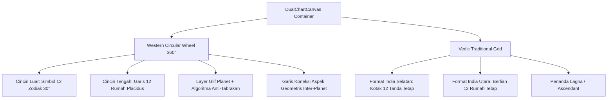

# Spesifikasi Fitur 02: Visualisasi Bagan Fleksibel (Roda Barat, Kotak Weda, atau Keduanya)

**Kode Fitur:** FEAT-02  
**Kategori:** User Interface & Vector Graphics (SVG)  
**Status:** Disetujui  

---

## 1. Deskripsi & Nilai Pengguna

Fitur ini bertugas merender representasi visual bagan zodiak secara interaktif, vektor murni (bebas pecah di semua resolusi layar), dan responsif:
* Menyesuaikan dengan metode yang dipilih pengguna: hanya menampilkan Roda Sirkular Barat 360°, hanya Bagan Kotak Weda (*South Indian / North Indian*), atau Keduanya sekaligus.
* Setiap elemen visual (glif planet, garis rumah, koneksi aspek) dapat disentuh/di-klik untuk membuka lembar informasi detail (*interactive inspector*).

---

## 2. Dekomposisi Komponen Visual (Tingkat Atomik)

### A. Komponen Roda Sirkular Barat 360°
1. **Cincin Zodiak Terluar ($R_1$ ke $R_2$):**
   * Lingkaran $360^\circ$ dibagi menjadi 12 busur sama panjang ($30^\circ$ per zodiak).
   * Menampilkan glif vektor SVG zodiak di titik tengah busur ($15^\circ, 45^\circ, \dots, 345^\circ$).
   * Tanda garis derajat (*degree ticks*) setiap interval $1^\circ$ dan $5^\circ$.
2. **Cincin Rumah / Cusp ($R_2$ ke $R_3$):**
   * Garis radial ditarik dari pusat ke derajat batas rumah (*cusps*) 1 sampai 12.
   * Poros utama dipertebal: Poros Horizontal (Ascendant $ASC$ - Descendant $DSC$) dan Poros Vertikal (Midheaven $MC$ - Imum Coeli $IC$).
   * Penomoran angka Romawi / Arab (1 s.d. 12) di tengah masing-masing rumah.
3. **Layer Glif Planet ($R_3$):**
   * Koordinat polar diubah ke kartesian:
     $$X = X_{\text{center}} + R \cdot \cos(\theta_{\text{screen}})$$
     $$Y = Y_{\text{center}} - R \cdot \sin(\theta_{\text{screen}})$$
   * **Algoritma Anti-Tabrakan (*Collision Avoidance*):** Jika jarak sudut antara dua planet $\le 4^\circ$, radius planet kedua digeser ke dalam sebesar $\Delta R = -14\text{ px}$ untuk mencegah glif saling bertumpukan.
4. **Garis Koneksi Aspek Internal ($0$ ke $R_3$):**
   * Garis penghubung lurus antar planet dengan kode warna semantik:
     * *Harmonis:* Trine ($120^\circ$) & Sekstil ($60^\circ$) $\rightarrow$ Warna Biru (#2563EB).
     * *Tegangan/Friksi:* Kuadrat ($90^\circ$) & Oposisi ($180^\circ$) $\rightarrow$ Warna Merah (#DC2626).
     * *Intensitas:* Konjungsi ($0^\circ$) $\rightarrow$ Warna Emas (#D97706).
   * Ketebalan garis proporsional terhadap kerapatan orb: $T = \max(1, 3.5 - 0.5 \times \text{orb})$.

### B. Komponen Bagan Tradisional Weda
1. **Format India Selatan (*South Indian Fixed-Sign Grid*):**
   * Grid matriks 4x4 dengan ruang tengah kosong (12 kotak zodiak).
   * Posisi zodiak bersifat tetap: Pisces selalu di kotak baris 1 kolom 2, Aries di baris 1 kolom 3, Taurus di baris 1 kolom 4, dst.
   * Kotak Lagna ditandai dengan garis diagonal ganda dan teks `"ASC / Lagna"`.
   * Planet-planet dituliskan di dalam kotak zodiak yang sesuai beserta penanda retrograde `[R]`.
2. **Format India Utara (*North Indian Fixed-House Diamond*):**
   * Terdiri dari 4 segitiga pusat membentuk berlian (Rumah 1, 4, 7, 10 / Kendra) dan 8 segitiga pendukung.
   * Posisi rumah bersifat tetap: Rumah 1 selalu berada di berlian atas tengah.
   * Angka kecil (1 s.d. 12) di sudut segitiga menunjukkan nomor tanda zodiak (*Rashi*).

---

## 3. Logika Responsif & Peralihan Antarmuka

| Tipe Layar / Mode | Mode Barat | Mode Weda | Mode Keduanya (Dual) |
| :--- | :--- | :--- | :--- |
| **Mobile Portrait** | Menampilkan Roda Barat satu layar penuh. | Menampilkan Kotak Weda satu layar penuh (dengan sakelar South/North). | Segmented Control Tabs di atas (`[Barat | Weda]`) untuk beralih instan tanpa re-render berat. |
| **Tablet / Desktop Landscape** | Roda Barat terpusat dengan panel data di samping. | Kotak Weda terpusat dengan tabel Dasha di samping. | Tampilan berdampingan (*Split-Screen 50:50*): Roda Barat di kiri, Kotak Weda di kanan. |

---

## 4. Interaktivitas Mikro (*Hit-Testing Inspector*)

1. **Sentuhan Glif Planet (*Target Touch Area*):**
   * Area sentuh (*hitbox*) lingkaran transparan minimal berdiameter 44x44 dp di sekeliling glif.
2. **Modal / Bottom Sheet Inspektor:**
   * Mengetuk planet membuka lembar informasi bawah:
     * Nama Planet & Simbol.
     * Derajat, Menit, Detik Eksak (contoh: $21^\circ 14^\prime 32^{\prime\prime}$ Scorpio).
     * Kecepatan bujur harian & status Retrograde.
     * Rumah yang ditempati & Tanda Zodiak.
     * Sisi Weda: Nakshatra, Nomor Pada, KP Sub-Lord, dan Martabat (*Exalted/Debilitated*).
     * Daftar semua aspek aktif yang menghubungkan planet tersebut dengan planet lain.

---

## 5. Kriteria Pengujian & Keberhasilan Atomik

* [ ] Glif planet tidak tumpang tindih saat terjadi konjungsi rapat ($0.1^\circ$ orb).
* [ ] Roda zodiak berotasi mulus dengan poros Ascendant berada presisi di kuadran kiri horisontal ($9\text{ o'clock}$ posisi Barat tradisional).
* [ ] Waktu render SVG pada perangkat mobile berdaya menengah $\le 16\text{ ms}$ (60 FPS).
