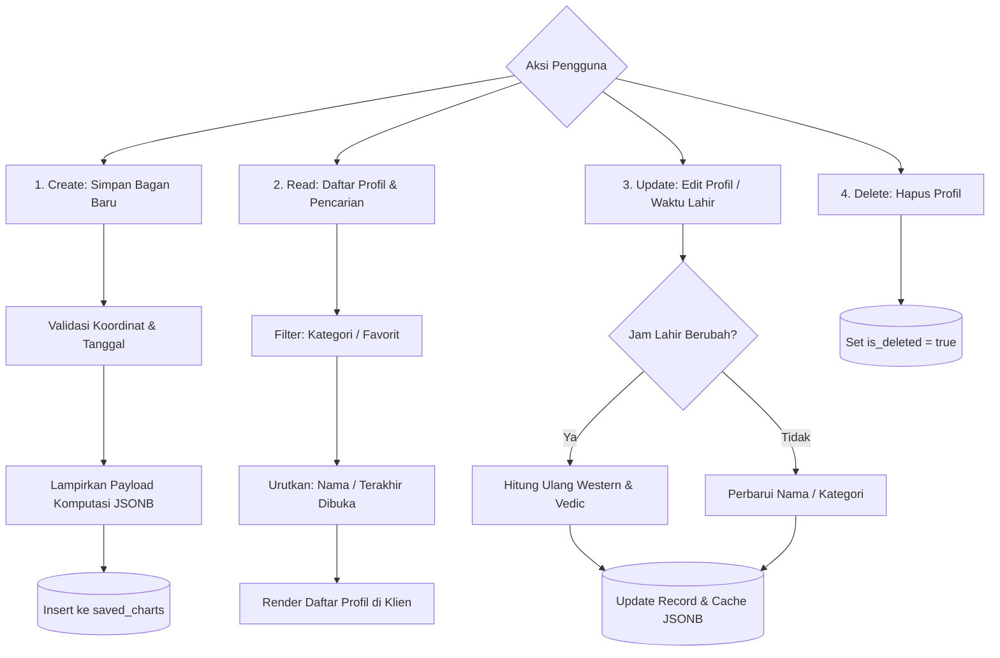

# Spesifikasi Fitur 03: Penyimpanan Birth Chart & Manajemen Multi-Profil

**Kode Fitur:** FEAT-03  
**Kategori:** Data Persistence & Profile Management  
**Status:** Disetujui  

---

## 1. Deskripsi & Nilai Pengguna

Fitur ini menyediakan mekanisme penyimpanan profil bagan kelahiran multi-pengguna secara permanen dan aman:
* Pengguna dapat menyimpan bagan diri sendiri, keluarga, teman, atau rekan bisnis tanpa perlu memasukkan ulang tanggal, jam, dan pin peta setiap kali membuka aplikasi.
* Mendukung pengelompokan kategori, pencarian instan, dan kapabilitas luring (*offline-first access*).

---

## 2. Dekomposisi Skema Entitas Data (Tingkat Atomik)

### Tabel Basis Data: `saved_charts`
| Kolom | Tipe Data | Batasan (*Constraints*) | Deskripsi |
| :--- | :--- | :--- | :--- |
| `id` | `UUID` | Primary Key, Default `uuid_generate_v4()` | Pengenal unik profil bagan. |
| `user_id` | `UUID` | Foreign Key `users.id`, Indexed | Pemilik akun penyimpan profil. |
| `profile_name` | `VARCHAR(100)` | Not Null | Nama lengkap atau julukan profil (misal: "Rian Pramana"). |
| `category` | `VARCHAR(20)` | Not Null, Default `'OTHER'` | Kategori: `SELF`, `FAMILY`, `FRIEND`, `COWORKER`, `PARTNER`, `OTHER`. |
| `latitude` | `NUMERIC(9,6)` | Not Null | Lintang presisi sub-meter ($-90.000000$ s.d. $+90.000000$). |
| `longitude` | `NUMERIC(9,6)` | Not Null | Bujur presisi sub-meter ($-180.000000$ s.d. $+180.000000$). |
| `location_name` | `VARCHAR(255)` | Nullable | Nama geocoding manusiawi (misal: "Bandung, Jawa Barat, Indonesia"). |
| `local_datetime` | `TIMESTAMP` | Not Null | Tanggal dan jam sipil lokal saat lahir. |
| `iana_timezone` | `VARCHAR(50)` | Not Null | String zona waktu IANA resmi (misal: `"Asia/Jakarta"`). |
| `utc_timestamp` | `TIMESTAMPTZ` | Not Null, Indexed | Timestamp kanonikal standar UTC. |
| `julian_day` | `DOUBLE PRECISION`| Not Null | Epoch Julian Day astronomis pada saat kelahiran. |
| `cached_western`| `JSONB` | Nullable | Cache hasil komputasi Barat (derajat, rumah, aspek) untuk akses instan. |
| `cached_vedic` | `JSONB` | Nullable | Cache hasil komputasi Weda (rashi, nakshatra, dasha awal). |
| `is_favorite` | `BOOLEAN` | Default `FALSE`, Indexed | Penanda profil favorit untuk akses cepat di dasbor. |
| `is_deleted` | `BOOLEAN` | Default `FALSE`, Indexed | Soft delete flag. |
| `created_at` | `TIMESTAMPTZ` | Default `NOW()` | Waktu pembuatan profil. |
| `updated_at` | `TIMESTAMPTZ` | Default `NOW()` | Waktu terakhir profil diubah. |

---

## 3. Operasi CRUD & Logika Bisnis Langkah demi Langkah



### Operasi 1: Pembuatan Profil (Create)
1. Klien mengirim data profil beserta hasil komputasi yang telah dihitung.
2. Backend memvalidasi integritas koordinat dan timestamp.
3. Simpan record baru ke database relasional; simpan payload komputasi ke dalam kolom `JSONB` agar pemanggilan profil berikutnya tidak perlu membebani CPU dengan komputasi ulang.

### Operasi 2: Daftar & Pencarian (Read)
1. Endpoint `GET /api/v1/chart/profiles`:
   * Mendukung parameter kueri pencarian `?q=budi` (*case-insensitive ILIKE*).
   * Mendukung filter `?category=COWORKER` dan `?is_favorite=true`.
   * Paginasi: `limit=20`, `offset=0`.
2. Hasil kueri menyertakan ringkasan: Matahari, Bulan, Ascendant/Lagna, dan Tanda Zodiak tanpa membengkakkan bandwidth.

### Operasi 3: Perubahan Data (Update)
1. Jika pengguna mengubah `profile_name` atau `category`: Hanya metadata tabel yang diupdate.
2. Jika pengguna mengubah `local_datetime` atau koordinat: Sistem secara otomatis memicu pipa komputasi ulang dan memperbarui `cached_western` serta `cached_vedic`.

---

## 4. Sinkronisasi Luring (*Offline-First Architecture*)

1. **Penyimpanan Lokal Klien:**
   * Klien mobile menyimpan seluruh profil pengguna di penyimpanan lokal (SQLite via WatermelonDB atau Expo SQLite).
   * Pengguna dapat membuka dan mempelajari bagan tersimpan di daerah tanpa sinyal internet (100% offline).
2. **Resolusi Konflik Sinkronisasi:**
   * Saat perangkat kembali terhubung ke internet, sinkronisasi dua arah dijalankan.
   * Menggunakan strategi *Last-Write-Wins (LWW)* berbasis stempel waktu `updated_at`.

---

## 5. Struktur Kontrak JSON

### Endpoint: `POST /api/v1/chart/profiles` (Simpan Profil)
```json
{
  "profile_name": "Rian Pramana",
  "category": "SELF",
  "latitude": -6.175392,
  "longitude": 106.827153,
  "location_name": "Jakarta Pusat, DKI Jakarta",
  "local_datetime": "2007-08-29T06:40:00",
  "is_favorite": true
}
```

### Response Body (`HTTP 201 Created`)
```json
{
  "status": "success",
  "profile": {
    "id": "c7a84091-28cf-4351-b8d1-580a6b7d532a",
    "profile_name": "Rian Pramana",
    "category": "SELF",
    "sun_sign": "Virgo",
    "moon_sign": "Pisces",
    "ascendant_sign": "Virgo",
    "lagna_sign": "Leo",
    "created_at": "2026-09-08T10:07:00Z"
  }
}
```
