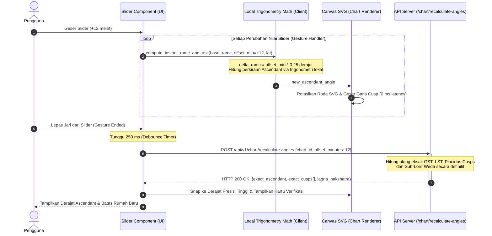

# Spesifikasi Fitur 04: Alat Bantu Jam Lahir Kurang Pasti (Rectification Slider)

**Kode Fitur:** FEAT-04  
**Kategori:** Interactive Chart Manipulation & Time Scrubbing  
**Status:** Disetujui  

---

## 1. Deskripsi & Nilai Pengguna

Sebagian besar pengguna tidak mengetahui jam lahir mereka secara presisi hingga hitungan menit (misal: hanya tahu "sekitar jam 6 pagi" atau "waktu subuh"). Karena Ascendant (Lagna) bergeser sebesar $1^\circ$ setiap 4 menit dan berganti tanda zodiak setiap $\sim 2\text{ jam}$, ketidakpastian 15 menit saja dapat mengubah pembacaan rumah dan Lagna secara drastis.

Fitur **Rectification Slider** memungkinkan pengguna menggeser waktu kelahiran secara interaktif ($\pm 30$ hingga $\pm 120$ menit) dan melihat pergeseran derajat Ascendant serta batas rumah secara instan (*real-time 60 FPS*) langsung pada grafik visual.

---

## 2. Dekomposisi Komponen Slider & Rentang Nilai (Tingkat Atomik)

| Parameter | Tipe Data | Nilai Bawaan (*Default*) | Rentang Nilai | Resolusi Langkah (*Step*) |
| :--- | :--- | :--- | :--- | :--- |
| `time_offset_minutes` | `integer` | `0` | $-60$ s.d. $+60$ menit (opsi perluas $\pm 120$) | $1$ menit per tick |
| `reference_utc` | `string` | Timestamp lahir awal | ISO-8601 UTC | Fixed base |
| `debounce_interval` | `integer` | `250` ms | $150$ s.d. $500$ ms | Waktu tunggu sebelum network request |

---

## 3. Algoritma Dua Jalur: Interpolasi Klien 60 FPS & Sinkronisasi Server

Untuk menghindari latensi jaringan saat slider digeser secara cepat, sistem menggunakan **Arsitektur Dua Jalur**:



### Rumus Trigonometri Ringan di Sisi Klien (Jalur 1)
Bumi berotasi $360^\circ$ dalam 24 jam (1440 menit), sehingga laju pergeseran adalah:
$$\text{Laju Rotasi} = \frac{360^\circ}{1440\text{ menit}} = 0.25^\circ \text{ per menit} = 15^\prime \text{ busur per menit}$$
Saat slider bergeser sebesar $\Delta t$ menit:
$$\Delta RAMC = \Delta t \times 0.25^\circ$$
$$RAMC_{\text{baru}} = (RAMC_{\text{awal}} + \Delta RAMC) \pmod{360^\circ}$$
Ascendant baru dihitung langsung di thread JavaScript/Native:
$$\tan(ASC_{\text{baru}}) = \frac{\cos(RAMC_{\text{baru}})}{-\sin(RAMC_{\text{baru}})\cos(\epsilon) - \tan(\text{lat})\sin(\epsilon)}$$

---

## 4. Fitur Penguncian & Konfirmasi Jam Baru

1. **Tombol "Terapkan Jam Baru":**
   * Jika pengguna merasa Ascendant yang baru lebih cocok dengan kepribadian dan peristiwa hidupnya, pengguna dapat mengetuk *"Terapkan Jam Ini Secara Permanen"*.
   * Sistem akan mengupdate profil bagan tersimpan di database dengan jam hasil penyesuaian.
2. **Tombol "Reset ke Jam Asli":**
   * Mengembalikan slider ke posisi `0` dan mengembalikan grafik ke jam kelahiran semula.

---

## 5. Struktur Kontrak JSON

### Request: `POST /api/v1/chart/recalculate-angles`
```json
{
  "chart_id": "c7a84091-28cf-4351-b8d1-580a6b7d532a",
  "offset_minutes": 12,
  "house_system": "PLACIDUS"
}
```

### Response Body (`HTTP 200 OK`)
```json
{
  "status": "success",
  "adjusted_datetime_local": "2007-08-29T06:52:00",
  "adjusted_utc": "2007-08-28T23:52:00Z",
  "western": {
    "ascendant": 159.42,
    "ascendant_sign": "Virgo",
    "midheaven": 69.18,
    "cusps": [159.42, 188.12, 217.33, 249.18, 281.45, 311.12, 339.42, 8.12, 37.33, 69.18, 101.45, 131.12]
  },
  "vedic": {
    "lagna": 135.45,
    "lagna_sign": "Leo",
    "nakshatra": "Purva Phalguni",
    "pada": 2
  }
}
```
