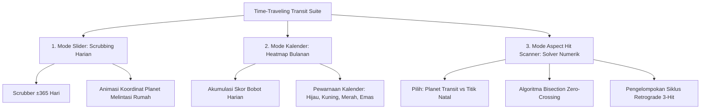

# Spesifikasi Fitur 05: Mesin Transit Bolak-Balik Waktu (Slider, Kalender, Hit Scanner)

**Kode Fitur:** FEAT-05  
**Kategori:** Time-Travel Ephemeris & Numerical Root-Finding  
**Status:** Disetujui  

---

## 1. Deskripsi & Nilai Pengguna

Fitur ini mengubah pengalaman pasif membaca horoskop menjadi alat eksplorasi ilmiah dan empiris dinamis. Pengguna dapat menelusuri konfigurasi langit pada:
1. **Hari Ini (*Real-Time*):** Melihat transit aktif yang sedang berlangsung saat ini.
2. **Masa Lalu (*Historical Milestone*):** Menguji konfigurasi langit pada tanggal-tanggal penting dalam hidupnya (kelulusan, kecelakaan, pernikahan, awal karier).
3. **Masa Depan (*Predictive Foresight*):** Mengantisipasi cuaca langit mendatang untuk perencanaan hidup strategis.

Menyediakan tiga moda eksplorasi: **Slider Waktu Harian**, **Kalender Intensitas Bulanan**, dan **Aspect Hit Scanner** (pencari otomatis momen puncak transit eksak).

---

## 2. Dekomposisi Tiga Moda Interaksi (Tingkat Atomik)



---

## 3. Algoritma Pencarian Akar Numerik (*Aspect Hit Scanner*)

Untuk mencari tanggal eksak puncak transit (di mana orb $= 0.000^\circ$):

### Langkah 1: Fungsi Selisih Sudut Objektif
Definisikan fungsi selisih sudut pada waktu $t$ (dalam Julian Day):
$$f(t) = (\lambda_{\text{transit}}(t) - \lambda_{\text{natal}}) - \theta_{\text{target}}$$
di mana $\theta_{\text{target}} \in \{0^\circ (\text{Konjungsi}), 60^\circ, 90^\circ, 120^\circ, 180^\circ (\text{Oposisi})\}$.

### Langkah 2: Pemindaian Kasar (*Coarse Scan*)
* Evaluasi $f(t)$ pada interval interval sampling $\Delta t = 3\text{ hari}$ sepanjang rentang pencarian (misal: 1 Januari 2026 s.d. 31 Desember 2026).
* Deteksi perubahan tanda (*zero-crossing*): jika $f(t_k) \times f(t_{k+1}) \le 0$, maka terdapat titik puncak eksak di antara $t_k$ dan $t_{k+1}$.

### Langkah 3: Penyempurnaan Akar Halus (*Fine Bisection Scan*)
Jalankan metode bisection hingga toleransi waktu $\epsilon_t \le 60\text{ detik}$:
1. $t_{\text{mid}} = \frac{t_{\text{low}} + t_{\text{high}}}{2}$.
2. Hitung posisi planet pada $t_{\text{mid}}$ via ephemeris.
3. Perbarui batas $t_{\text{low}}$ atau $t_{\text{high}}$ berdasarkan tanda $f(t_{\text{mid}})$.
4. Hentikan iterasi saat $|f(t_{\text{mid}})| \le 0.0005^\circ$ (1.8 detik busur).

### Langkah 4: Deteksi Siklus Retrograde Tiga Puncak (*Tri-Hit Cycle*)
Jika planet transit adalah planet lambat (Saturnus, Yupiter, Uranus, Neptunus, Pluto), planet tersebut dapat membentuk aspek 3 kali:
1. **Hit 1 (Direct Motion):** Pembukaan tema / peristiwa awal.
2. **Hit 2 (Retrograde Motion):** Introspeksi, revisi, intensitas puncak internal.
3. **Hit 3 (Direct Motion Kembali):** Penyelesaian dan integrasi permanen.
*Sistem mengelompokkan ketiga hit ini ke dalam satu "Kartu Siklus Transit" yang utuh di antarmuka.*

---

## 4. Mode Kalender: Skor Intensitas Transit Harian (*Daily Heatmap*)

Setiap tanggal pada kalender diberi skor intensitas langit $S_{\text{hari}}$:
$$S_{\text{hari}} = \sum_{i=1}^{N} W(\delta_i) \times P_{\text{planet}} \times M_{\text{aspek}}$$
* $W(\delta_i) = 10.0 \times \exp(-1.4 \times \delta_i)$ (fungsi peluruhan eksponensial).
* $P_{\text{planet}}$: Pengali bobot planet (Saturnus = 1.5, Pluto = 1.4, Mars = 1.2, Merkurius = 0.8).
* $M_{\text{aspek}}$: Pengali jenis aspek (Konjungsi/Oposisi = 1.5, Kuadrat = 1.3, Trine = 1.0).

**Visualisasi Warna Kalender:**
* $S_{\text{hari}} < 15$: Netral / Tenang (Abu-abu lembut).
* $15 \le S_{\text{hari}} < 35$: Moderat (Biru/Hijau - Arus Konstruktif).
* $S_{\text{hari}} \ge 35$: Intensitas Tinggi / Transformasi Kritis (Oranye/Merah Tua).

---

## 5. Struktur Kontrak JSON

### Request: `POST /api/v1/transit/scan-hit`
```json
{
  "chart_id": "c7a84091-28cf-4351-b8d1-580a6b7d532a",
  "transit_body": "Saturn",
  "natal_body": "Sun",
  "aspect_angle": 180.0,
  "start_date": "2026-01-01",
  "end_date": "2027-12-31"
}
```

### Response Body (`HTTP 200 OK`)
```json
{
  "status": "success",
  "event_name": "Transit Saturn Opposition Natal Sun",
  "is_tri_hit_cycle": true,
  "cycle_hits": [
    {
      "hit_phase": 1,
      "exact_timestamp_utc": "2026-04-12T11:20:00Z",
      "motion": "DIRECT",
      "orb_degrees": 0.0002
    },
    {
      "hit_phase": 2,
      "exact_timestamp_utc": "2026-08-14T03:22:15Z",
      "motion": "RETROGRADE",
      "orb_degrees": 0.0001
    },
    {
      "hit_phase": 3,
      "exact_timestamp_utc": "2027-01-05T19:45:00Z",
      "motion": "DIRECT",
      "orb_degrees": 0.0003
    }
  ]
}
```
