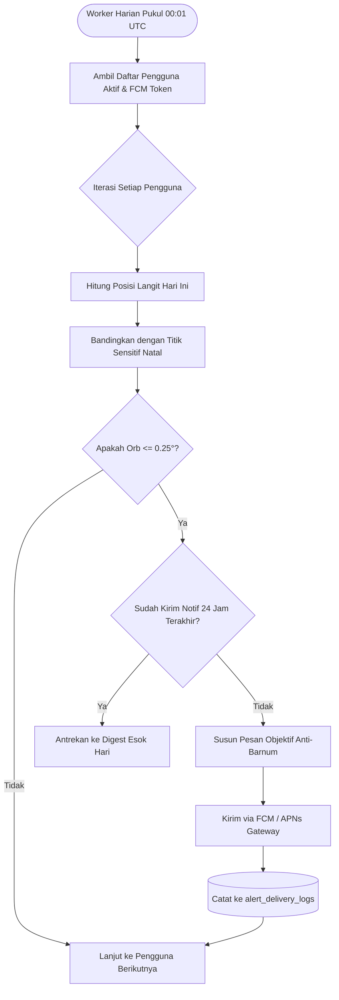

# Spesifikasi Fitur 06: Notifikasi Transit Kritis (Smart Alerts)

**Kode Fitur:** FEAT-06  
**Kategori:** Push Notification Engine & Background Evaluation  
**Status:** Disetujui  

---

## 1. Deskripsi & Nilai Pengguna

Sebagian besar aplikasi astrologi mengirimkan notifikasi harian generik ("Hari ini hari keberuntunganmu!"). Fitur **Smart Transit Alerts** menolak pendekatan tersebut dan berfungsi sebagai sistem peringatan astronomis objektif:
* Hanya terpicu ketika transit planet penting membentuk orb yang sangat ketat ($\le 0.25^\circ$) terhadap titik sensitif natal pengguna.
* Pesan notifikasi menyajikan fakta matematis astronomis murni dan ranah kehidupan yang dipengaruhi tanpa bumbu ramalan sensasional.

---

## 2. Kriteria & Ambang Batas Pemicu (*Trigger Matrix*)

| Komponen | Nilai Ambang Batas / Aturan | Keterangan |
| :--- | :--- | :--- |
| **Ambang Batas Orb** | $\text{Orb} \le 0.25^\circ$ (15 menit busur) | Hanya puncak eksak yang memicu alert. |
| **Planet Transit yang Dimonitor** | Saturnus, Yupiter, Mars, Uranus, Neptunus, Pluto, Simpul Rahu/Ketu, dan Gerhana Matahari/Bulan. | Planet cepat (Bulan/Merkurius) diabaikan agar tidak menimbulkan spam notifikasi harian. |
| **Titik Natal Sensitif** | Matahari Natal, Bulan Natal, Derajat Ascendant (Lagna), Derajat Midheaven (MC), dan Penguasa Dasha Aktif. | Titik-titik paling berdampak dalam struktur psikologis & kehidupan. |
| **Batas Frekuensi (*Rate Limit*)** | Maksimal 1 notifikasi per 24 jam per pengguna. | Jika ada multi-transit dalam 1 hari, sistem menggabungkannya ke dalam satu ringkasan (*Digest Alert*). |
| **Waktu Pengiriman Lokal** | Pukul 07:00 pagi waktu sipil lokal pengguna. | Berdasarkan `iana_timezone` tersimpan pengguna. |

---

## 3. Pipa Evaluasi Batch Latar Belakang



---

## 4. Standar Penyusunan Teks Notifikasi (*Anti-Barnum Copywriting Standards*)

* **DILARANG:** Kata-kata seperti *"Kabar gembira!", "Hati-hati malapetaka!", "Zodiakmu sedang beruntung!"*.
* **WAJIB:**
  1. Sebutkan nama planet transit dan aspek eksaknya (misal: *"Transit Saturnus Oposisi Matahari Natal"*).
  2. Sebutkan derajat orb eksak (misal: *"Puncak Eksak (Orb $0.03^\circ$)"*).
  3. Petakan ke ranah kehidupan objektif (misal: *"Fokus tema: Daya tahan fisik, pengujian batas beban kerja, dan restrukturisasi prioritas"*).

---

## 5. Struktur Payload Notifikasi FCM/APNs

```json
{
  "to": "fcm_token_device_abc123",
  "notification": {
    "title": "Transit Kritis: Saturnus Oposisi Matahari Natal",
    "body": "Puncak eksak hari ini (orb 0.03°). Fokus: Pengujian batas daya tahan kerja dan restrukturisasi tanggung jawab struktural."
  },
  "data": {
    "type": "CRITICAL_TRANSIT_ALERT",
    "chart_id": "c7a84091-28cf-4351-b8d1-580a6b7d532a",
    "transit_body": "Saturn",
    "natal_point": "Sun",
    "aspect_type": "OPPOSITION",
    "orb_degrees": 0.032,
    "affected_domains": ["Career/Situational", "Somatic/Physiological"],
    "deep_link": "astrology://transit/detail?event=saturn_opp_sun"
  }
}
```
