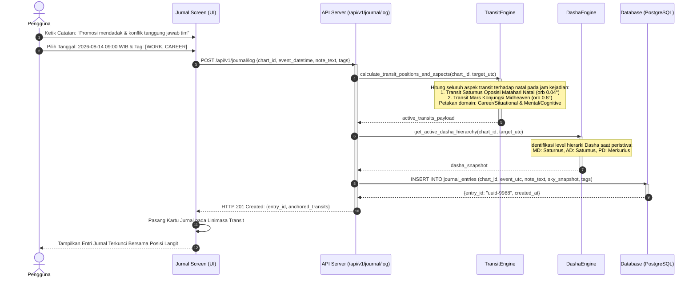

# Spesifikasi Fitur 07: Jurnal Refleksi Empiris (Astro-Journal)

**Kode Fitur:** FEAT-07  
**Kategori:** Empirical Tracking & Event Anchoring  
**Status:** Disetujui  

---

## 1. Deskripsi & Nilai Pengguna

Fitur **Jurnal Refleksi Empiris** adalah instrumen riset personal bagi pengguna:
* Mengubah astrologi dari sekadar "percaya ramalan" menjadi metode pengujian empiris atas pola hidup sendiri.
* Pengguna mencatat peristiwa nyata di tanggal tertentu, dan sistem secara otomatis mengunci konfigurasi astronomis saat itu (*celestial snapshot*), memungkinkan pengguna memvalidasi apakah ada korelasi antara pergerakan langit dan realitas hidupnya.

---

## 2. Dekomposisi Entitas Data Jurnal (Tingkat Atomik)

### Tabel Basis Data: `journal_entries`
| Kolom | Tipe Data | Batasan (*Constraints*) | Deskripsi |
| :--- | :--- | :--- | :--- |
| `id` | `UUID` | Primary Key | Pengenal unik catatan jurnal. |
| `chart_id` | `UUID` | Foreign Key `saved_charts.id`, Indexed | Bagan natal yang menjadi jangkar referensi. |
| `event_utc` | `TIMESTAMPTZ` | Not Null, Indexed | Tanggal dan jam persis peristiwa terjadi. |
| `note_text` | `TEXT` | Not Null (Maks 5000 karakter) | Catatan deskripsi peristiwa nyata dari pengguna. |
| `subjective_tags`| `VARCHAR(50)[]`| Nullable | Tag kategori pilihan pengguna (`WORK`, `HEALTH`, `RELATIONSHIP`, `EMOTIONAL`, `FINANCE`). |
| `sky_snapshot` | `JSONB` | Not Null | Kuncian data astronomis permanen pada jam kejadian (aspek aktif, orb, Dasha). |
| `alignment_score`| `NUMERIC(3,2)` | Nullable | Skor kecocokan antara domain transit dan tag subjektif (0.00 s.d. 1.00). |
| `created_at` | `TIMESTAMPTZ` | Default `NOW()` | Stempel waktu entri dibuat. |

---

## 3. Pipa Penguncian Snapshot Langit (*Celestial Snapshot Anchoring*)



---

## 4. Tampilan Linimasa & Validasi Korelasi Empiris

1. **Integrasi Linimasa Transit:**
   * Setiap tanggal yang memiliki catatan jurnal ditandai dengan ikon pena pada *Scrubber Slider* dan *Kalender*.
   * Mengetuk tanggal langsung menampilkan perbandingan berdampingan: **Peristiwa Nyata Anda** vs **Konfigurasi Langit Saat Itu**.
2. **Indeks Validasi Korelasi:**
   * Sistem menghitung seberapa sering peristiwa kategori `HEALTH` terjadi bertepatan dengan aspek stres pada penguasa Rumah ke-6 atau transit Saturnus/Mars terhadap Ascendant.

---

## 5. Struktur Kontrak JSON

### Request: `POST /api/v1/journal/log`
```json
{
  "chart_id": "c7a84091-28cf-4351-b8d1-580a6b7d532a",
  "event_datetime_local": "2026-08-14T16:00:00",
  "iana_timezone": "Asia/Jakarta",
  "note_text": "Menerima promosi jabatan mendadak namun terjadi perselisihan sengit mengenai delegasi tugas tim.",
  "subjective_tags": ["WORK", "CAREER", "STRESS"]
}
```

### Response Body (`HTTP 201 Created`)
```json
{
  "status": "success",
  "entry_id": "8b9e6c2d-88f1-432a-bc91-912837264819",
  "anchored_astronomy": {
    "utc_timestamp": "2026-08-14T09:00:00Z",
    "dominant_transit": "Saturn Opposition Sun (Orb 0.04°)",
    "secondary_transit": "Mars Conjunction Midheaven (Orb 0.81°)",
    "active_dasha": "Saturn - Saturn - Mercury",
    "calculated_domains": ["Career/Situational", "Mental/Cognitive"]
  }
}
```
