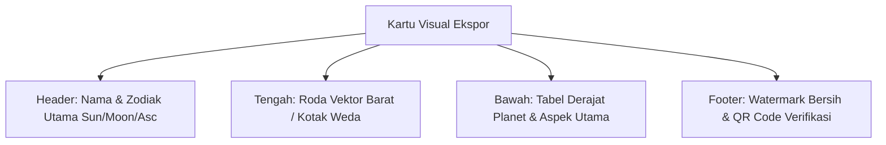

# Spesifikasi Fitur 08: Fitur Bagikan (Share Feature & High-Res Export)

**Kode Fitur:** FEAT-08  
**Kategori:** Export, Social Sharing & Deep-Linking  
**Status:** Disetujui  

---

## 1. Deskripsi & Nilai Pengguna

Fitur ini memungkinkan pengguna untuk mengekspor atau membagikan hasil bagan kelahiran, visualisasi roda, atau analisis transit penting mereka ke pihak luar:
* Menghasilkan kartu visual beresolusi tinggi (PNG 300 DPI / SVG) yang elegan untuk diunggah ke media sosial atau didiskusikan dengan praktisi lain.
* Menyediakan tautan berbagi aman (*shareable deep-link*) dengan filter privasi bawaan (*privacy-safe defaults*).

---

## 2. Format & Varian Ekspor (Tingkat Atomik)

| Format | Varian Rasio | Resolusi / Ukuran | Sasaran Penggunaan |
| :--- | :--- | :--- | :--- |
| **PNG (Image Card)** | Persegi `1:1` | $1080 \times 1080\text{ px}$ (300 DPI) | Postingan Feed Instagram, Twitter/X, WhatsApp chat. |
| **PNG (Story Card)** | Vertikal `9:16` | $1080 \times 1920\text{ px}$ (300 DPI) | Instagram Story, WhatsApp Status. |
| **SVG (Vector Asset)**| Vektor Bebas Skala | Ringan ($< 150\text{ KB}$) | Cetak fisik berkualitas tinggi atau integrasi web. |
| **Shareable URL** | Tautan Pendek | String URL (`https://astro.io/s/xyz`) | Tautan interaktif yang dapat dibuka di browser web. |

---

## 3. Komponen Visual Kartu Ekspor



### Aturan Perlindungan Privasi Default pada Ekspor Publik
1. **Penyembunyian Waktu & Tahun Lahir:**
   * Kartu ekspor publik secara bawaan hanya menampilkan tanggal dan bulan (misal: "29 Agustus"), menyembunyikan jam dan menit lahir serta tahun kelahiran asli demi keamanan identitas pengguna (*anti-doxxing*).
2. **Pengecualian Catatan Pribadi:**
   * Teks catatan Jurnal Empiris pribadi tidak pernah dimasukkan ke dalam kartu grafis ekspor publik.

---

## 4. Alur Integrasi Native OS Share Sheet

1. Pengguna mengetuk tombol *"Bagikan"* di layar bagan atau transit.
2. Pengguna memilih format: `PNG (Story)`, `PNG (Square)`, atau `Salin Tautan`.
3. Klien memicu `expo-sharing` untuk membuka lembar berbagi bawaan sistem operasi (iOS UIActivityViewController / Android Intent Chooser).
4. Pengguna dapat langsung mengirim ke WhatsApp, Telegram, Instagram Stories, atau menyimpan berkas ke galeri ponsel.

---

## 5. Struktur Kontrak JSON

### Request: `POST /api/v1/share/generate-link`
```json
{
  "chart_id": "c7a84091-28cf-4351-b8d1-580a6b7d532a",
  "hide_birth_year": true,
  "hide_birth_time": true,
  "theme": "DARK_NEBULA"
}
```

### Response Body (`HTTP 200 OK`)
```json
{
  "status": "success",
  "share_code": "c7a840",
  "share_url": "https://astro.io/s/c7a840",
  "rendered_card_png": "https://storage.astro.io/cards/c7a840_sq.png",
  "expires_at": "2026-10-08T10:00:00Z"
}
```
