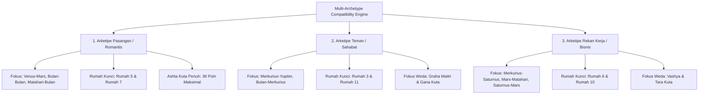

# Spesifikasi Fitur 09: Kecocokan Multi-Relasi (Compatibility / Synastry)

**Kode Fitur:** FEAT-09  
**Kategori:** Relational Dynamics & Multi-Archetype Synastry  
**Status:** Disetujui  

---

## 1. Deskripsi & Nilai Pengguna

Kecocokan astrologi sering kali dipersempit hanya sebatas ramalan asmara generik. Fitur ini memperluas evaluasi ke dalam **Tiga Arketipe Hubungan Manusia Nyata**:
1. **Pasangan (Romantis):** Mengkaji keintiman, resonansi emosional, dan komitmen jangka panjang.
2. **Teman (Sosial):** Mengkaji kecocokan humor, gaya ngobrol santai, dan rasa saling mendukung.
3. **Rekan Kerja (Profesional/Bisnis):** Mengkaji etika kerja, disiplin eksekusi tugas, komunikasi teknis, dan pembagian kepemimpinan.

Mendukung 3 sumber profil target: **Kontak Telepon**, **Orang di Sekitar (*Nearby*)**, dan **Orang Tidak Dikenal (*Stranger Profiles*)**.
> **Mandat Khusus:** Untuk profil Orang Tidak Dikenal, **seluruh dimensi kecocokan tetap dihitung dan disajikan secara utuh tanpa ada aspek atau rumah yang dikurangi.**

---

## 2. Dekomposisi Tiga Arketipe Relasi (Tingkat Atomik)



### Matriks Pembobotan Berdasarkan Arketipe

| Dimensi Penilaian | Bobot Pasangan (*Romance*) | Bobot Teman (*Friendship*) | Bobot Rekan Kerja (*Coworker*) |
| :--- | :---: | :---: | :---: |
| **Resonansi Emosional (Bulan-Bulan)** | $35\%$ | $20\%$ | $5\%$ |
| **Daya Tarik & Gairah (Venus-Mars)** | $30\%$ | $0\%$ | $0\%$ |
| **Komunikasi & Intelektual (Merkurius)**| $15\%$ | $40\%$ | $35\%$ |
| **Etika Kerja & Struktur (Saturnus-Mars)**| $5\%$ | $10\%$ | $35\%$ |
| **Keseimbangan Ego & Otoritas (Matahari)**| $15\%$ | $30\%$ | $25\%$ |

---

## 3. Sumber Profil & Penanganan Orang Tidak Dikenal (*Stranger Profiles*)

1. **Kontak Telepon (`CONTACTS`):**
   * Pengguna mengimpor tanggal lahir dari buku telepon perangkat via `expo-contacts`.
2. **Pengguna di Sekitar (`NEARBY`):**
   * Menggunakan kueri spasial radius 5 km terhadap pengguna lain yang mengaktifkan deteksi sosial.
3. **Orang Tidak Dikenal (`STRANGER`):**
   * Pengguna memasukkan profil orang yang baru dikenal (hanya diketahui kota kelahiran dan tanggal lahir perkiraan).
   * **Integritas Analisis Penuh:** Sistem tidak menyunat data. Skor komunikasi, disiplin kerja, dinamika ego, dan Ashta Kuta Weda dihitung 100% lengkap. Jika jam lahir partner tidak pasti, zodiak bulan (*Chandra Lagna*) digunakan sebagai acuan rumah sekunder dengan penanda diagnostik transparan.

---

## 4. Algoritma Perhitungan Synastry (Barat + Weda)

1. **Aspek Silang Barat (*Inter-Chart Aspects*):**
   * Hitung selisih bujur $\Delta\theta = |\lambda_{A, i} - \lambda_{B, j}|$.
   * Terapkan bobot peluruhan eksponensial $W(\delta)$ untuk aspek mayor ($0^\circ, 60^\circ, 90^\circ, 120^\circ, 180^\circ$).
2. **Ashta Kuta Weda (36 Poin):**
   * Varna (1 poin), Vashya (2 poin), Tara (3 poin), Yoni (4 poin), Graha Maitri (5 poin), Gana (6 poin), Bhakoot (7 poin), Nadi (8 poin).
   * Pada arketipe Rekan Kerja, bobot Nadi (kesehatan keturunan) dialihkan ke bobot Graha Maitri (persahabatan antar-planet penguasa).

---

## 5. Struktur Kontrak JSON

### Request: `POST /api/v1/compatibility/evaluate`
```json
{
  "user_chart_id": "c7a84091-28cf-4351-b8d1-580a6b7d532a",
  "target_type": "STRANGER",
  "target_data": {
    "city_name": "Bandung",
    "approximate_date": "2005-03-15",
    "approximate_time": "12:00"
  },
  "archetype": "COWORKER"
}
```

### Response Body (`HTTP 200 OK`)
```json
{
  "status": "success",
  "archetype": "COWORKER",
  "overall_score": 78,
  "verdict": "Sinergi Produktif Tinggi",
  "dimensions": {
    "communication_flow": {
      "score": 85,
      "verdict": "Sangat Cepat & Komprehensif",
      "key_aspect": "Merkurius Trine Merkurius (Orb 1.2°)"
    },
    "work_ethic_and_discipline": {
      "score": 72,
      "verdict": "Terstruktur & Tepat Waktu",
      "key_aspect": "Saturnus Sekstil Mars (Orb 0.5°)"
    },
    "ego_and_authority_balance": {
      "score": 68,
      "verdict": "Perlu Pembagian Tanggung Jawab Jelas",
      "key_aspect": "Matahari Kuadrat Mars (Orb 2.1°)"
    }
  },
  "vedic_kuta_points": {
    "earned": 26,
    "max": 36,
    "rashi_harmony": "Graha Maitri Penuh"
  },
  "actionable_takeaway": "Gaya komunikasi sangat produktif dan cepat menemukan solusi konseptual. Delineasikan kepemimpinan proyek di awal agar tidak terjadi perebutan wewenang saat tenggat waktu mepet."
}
```
