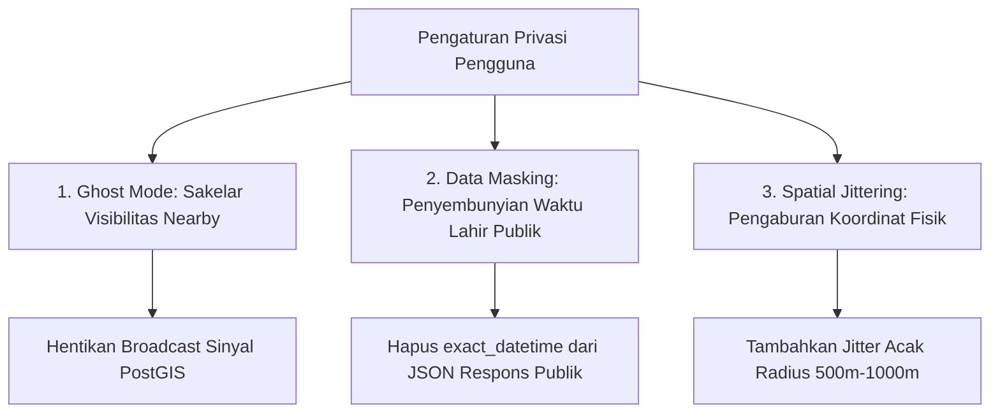

# Spesifikasi Fitur 10: Kontrol Privasi & Ghost Mode (Mode Penyamaran)

**Kode Fitur:** FEAT-10  
**Kategori:** Privacy, Security & Social Anonymity  
**Status:** Disetujui  

---

## 1. Deskripsi & Nilai Pengguna

Data kelahiran (tanggal, jam, menit lahir, dan koordinat tempat lahir) merupakan data pribadi yang sangat sensitif. Jika bocor, data tersebut dapat disalahgunakan untuk pencurian identitas atau pelacakan fisik (*stalking*).

Fitur **Kontrol Privasi & Ghost Mode** memberi kendali mutlak kepada pengguna untuk:
* Mematikan visibilitas deteksi orang di sekitar (*Nearby*) secara instan.
* Berinteraksi dalam pengujian kecocokan dengan orang lain tanpa membeberkan tanggal, jam, atau lokasi kelahiran asli (*data masking*).
* Menjaga kedalaman analisis astrologi tetap 100% akurat di server tanpa membocorkan data mentah ke layar perangkat orang lain.

---

## 2. Tiga Lapisan Perlindungan Privasi (Tingkat Atomik)



### A. Lapisan 1: Ghost Mode (Sakelar Penyamaran Penuh)
* Tombol sakelar utama di layar profil: `is_ghost_mode_enabled`.
* **Saat Aktif:**
  * Sistem menghapus record koordinat pengguna dari tabel kueri spasial *Nearby* (`nearby_active_beacons`).
  * Pengguna lain di sekitar tidak dapat melihat profil pengguna.
  * Pengguna yang menyalakan Ghost Mode tetap bisa mencari bagan orang lain jika diizinkan.

### B. Lapisan 2: Data Masking (Penyamaran Data Kelahiran Publik)
* Saat dua orang membandingkan bagan (*synastry*):
  * Backend menghitung aspek menggunakan data presisi tinggi secara terisolasi.
  * Sebelum payload dikirim ke perangkat partner, middleware sanitasi memotong:
    * `birth_time` $\rightarrow$ diganti `"HIDDEN_BY_USER"`.
    * `birth_year` $\rightarrow$ diganti `XXXX`.
    * `exact_coordinates` $\rightarrow$ diganti nama kota umum saja (misal: `"Jakarta"`).
  * **Penting:** Skor kecocokan, dinamika planet, dan analisis 5-domain tetap tersaji lengkap 100%.

### C. Lapisan 3: Spatial Jittering (Pengaburan Koordinat)
* Jika pengguna mengizinkan fitur *Nearby* (Ghost Mode Nonaktif):
  * Koordinat GPS asli tidak pernah disimpan pada tabel publik.
  * Sistem menerapkan algoritma pengaburan (*coordinate fuzzing*):
    $$Lat_{\text{public}} = Lat_{\text{real}} + \Delta Lat_{\text{random}} \quad (\text{radius } 500\text{m} - 1000\text{m})$$
    $$Lon_{\text{public}} = Lon_{\text{real}} + \Delta Lon_{\text{random}}$$

---

## 3. Kebijakan Retensi & Perlindungan Data Pihak Ketiga

1. **Nol Pelacak Iklan (Zero Ad Trackers):**
   * Tidak ada SDK iklan pihak ketiga (Google AdMob, Facebook Pixel) yang diizinkan mengakses payload kelahiran atau koordinat GPS.
2. **Enkripsi saat Diam (*Encryption at Rest*):**
   * Data koordinat sensitif di database dienkripsi menggunakan AES-256 (peta kunci PostgreSQL pgcrypto).

---

## 4. Struktur Kontrak JSON

### Request: `PATCH /api/v1/user/privacy-settings`
```json
{
  "ghost_mode_enabled": true,
  "allow_nearby_discovery": false,
  "mask_birth_time_in_synastry": true,
  "mask_birth_year_in_synastry": true
}
```

### Response Body (`HTTP 200 OK`)
```json
{
  "status": "success",
  "privacy_settings": {
    "ghost_mode_enabled": true,
    "allow_nearby_discovery": false,
    "mask_birth_time_in_synastry": true,
    "mask_birth_year_in_synastry": true,
    "beacon_status": "OFFLINE",
    "updated_at": "2026-09-08T10:09:00Z"
  }
}
```
