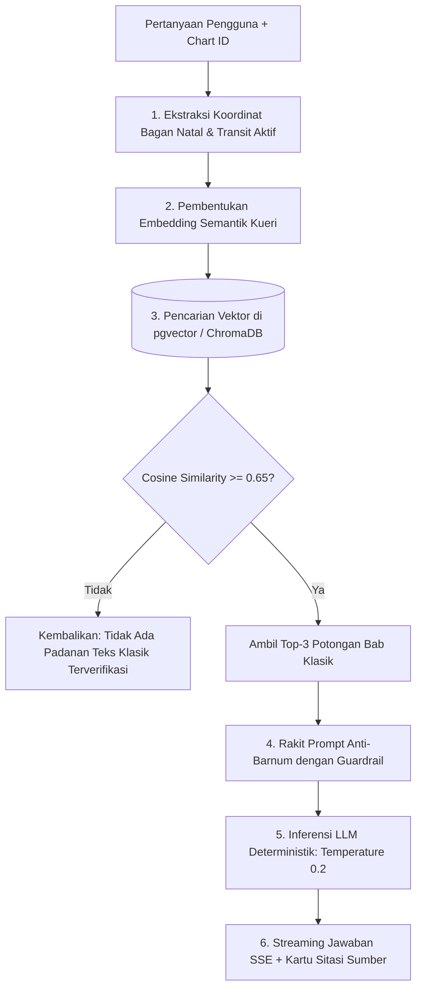

# Spesifikasi Fitur 11: Chatbot AI Berbasis RAG (Retrieval-Augmented Generation)

**Kode Fitur:** FEAT-11  
**Kategori:** AI Engine, Classical Doctrine Retrieval & Anti-Barnum Synthesis  
**Status:** Disetujui  

---

## 1. Deskripsi & Nilai Pengguna

Chatbot AI umum di internet cenderung menghasilkan ramalan manis generik (*flattery bias*) atau berhalusinasi saat ditanya mengenai detail astrologi yang rumit. 

Fitur **Chatbot AI Berbasis RAG** dirancang dengan arsitektur tertutup yang membumikan seluruh jawaban AI pada:
1. **Koordinat Matematis Nyata Pengguna:** Derajat eksak planet, rumah, dan aspek transit.
2. **Koleksi Doktrin Klasik Otoritatif:** Potongan naskah klasik terverifikasi (*Brihat Parashara Hora Shastra*, *Jataka Parijata*, *Phaladeepika*, risalah astrologi Helenistik/Ptolemeus).
3. **Standar Nol Halusinasi (*Zero Hallucination*):** AI dilarang berspekulasi jika konfigurasi tidak memiliki dasar dalam teks klasik yang diindeks.

---

## 2. Dekomposisi Pipa RAG (Tingkat Atomik)



---

## 3. Strategi Pengindeksan Korpus Doktrin Klasik (*Vector Store*)

* **Granularitas Chunking:** 300 s.d. 500 token per segmen teks doktrin klasik.
* **Skema Metadata Terstruktur:**
  * `source_canon`: Nama kitab (misal: `"Brihat Parashara Hora Shastra"`).
  * `chapter_ref`: Bab dan sloka (misal: `"Chapter 24, Sloka 12-15"`).
  * `tradition`: `"VEDIC"` atau `"WESTERN_HELLENISTIC"`.
  * `planetary_tags`: `["Saturn", "Moon", "Opposition"]`.
  * `house_tags`: `["House_1", "House_7"]`.
  * `life_domains`: `["Mental/Cognitive", "Career/Situational"]`.

---

## 4. Guardrail Sistem Prompt Anti-Barnum (*Strict System Instructions*)

Sistem prompt membungkus model dengan instruksi ketat:
1. **DILARANG BERHALUSINASI:** Hanya gunakan informasi yang secara eksplisit tertulis pada teks konteks yang disuntikkan.
2. **ELIMINASI SANJUNGAN GENERIK:** Dilarang menggunakan kalimat abu-abu seperti *"Anda memiliki potensi besar tersembunyi yang menunggu untuk mekar"* atau ramalan nasib takdir mutlak.
3. **SITASI OTORITATIF WAJIB:** Setiap interpretasi wajib menyertakan nama buku dan bab referensinya.
4. **PEMETAAN 5 DOMAIN:** Terjemahkan implikasi klasik ke dalam 5 domain hidup modern yang objektif:
   * Mental / Kognitif (fokus, stres, analisis).
   * Emosional / Psikologis (rasa aman, batas personal).
   * Karier / Situasional (tanggung jawab, friksi wewenang, struktur kerja).
   * Interpersonal / Relasi (gaya komunikasi, dinamika kerja sama).
   * Somatik / Fisiologis (pola energi fisik, kelelahan, ritme istirahat).

---

## 5. Struktur Kontrak JSON Streaming (Server-Sent Events)

### Endpoint: `POST /api/v1/chat/inquire`

#### Request Body
```json
{
  "chart_id": "c7a84091-28cf-4351-b8d1-580a6b7d532a",
  "query": "Mengapa belakangan ini saya merasa sangat terkuras tenaganya saat mengerjakan proyek kantor?",
  "stream": true
}
```

#### Stream Responses (SSE)
```text
event: metadata
data: {"active_transits_identified": ["Saturn Opposition Natal Sun (Orb 0.04°)"], "active_dasha": "Saturn-Saturn"}

event: token
data: {"text": "Berdasarkan posisi efemeris saat ini, Saturnus transit berada di 151°12' membentuk oposisi sudut eksak (180°02', orb 0.04°) terhadap Matahari natal Anda di 155°12'. "}

event: token
data: {"text": "Dalam ranah Somatik dan Karier, oposisi Saturnus terhadap Matahari mengindikasikan pengujian batas fisik dan restrukturisasi beban kerja. "}

event: citation
data: {
  "source_canon": "Brihat Parashara Hora Shastra",
  "chapter": 24,
  "sloka": "14-16",
  "classical_quote": "Ketika Shani memberi aspek keras pada Surya, ketahanan fisik diuji dan tanggung jawab struktural menuntut disiplin penuh."
}

event: finish
data: {"status": "completed"}
```
