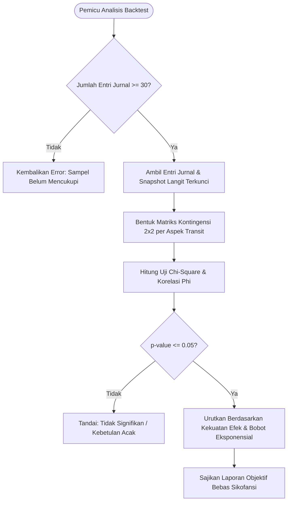

# Spesifikasi Fitur 12: Mesin Korelasi & Backtesting Empiris (Personal Data Mining)

**Kode Fitur:** FEAT-12  
**Kategori:** Data Science & Empirical Validation  
**Status:** Disetujui  

---

## 1. Deskripsi & Nilai Pengguna

Fitur ini adalah mesin analitik tingkat lanjut yang mengolah riwayat catatan dari [FEAT-07 (Jurnal Refleksi Empiris)](./07_jurnal_refleksi_empiris.md) untuk membuktikan korelasi astronomis secara statistik murni:
* Menghilangkan bias konfirmasi (*confirmation bias*) dan sugesti subjektif dengan menerapkan uji signifikansi statistik matematis (Chi-Square Test of Independence & Pearson Correlation Coefficient).
* Memberikan laporan analitik personal berbasis data nyata: mengidentifikasi konfigurasi transit, Dasha, atau aspek planet apa yang secara statistik memiliki korelasi signifikan ($p < 0.05$) terhadap kemunculan peristiwa atau kondisi psikologis pengguna (seperti stres kerja, kejernihan kognitif, atau friksi relasional).

---

## 2. Dekomposisi Parameter & Skema Data (Tingkat Atomik)

### Tabel Basis Data Pendukung: `backtest_runs`
| Kolom | Tipe Data | Batasan | Deskripsi |
| :--- | :--- | :--- | :--- |
| `id` | `UUID` | Primary Key | Pengenal unik analisis backtest. |
| `chart_id` | `UUID` | Foreign Key `saved_charts.id`, Indexed | Bagan natal rujukan. |
| `min_sample_size` | `INTEGER` | Not Null, Default `30` | Jumlah sampel minimal entri jurnal terverifikasi. |
| `analyzed_tag` | `VARCHAR(50)` | Not Null | Tag subjek yang dianalisis (misal: `BURNOUT`, `FOCUS`, `CONFLICT`). |
| `p_value_threshold`| `NUMERIC(4,3)`| Default `0.050` | Ambang batas signifikansi statistik ($p \le 0.05$). |
| `correlation_matrix`| `JSONB` | Not Null | Hasil komputasi korelasi, koefisien, $p$-value, dan bobot transit. |
| `created_at` | `TIMESTAMPTZ` | Default `NOW()` | Waktu eksekusi backtest. |

---

## 3. Algoritma & Logika Komputasi Langkah demi Langkah



### Formulasi Matematis:
1. **Matriks Kontingensi ($2 \times 2$):**
   * $O_{11}$: Tag hadir saat transit aktif (orb $\le 2.0^\circ$).
   * $O_{12}$: Tag hadir saat transit TIDAK aktif.
   * $O_{21}$: Tag absen saat transit aktif.
   * $O_{22}$: Tag absen saat transit TIDAK aktif.

2. **Uji Independensi Chi-Square ($\chi^2$):**
   $$\chi^2 = \sum_{i=1}^2 \sum_{j=1}^2 \frac{(O_{ij} - E_{ij})^2}{E_{ij}}$$
   Dengan frekuensi ekspektasi:
   $$E_{ij} = \frac{R_i \times C_j}{N}$$

3. **Koefisien Korelasi Phi ($\phi$):**
   $$\phi = \sqrt{\frac{\chi^2}{N}}$$

4. **Ambang Keputusan Objektif:**
   * Jika $p$-value $> 0.05$: Hasil dianggap tidak memiliki korelasi yang dapat dibuktikan secara statistik.
   * Jika $p$-value $\le 0.05$: Korelasi diakui dan dihitung kekuatan dampaknya.

---

## 4. Penanganan Edge Cases & Integritas Data

1. **Jumlah Sampel Terlalu Sedikit ($N < 30$):** Sistem secara ketat menolak komputasi untuk mencegah kesimpulan semu (*false positive* / bias sampel kecil).
2. **Entri Bersamaan (Multi-Transit Clustered):** Jika beberapa transit terjadi secara simultan pada saat tag muncul, algoritma menerapkan regresi logistik multivariat untuk memisahkan variabel perancu (*confounding variables*).
3. **Anti-Pseudosains:** Jika tidak ada aspek langit yang berkorelasi secara statistik dengan tag pengguna, antarmuka wajib menyatakan secara transparan: *"Tidak ditemukan korelasi statistik yang signifikan antara konfigurasi planet dan entri jurnal Anda untuk kategori ini."*

---

## 5. Struktur Kontrak JSON

### Request: `POST /api/v1/analytics/backtest`
```json
{
  "chart_id": "c7a84091-28cf-4351-b8d1-580a6b7d532a",
  "target_tag": "BURNOUT",
  "min_samples": 30,
  "confidence_level": 0.95
}
```

### Response Body (`HTTP 200 OK`)
```json
{
  "status": "success",
  "sample_size": 42,
  "target_tag": "BURNOUT",
  "statistically_significant_correlations": [
    {
      "transit_signature": "Transit Mars Square Natal Saturn",
      "p_value": 0.0184,
      "is_significant": true,
      "correlation_strength": 0.472,
      "observed_frequency_when_active": 0.714,
      "baseline_frequency": 0.238,
      "relative_risk_ratio": 3.0,
      "summary": "Peluang terjadinya burnout 3x lebih tinggi secara statistik saat transit Mars membentuk aspek square terhadap Saturnus natal."
    }
  ],
  "null_hypotheses_accepted": [
    {
      "transit_signature": "Transit Moon Opposition Sun",
      "p_value": 0.642,
      "is_significant": false,
      "summary": "Tidak ada korelasi yang terbukti antara fase oposisi Bulan dan kemunculan burnout."
    }
  ]
}
```
