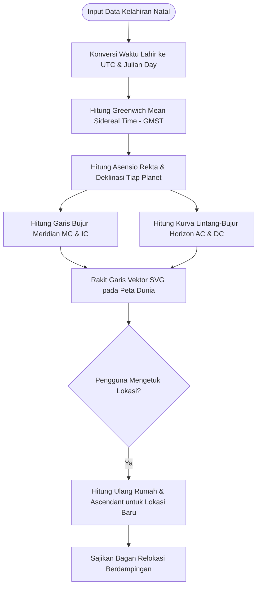

# Spesifikasi Fitur 13: Astro-Kartografi & Relokasi Geodetik (Astro-Cartography)

**Kode Fitur:** FEAT-13  
**Kategori:** Geodetic Mechanics & Relocational Astrology  
**Status:** Disetujui  

---

## 1. Deskripsi & Nilai Pengguna

Fitur **Astro-Kartografi & Relokasi Geodetik** memproyeksikan konfigurasi natal pengguna ke peta geografis dunia:
* Memetakan garis angularitas planet (planet tepat berada di titik Ascendant/AC, Midheaven/MC, Descendant/DC, atau Imum Coeli/IC) di seluruh permukaan bumi secara matematis.
* Membantu pengguna mengevaluasi pengaruh lokasi geografis terhadap fokus kehidupan (karier di garis MC, relasi di garis DC, eksplorasi diri di garis AC, atau stabilitas emosional di garis IC).
* Menyediakan fitur kalkulasi instan **Bagan Relokasi (*Relocated Chart*)** dengan mengetuk titik mana pun di peta dunia tanpa mengubah tanggal/jam kelahiran UTC asli.

---

## 2. Dekomposisi Input & Parameter Perhitungan (Tingkat Atomik)

| Parameter | Tipe Data | Format / Satuan | Rentang Validasi | Deskripsi |
| :--- | :--- | :--- | :--- | :--- |
| `chart_id` | `UUID` | UUIDv4 | Terdaftar di DB | Profil kelahiran natal yang diproyeksikan. |
| `projection_type` | `enum` | String | `MERCATOR`, `EQUIRECTANGULAR` | Proyeksi peta visual (default: `MERCATOR`). |
| `target_latitude` | `float` | Derajat Desimal ($^\circ$) | $-90.000000 \le \text{lat} \le +90.000000$ | Koordinat lokasi tujuan relokasi. |
| `target_longitude`| `float` | Derajat Desimal ($^\circ$) | $-180.000000 \le \text{lon} \le +180.000000$| Bujur lokasi tujuan relokasi. |
| `active_planets` | `array` | String[] | `["SUN", "MOON", "MARS", ...]` | Filter planet yang ingin ditampilkan garisnya. |

---

## 3. Algoritma & Formula Matematika Geodetik



### Formulasi Geodetik & Trigonometri Bola:
1. **Garis Midheaven (MC Line):**
   Garis bujur bumi ($\lambda_{MC}$) di mana planet $P$ memiliki asensio rekta $\alpha_P$ yang bertepatan dengan meridian langit:
   $$\lambda_{MC} = (\alpha_P - GMST) \pmod{360^\circ}$$
   *(Jika bernilai $> 180^\circ$, normalisasi ke $-180^\circ \le \lambda \le +180^\circ$).*

2. **Garis Imum Coeli (IC Line):**
   $$\lambda_{IC} = (\lambda_{MC} + 180^\circ) \pmod{360^\circ}$$

3. **Garis Horizon Ascendant (AC Line) & Descendant (DC Line):**
   Untuk setiap derajat lintang geografis $\phi$ (dari $-66^\circ$ hingga $+66^\circ$), hitung sudut jam lokal (*Local Hour Angle* - $LHA$):
   $$\cos(LHA) = -\tan(\phi) \cdot \tan(\delta_P)$$
   * Jika $|\tan(\phi) \cdot \tan(\delta_P)| \le 1$:
     $$\lambda_{AC} = (\alpha_P - LHA - GMST) \pmod{360^\circ}$$
     $$\lambda_{DC} = (\alpha_P + LHA - GMST) \pmod{360^\circ}$$
   * Jika bernilai $> 1$: Planet berada dalam kondisi sirkumpolar (tidak pernah terbit/terbenam pada lintang tersebut).

---

## 4. Penanganan Edge Cases

1. **Lintang Ekstrem Kutub ($|\phi| > 66.5^\circ$):** Trigonometri horizon tidak memotong ekuator; sistem memotong visualisasi garis AC/DC pada lintang batas kutub tanpa menyebabkan kalkulasi error (*infinite slope*).
2. **Kemandirian Waktu UTC:** Relokasi hanya mengubah batas rumah (*houses*) dan Ascendant/Midheaven; bujur ekliptika absolut planet dan siklus Dasha tetap 100% identik dengan kelahiran asli.

---

## 5. Struktur Kontrak JSON

### Request: `POST /api/v1/relocation/calculate`
```json
{
  "chart_id": "c7a84091-28cf-4351-b8d1-580a6b7d532a",
  "target_latitude": 35.6762,
  "target_longitude": 139.6503,
  "target_label": "Tokyo, Japan"
}
```

### Response Body (`HTTP 200 OK`)
```json
{
  "status": "success",
  "relocated_profile": {
    "location": "Tokyo, Japan",
    "coordinates": {"lat": 35.6762, "lon": 139.6503},
    "iana_timezone": "Asia/Tokyo",
    "relocated_ascendant": {
      "sign": "Scorpio",
      "degree": 14.821,
      "sign_index": 8
    },
    "relocated_midheaven": {
      "sign": "Leo",
      "degree": 21.340,
      "sign_index": 5
    },
    "angular_planetary_proximities": [
      {
        "planet": "JUPITER",
        "angular_point": "MIDHEAVEN",
        "distance_degrees": 1.15,
        "orb_influence": "VERY_STRONG",
        "interpretation_focus": "Career expansion and public leadership visibility in this region."
      }
    ]
  }
}
```
