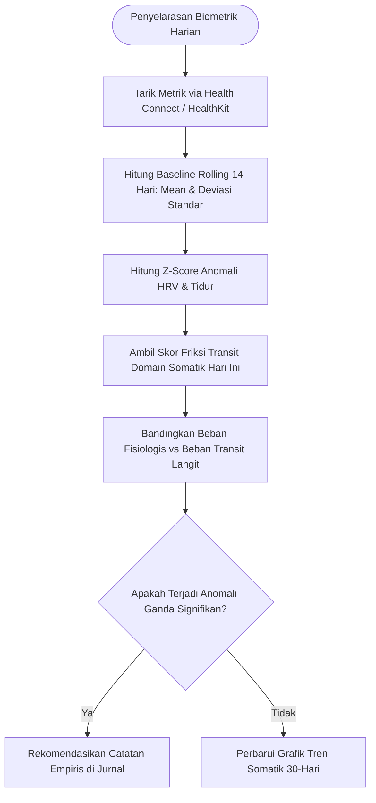

# Spesifikasi Fitur 14: Sinkronisasi Biometrik & Pelacak Somatik (Somatic Telemetry)

**Kode Fitur:** FEAT-14  
**Kategori:** Physiological Anchoring & Health Telemetry  
**Status:** Disetujui  

---

## 1. Deskripsi & Nilai Pengguna

Fitur ini menjembatani domain **Somatik / Vitalitas** pada matriks interpretasi dengan data fisiologis tubuh nyata pengguna:
* Mengintegrasikan metrik kesehatan objektif dari **Android Health Connect** dan **Apple HealthKit** (seperti *Heart Rate Variability* - HRV, detak jantung istirahat / RHR, dan durasi tidur nyenyak *Deep Sleep*).
* Menghitung korelasi matematis antara indeks friksi transit langit harian dengan anomali sistem saraf otonom (tekanan fisiologis) tanpa mengandalkan sensasi subjektif semata.
* **Privasi Ketat (*Local-First*):** Seluruh data biometrik disimpan secara luring pada penyimpanan aman lokal perangkat pengguna (*On-Device SQLite*).

---

## 2. Dekomposisi Skema Data (Tingkat Atomik)

### Tabel Basis Data Lokal: `biometric_daily_logs`
| Kolom | Tipe Data | Batasan | Deskripsi |
| :--- | :--- | :--- | :--- |
| `id` | `UUID` | Primary Key | Pengenal log biometrik harian. |
| `chart_id` | `UUID` | Foreign Key `saved_charts.id` | Profil natal pengguna pemilik data. |
| `log_date` | `DATE` | Not Null, Unique per `chart_id` | Tanggal kalender metrik. |
| `hrv_rmssd_ms` | `FLOAT` | $> 0$ | Root Mean Square of Successive Differences (ms). |
| `resting_heart_rate`| `INTEGER` | $30 \le \text{RHR} \le 220$ | Detak jantung istirahat (bpm). |
| `deep_sleep_minutes`| `INTEGER` | $\ge 0$ | Durasi tidur gelombang lambat (*Deep Sleep*). |
| `rem_sleep_minutes` | `INTEGER` | $\ge 0$ | Durasi tidur fase mimpi (*REM*). |
| `somatic_z_score` | `NUMERIC(4,2)`| Nullable | Deviasi standar terhadap baseline 14 hari pengguna. |
| `transit_somatic_score`| `NUMERIC(4,2)`| Nullable | Skor beban transit astrologis domain somatik hari tersebut. |

---

## 3. Algoritma & Logika Komputasi Langkah demi Langkah



### Formulasi Deteksi Anomali Somatik:
1. **Deviasi Standar HRV Baseline ($Z$-Score):**
   $$Z_{HRV} = \frac{\text{HRV}_{\text{hari ini}} - \mu_{14}}{\sigma_{14}}$$
   *(Nilai $Z_{HRV} \le -1.5$ menunjukkan penurunan drastis pada tonus parasimpatis / stres fisiologis akut).*

2. **Indeks Friksi Somatik Transit Langit ($F_{\text{somatic}}$):**
   $$F_{\text{somatic}} = \sum_{k=1}^{M} W(\delta_k) \cdot I_k(\text{Somatik})$$
   Di mana $W(\delta) = 10.0 \times \exp(-1.4 \times \delta)$ adalah bobot eksponensial orb, dan $I_k$ adalah koefisien friksi aspek (aspek keras Saturnus/Mars/Rahu terhadap Penguasa Rumah ke-6 atau Ascendant).

3. **Koefisien Korelasi Linier ($r$):**
   $$r = \frac{\sum (F_{\text{somatic}} - \bar{F})(Z_{HRV} - \bar{Z})}{\sqrt{\sum (F_{\text{somatic}} - \bar{F})^2 \sum (Z_{HRV} - \bar{Z})^2}}$$

---

## 4. Penanganan Edge Cases & Keamanan

1. **Perangkat Tidak Memiliki Sensor HRV:** Sistem beralih ke analisis berbasis durasi jam tidur total (*Total Sleep Duration*) tanpa memaksa data HRV.
2. **Karantina Data Kesehatan:** Data metrik biometrik mentah tidak pernah dikirim ke server *backend cloud*; analisis korelasi dieksekusi secara lokal di mesin JavaScript/WASM perangkat klien.

---

## 5. Struktur Kontrak JSON (Komputasi Klien Lokal)

### Payload Evaluasi Lokal: `GET /local/analytics/somatic-correlation`
```json
{
  "chart_id": "c7a84091-28cf-4351-b8d1-580a6b7d532a",
  "period_days": 30,
  "correlation_coefficient_r": -0.612,
  "interpretation": "Korelasi negatif moderat-kuat: penurunan pemulihan sistem saraf (HRV rendah) cenderung terjadi bersamaan dengan transit berat pada penguasa Rumah ke-6 natal.",
  "significant_events": [
    {
      "date": "2026-08-28",
      "hrv_rmssd": 32.4,
      "z_score": -2.14,
      "dominant_sky_friction": "Transit Saturn Conjunction Natal Mars (Orb 0.12°)",
      "somatic_score": 8.84
    }
  ]
}
```
