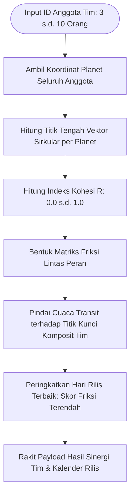

# Spesifikasi Fitur 15: Komposit Tim & Sinergi Kelompok (Team Composite & B2B)

**Kode Fitur:** FEAT-15  
**Kategori:** Multi-Entity Astrodynamics & B2B Strategy  
**Status:** Disetujui  

---

## 1. Deskripsi & Nilai Pengguna

Fitur ini memperluas analisis sinastri 1-lawan-1 pada [FEAT-09 (Kecocokan Multi-Relasi)](./09_kecocokan_multi_arketipe.md) ke skala **Dinamika Kelompok / Tim Kerja (3 s.d. 10 Anggota)**:
* Membentuk **Bagan Komposit Tim Vektorial (*Group Vector Midpoint Chart*)** untuk startup, dewan direksi, atau tim proyek.
* Mengukur indeks kohesi dan friksi internal tim secara kuantitatif: friksi komunikasi (Merkurius), friksi eksekusi/otoritas (Matahari & Mars), serta stabilitas ketahanan tekanan (Bulan & Saturnus).
* **Launch Window Scanner:** Memindai kalender 30–90 hari ke depan untuk menemukan jendela waktu peluncuran produk atau penggalangan dana (*pitching*) dengan resistensi transit tim paling rendah.

---

## 2. Dekomposisi Parameter & Skema Data (Tingkat Atomik)

| Parameter | Tipe Data | Format / Satuan | Rentang Validasi | Deskripsi |
| :--- | :--- | :--- | :--- | :--- |
| `team_name` | `string` | UTF-8 String | 1 s.d. 100 Karakter | Nama tim proyek atau perusahaan. |
| `member_chart_ids` | `array` | UUID[] | $3 \le \text{anggota} \le 10$ | Daftar ID profil anggota yang sudah tersimpan. |
| `member_roles` | `map` | `UUID -> ENUM` | `LEAD`, `ENGINEERING`, `PRODUCT`, `OPERATIONS` | Peran struktural masing-masing anggota. |
| `target_horizon_days`| `integer` | Hari Kalender | $7 \le \text{hari} \le 180$ | Rentang pemindaian jendela waktu optimal. |

---

## 3. Algoritma Komputasi Vektor Komposit & Kohesi Sirkular



### Formulasi Matematika Titik Tengah Vektor Sirkular:
Untuk $K$ orang anggota dengan posisi bujur ekliptika planet $\theta_1, \theta_2, \dots, \theta_K$ (dalam radian):
1. **Dekomposisi Komponen Kartesius:**
   $$X = \frac{1}{K} \sum_{i=1}^K \cos(\theta_i), \quad Y = \frac{1}{K} \sum_{i=1}^K \sin(\theta_i)$$

2. **Bujur Komposit Tim ($\bar{\theta}$):**
   $$\bar{\theta} = \text{atan2}(Y, X) \pmod{2\pi}$$

3. **Indeks Kohesi Tim ($R$):**
   $$R = \sqrt{X^2 + Y^2} \quad (0 \le R \le 1)$$
   * $R \ge 0.85$: Tingkat keselarasan arketipe sangat kompak.
   * $R \le 0.40$: Tingkat dispersi arketipe tinggi; tim memiliki gaya kerja yang saling bertolak belakang dan membutuhkan protokol komunikasi formal.

---

## 4. Penanganan Edge Cases

1. **Titik Planet Saling Berseberangan Sempurna ($180^\circ$):** Jika dua anggota memiliki posisi tepat berlawanan sehingga $X = 0, Y = 0$, algoritma menetapkan $R = 0$ dan memilih titik tengah kutub kardinal berdasarkan bobot peran *Lead*.
2. **Pergantian Anggota:** Penambahan atau pencoretan anggota tim langsung memicu rekalkulasi vektor komposit tanpa menghapus riwayat kalender rilis sebelumnya.

---

## 5. Struktur Kontrak JSON

### Request: `POST /api/v1/teams/synergy-analysis`
```json
{
  "team_name": "Antigravity Core Engineering",
  "member_chart_ids": [
    "c7a84091-28cf-4351-b8d1-580a6b7d532a",
    "f2b81092-12af-4819-a1d2-990a1b2c3d4e",
    "3c7719ab-8991-4e29-b631-1029384756ab"
  ],
  "scan_days_ahead": 60
}
```

### Response Body (`HTTP 200 OK`)
```json
{
  "status": "success",
  "team_name": "Antigravity Core Engineering",
  "overall_cohesion_index": 0.78,
  "communication_friction_risk": "LOW",
  "execution_alignment_score": 8.4,
  "optimal_launch_windows": [
    {
      "start_date": "2026-10-12",
      "end_date": "2026-10-16",
      "aggregate_friction_score": 1.2,
      "favorable_aspects": "Transit Jupiter Trine Team Composite Sun (Orb 0.3°)",
      "recommendation": "Jendela waktu dengan resistensi astrologis terendah; ideal untuk rilis publik atau negosiasi kontrak besar."
    }
  ]
}
```
