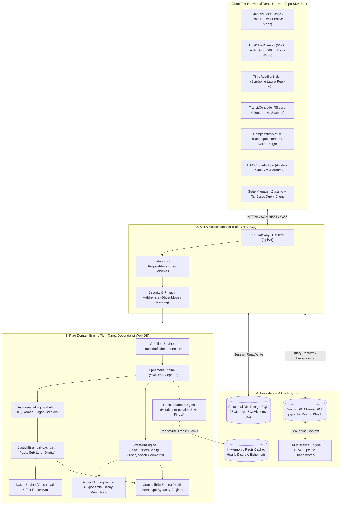

# Dokumen Desain Teknis (TDD) - Bagian 1: Arsitektur Sistem

**ID Dokumen:** TDD-ASTRO-001  
**Versi:** 1.0.0  
**Status:** Disetujui untuk Desain Detail  
**Referensi:** PRD-ASTRO-001 (PRD v2.0.0), ADR 0001–0006  

---

## 1. Ringkasan Eksekutif & Filosofi Desain

Sistem **Astrology-Interpreter Engine** dibangun sebagai platform komputasi astrologi presisi tinggi lintas platform (Mobile iOS/Android & Web SPA). Arsitektur dirancang dengan prinsip **Clean Hexagonal Architecture** yang memisahkan secara ketat logika komputasi matematika astronomis murni (*Domain Core*) dari antarmuka web, basis data, dan pustaka eksternal.

### Prinsip Desain Fundamental
1. **Determinisme Mutlak (*Strict Determinism*):**
   Setiap fungsi komputasi pada *Domain Core* bersifat murni (*pure function*): input koordinat geografis, tanggal, dan jam yang sama selalu menghasilkan matriks data astronomis bit-for-bit yang identik tanpa elemen acak.
2. **Dekopel Dual-Zodiak (*Dual-Core Ecliptic Separation*):**
   Perhitungan posisi benda langit dihitung pada kerangka bujur ekliptika nyata (*apparent ecliptic longitude*). Kerangka Barat (*Tropical*) dan Kerangka India (*Sidereal*) didekopel melalui parameter Ayanamsha eksplisit (default: Lahiri / Chitra Paksha) tanpa saling mengotori status internal (ADR-0004).
3. **Resolusi Lokasi Luring (*Offline-First Geospatial Resolution*):**
   Penentuan zona waktu sipil lokal dan aturan Daylight Saving Time (DST) historis dieksekusi 100% luring menggunakan algoritma penelusuran poligon spasial *in-process*, menolak ketergantungan pada API geocoding pihak ketiga (ADR-0003).
4. **Anti-Barnum Grounding:**
   Setiap analisis teks didorong oleh inferensi RAG (*Retrieval-Augmented Generation*) yang terikat secara matematis pada derajat transit dan doktrin klasik terverifikasi, menolak ramalan umum bernada sanjungan (*flattery bias*).

---

## 2. Topologi & Diagram Arsitektur Sistem

Sistem mengadopsi arsitektur **Modular Monolith** berperforma tinggi dengan komunikasi asinkron untuk perhitungan berat dan *caching* berlapis:



---

## 3. Dekomposisi Komponen & Tanggung Jawab

### 3.1 Client Tier (Universal Expo React Native)
* **MapPinPicker Component:** Menyediakan antarmuka visual peta interaktif dengan pin jatuh (*pin-drop*) untuk menangkap bujur dan lintang presisi sub-meter, menghindari titik tengah kota (*city centroids*).
* **DualChartCanvas Component:** Modul visualisasi rendering berbasis SVG yang mampu merender:
  1. *Western Circular Wheel:* Roda zodiak 360° dengan pembagian rumah Placidus/Whole Sign dan garis koneksi aspek geometris berwarna (trine/sextile = harmonis, square/opposition = friksi).
  2. *Vedic Traditional Square:* Format bagan kotak India Selatan (*fixed sign*) dan India Utara (*fixed house diamond*).
* **TimeRectifierSlider Component:** Komponen kontrol interaktif yang memungkinkan manipulasi jam lahir ($\pm 30$ hingga $\pm 60$ menit) secara lokal atau responsif untuk melihat perpindahan Lagna seketika.
* **TransitController Component:** Menyediakan antarmuka bolak-balik waktu berupa *Scrubbing Slider*, *Calendar Heatmap*, dan *Aspect Hit Scanner Form*.
* **State Management:** Zustand menangani status lokal sesi dan preferensi pengguna; TanStack Query menangani *server state caching*, deduplikasi kueri, dan sinkronisasi data latar belakang.

### 3.2 API & Application Tier (FastAPI)
* **Router & Controller Layer:** Menyediakan endpoint RESTful versi 1 (`/api/v1/chart`, `/api/v1/transit`, `/api/v1/compatibility`, `/api/v1/journal`, `/api/v1/chat`).
* **Validation Layer:** Menggunakan Pydantic v2 dengan validasi tipe data ketat, rentang lintang ($-90^\circ$ s.d. $+90^\circ$), bujur ($-180^\circ$ s.d. $+180^\circ$), serta format ISO-8601 UTC.
* **Privacy & Ghost Mode Middleware:** Melakukan transformasi data saat mode penyamaran aktif: memotong presisi koordinat desimal untuk publik, menyembunyikan identitas waktu lahir asli, dan memfilter visibilitas *nearby*.

### 3.3 Pure Domain Engine Tier (Python)
Lapisan ini tidak memiliki dependensi terhadap framework HTTP (FastAPI) maupun database (SQLAlchemy):
* **`GeoTimeEngine`:**
  * Menerima pasangan koordinat $(Lat, Lon)$.
  * Menjalankan kueri spasial poligon offline via `timezonefinder.TimezoneFinder()`.
  * Menghasilkan zona waktu IANA resmi (misal: `"Asia/Jakarta"`, `"America/New_York"`).
  * Mengonversi waktu sipil lokal ke timestamp UTC kanonikal melalui `zoneinfo.ZoneInfo`, memperhitungkan sejarah perubahan DST lokal secara deterministik.
* **`EphemerisEngine` & `AyanamshaEngine`:**
  * Menghitung posisi geosenris presisi tinggi untuk Matahari, Bulan, Merkurius, Venus, Mars, Yupiter, Saturnus, Uranus, Neptunus, Pluto, serta simpul bulan Rahu (True Node) dan Ketu.
  * Menghitung kecepatan harian (*daily motion speed*) dan penanda status *Retrograde*.
  * Menghitung nilai Ayanamsha astronomis pada epoch Julian Date target (Lahiri default).
* **`AnglesAndHousesEngine`:**
  * Menghitung Greenwich Sidereal Time ($GST$) dan Local Sidereal Time ($LST$).
  * Menghitung Right Ascension of Midheaven ($RAMC$), Midheaven ($MC$), dan Ascendant ($Lagna$).
  * Mengomputasi garis batas 12 rumah (*house cusps*) berdasarkan sistem Placidus dan Whole Sign.
* **`JyotishEngine` & `DashaEngine`:**
  * Memetakan posisi bintang ke 27 Nakshatra (rentang $13^\circ 20^\prime$ per nakshatra), 4 Pada ($3^\circ 20^\prime$ per pada), dan Sub-Lord Krishnamurti Padhdhati (KP).
  * Menghitung martabat planet (*Dignity*): Eksaltasi, Moolatrikona, Swakshetra, Debilitasi, serta persahabatan antar-planet (*Panchadha Maitri*).
  * Menjalankan parser siklus 4-lapis Vimshottari Dasha (Mahadasha, Antardasha, Pratyantardasha, Sookshmadasha) dari fraksi bujur bulan saat lahir.
* **`WesternAspectEngine` & `AspectScoringEngine`:**
  * Menghitung selisih sudut geometris antar-planet: Konjungsi ($0^\circ$), Oposisi ($180^\circ$), Trine ($120^\circ$), Square ($90^\circ$), Sextile ($60^\circ$).
  * Menghitung bobot kekuatan aspek berbasis fungsi peluruhan eksponensial kontinu (ADR-0005):
    $$W(\delta) = 10.0 	imes \exp(-1.4 	imes \delta)$$
* **`TransitScannerEngine`:**
  * Menginterpolasi posisi transit berdasarkan blok efemeris diskrit per jam (ADR-0006).
  * Menyediakan fitur pelacak tanggal eksak (*Aspect Hit Scanner*) menggunakan pencarian akar bisection/Newton-Raphson untuk menemukan puncak orb $0.00^\circ$.
* **`CompatibilityEngine`:**
  * Menilai kecocokan untuk tiga arketipe relasi: Pasangan (Romantis), Teman (Sosial/Karakter), dan Rekan Kerja (Etika Kerja/Komunikasi/Sinergi Merkurius-Saturnus-Mars).
  * Menghitung seluruh dimensi secara utuh tanpa pengecualian untuk profil orang yang tidak dikenal (*Stranger Profiles*).
* **`RAGDoctrineEngine`:**
  * Menghubungkan metadata konfigurasi astrologi pengguna dengan dokumen literatur klasik terpercaya (*Brihat Parashara Hora Shastra*, *Jataka Parijata*, karya Ptolemy, dsb.) via embedding vektor, menyajikan wawasan objektif bebas halusinasi.

---

## 4. Struktur Direktori Proyek

```text
astrology-interpreter/
├── backend/
│   ├── app/
│   │   ├── api/
│   │   │   └── v1/
│   │   │       ├── endpoints/
│   │   │       │   ├── chart.py           # Endpoint kalkulasi natal lengkap
│   │   │       │   ├── geo.py             # Endpoint resolusi koordinat & zona waktu
│   │   │       │   ├── transit.py         # Endpoint transit slider, kalender & scanner
│   │   │       │   ├── compatibility.py   # Endpoint synastry multi-arketipe
│   │   │       │   ├── journal.py         # Endpoint catatan empiris pengguna
│   │   │       │   ├── alerts.py          # Endpoint manajemen smart alerts
│   │   │       │   └── chat.py            # Endpoint RAG chatbot
│   │   │       └── router.py              # Agregator rute API v1
│   │   ├── core/
│   │   │   ├── config.py                  # Pydantic BaseSettings & Environment Vars
│   │   │   ├── constants.py               # Konstanta zodiak, nakshatra & orb
│   │   │   └── exceptions.py              # Domain & HTTP exception handler terpusat
│   │   ├── engine/                        # DOMAIN CORE (Pure Mathematical Engine)
│   │   │   ├── geotime.py                 # Resolusi TimezoneFinder & ZoneInfo
│   │   │   ├── ephemeris.py               # Interface Swiss Ephemeris / PyEphem
│   │   │   ├── ayanamsha.py               # Perhitungan presesi Lahiri / KP
│   │   │   ├── angles.py                  # Ascendant, MC, Placidus & Whole Sign cusps
│   │   │   ├── jyotish.py                 # Nakshatra, Pada, Sub-Lord, Dignity
│   │   │   ├── dasha.py                   # Rekursif Vimshottari 4-tier engine
│   │   │   ├── aspects.py                 # Perhitungan selisih sudut & orb eksponensial
│   │   │   ├── transit_scanner.py         # Aspect hit finder & time-travel interpolator
│   │   │   ├── compatibility.py           # Multi-archetype synastry evaluator
│   │   │   └── rag_synthesizer.py         # Vector context builder & prompt generator
│   │   ├── db/
│   │   │   ├── base.py                    # Deklarasi declarative base SQLAlchemy
│   │   │   ├── session.py                 # Engine & SessionLocal factory
│   │   │   └── init_db.py                 # Inisialisasi skema awal
│   │   ├── models/                        # Entitas Tabel SQLAlchemy 2.0
│   │   │   ├── user.py                    # Tabel User & Akun
│   │   │   ├── chart.py                   # Tabel Profil Bagan Tersimpan
│   │   │   ├── journal.py                 # Tabel Entri Jurnal Empiris
│   │   │   ├── alert.py                   # Tabel Pengaturan Alert Transit
│   │   │   └── transit_cache.py           # Tabel Cache Efemeris Diskrit
│   │   ├── schemas/                       # Pydantic Request & Response Schemas
│   │   │   ├── chart.py
│   │   │   ├── transit.py
│   │   │   ├── compatibility.py
│   │   │   └── journal.py
│   │   └── services/                      # Layanan orkestrasi antara DB dan Engine
│   ├── tests/                             # Unit tests & golden benchmark ephemeris
│   ├── pyproject.toml                     # Konfigurasi dependensi Poetry/pip
│   └── Dockerfile                         # Kontainerisasi backend
│
├── frontend/
│   ├── app/                               # Rute Halaman Expo Router
│   │   ├── (tabs)/
│   │   │   ├── index.tsx                  # Layar Utama: Dual Chart Dashboard
│   │   │   ├── transit.tsx                # Layar Transit: Slider, Kalender, Scanner
│   │   │   ├── compatibility.tsx          # Layar Kecocokan: Teman/Kerja/Pasangan
│   │   │   ├── journal.tsx                # Layar Jurnal Empiris & Riwayat
│   │   │   └── profile.tsx                # Layar Profil & Pengaturan Ghost Mode
│   │   ├── chart/
│   │   │   └── [id].tsx                   # Tampilan Detail Bagan Tersimpan
│   │   └── _layout.tsx                    # Root layout & context provider
│   ├── src/
│   │   ├── api/                           # Klien Axios & hook TanStack Query
│   │   ├── components/
│   │   │   ├── charts/                    # Render SVG Roda Barat & Kotak Weda
│   │   │   ├── controls/                  # Time Rectifier Slider & Transit Controls
│   │   │   ├── maps/                      # Map Pin Drop Selector
│   │   │   └── common/                    # Tombol, Card, Modal, Typography
│   │   ├── store/                         # Global state Zustand (sesi, tema, preferensi)
│   │   └── types/                         # Definisi TypeScript yang cocok dengan Schema API
│   ├── package.json
│   └── app.json                           # Konfigurasi Expo
│
└── docs/                                  # Dokumentasi Sistem (id & en)
    ├── id/
    │   ├── PRD.md
    │   ├── adr/
    │   └── tdd/
    │       ├── 01_arsitektur_sistem.md    # DOKUMEN INI
    │       ├── 02_sequence_diagram.md     # (Tahap 2)
    │       ├── 03_adr.md                  # (Tahap 3)
    │       └── 04_penanganan_kegagalan_dan_skalabilitas.md # (Tahap 4)
    └── en/
        └── tdd/
