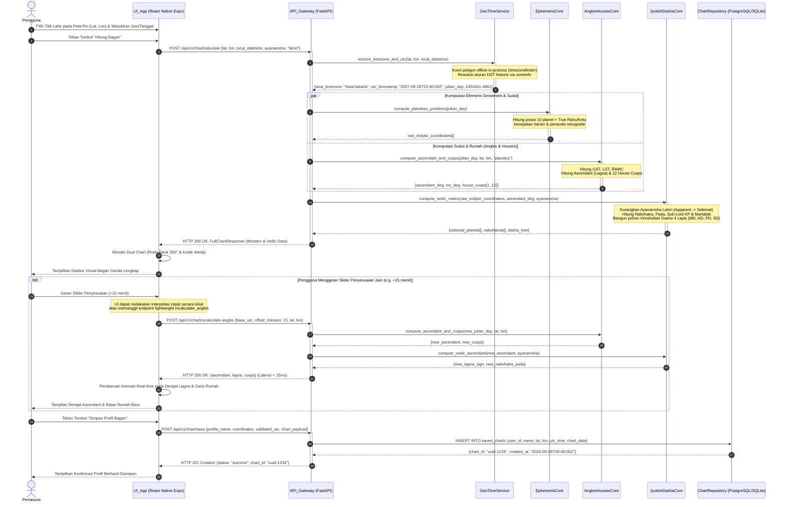

# Sequence Diagram 01: Kalkulasi Bagan Natal & Penyesuaian Jam Lahir (Rectification Slider)

**ID Dokumen:** SD-ASTRO-001  
**Fitur Terkait:** Fitur 1 (Pengecekan Birth Chart Dual-Method), Fitur 2 (Visualisasi Bagan Ganda), Fitur 3 (Penyimpanan Chart), Fitur 4 (Rectification Slider)  
**Status:** Disetujui  

---

## 1. Deskripsi Skenario

Diagram ini memodelkan alur interaksi menyeluruh saat:
1. Pengguna memasukkan tanggal lahir, jam lahir, dan memilih lokasi presisi menggunakan pin jatuh (*pin-drop*) pada peta.
2. Sistem secara luring (*offline*) mendeteksi zona waktu IANA dan mengonversi waktu sipil lokal ke UTC kanonikal.
3. *Domain Core* mengeksekusi komputasi astronomis ganda secara paralel: Kerangka Barat (*Tropical*) dan Kerangka India (*Sidereal* Lahiri).
4. Pengguna yang memiliki keraguan menit lahir menggeser *Rectification Slider* secara interaktif di layar untuk mengamati perubahan derajat Ascendant (Lagna) dan batas rumah secara instan (*low latency*).
5. Pengguna menyimpan bagan yang telah terkonfirmasi ke dalam basis data.

---

## 2. Partisipan Sistem

* **Pengguna (User):** Aktor akhir yang berinteraksi dengan antarmuka.
* **UI_App (Expo React Native Client):** Antarmuka klien (Form Input, Peta Pin, Roda SVG, Slider).
* **API_Gateway (FastAPI Router):** Penerima request RESTful `/api/v1/chart/calculate` dan `/api/v1/chart/save`.
* **GeoTimeService:** Engine resolusi poligon spasial luring `timezonefinder` dan konversi DST `zoneinfo`.
* **EphemerisCore:** Pustaka astronomis presisi tinggi (`pyswisseph` / `ephem`) untuk koordinat geosentris.
* **AnglesHousesCore:** Algoritma komputasi GST, LST, RAMC, Midheaven, Ascendant, dan House Cusps (Placidus & Whole Sign).
* **JyotishDashaCore:** Algoritma pemetaan Nakshatra, Pada, Sub-Lord KP, dan pohon hierarki Vimshottari Dasha 4 lapis.
* **ChartRepository (Database):** Penyimpanan profil permanen PostgreSQL / SQLite via SQLAlchemy 2.0.

---

## 3. Sequence Diagram (Mermaid)



---

## 4. Penanganan Kasus Khusus (*Edge Cases*)

| Kasus Khusus | Risiko | Mekanisme Penanganan |
| :--- | :--- | :--- |
| **Wilayah Lintang Ekstrem ($>66^\circ$)** | Sistem rumah Placidus gagal terbagi (*intercepted/broken cusps*). | Otomatis *fallback* atau beri opsi transisi ke sistem rumah *Whole Sign* atau *Porphyry* dengan pesan diagnostik yang jelas. |
| **Tanggal Lahir pada Jam Transisi DST** | Kerancuan waktu ganda (*ambiguous time*) saat jam dimundurkan. | `zoneinfo` menggunakan flag `fold=0` / `fold=1` untuk membedakan secara tegas waktu sebelum dan sesudah peralihan. |
| **Penggeseran Slider Terlalu Cepat (*High-Frequency Scrubbing*)** | Banjir request ke API (*network congestion*). | Frontend menerapkan teknik *debounce/throttle* (100 ms) saat slider bergerak, dan komputasi trigonometri Ascendant sederhana dijalankan langsung di thread klien untuk rendering instan 60 FPS. |
| **Profil Bayi yang Baru Lahir (Julian Date Real-Time)** | Delta $\Delta T$ (selisih TT dan UT) belum terpublikasi definitif. | Gunakan estimasi polinomial NASA/IERS untuk $\Delta T$ terkini dengan presisi sub-detik busur. |

---

## 5. Struktur Kontrak Data (Contoh Ringkas)

### Request: `POST /api/v1/chart/calculate`
```json
{
  "latitude": -6.175392,
  "longitude": 106.827153,
  "local_datetime": "2007-08-29T06:40:00",
  "ayanamsha": "lahiri",
  "house_system": "placidus"
}
```

### Response: `HTTP 200 OK`
```json
{
  "status": "success",
  "meta": {
    "iana_timezone": "Asia/Jakarta",
    "utc_timestamp": "2007-08-28T23:40:00Z",
    "julian_day": 2454341.486111,
    "ayanamsha_value": 23.9631
  },
  "western": {
    "ascendant": 156.421,
    "midheaven": 66.184,
    "houses": [156.421, 185.12, 214.33, 246.18, 278.45, 308.12, 336.42, 5.12, 34.33, 66.18, 98.45, 128.12],
    "planets": {
      "Sun": {"longitude": 155.12, "speed": 0.965, "is_retrograde": false, "house": 12},
      "Moon": {"longitude": 342.48, "speed": 13.12, "is_retrograde": false, "house": 7}
    }
  },
  "vedic": {
    "lagna": {"longitude": 132.458, "sign": "Leo", "nakshatra": "Purva Phalguni", "pada": 1},
    "planets": {
      "Sun": {"longitude": 131.157, "sign": "Leo", "nakshatra": "Magha", "pada": 4, "dignity": "Swakshetra"},
      "Moon": {"longitude": 318.517, "sign": "Aquarius", "nakshatra": "Shatabhisha", "pada": 4, "dignity": "Neutral"}
    },
    "vimshottari_dasha": {
      "current_mahadasha": "Saturn",
      "current_antardasha": "Saturn",
      "current_pratyantardasha": "Mercury"
    }
  }
}
```
