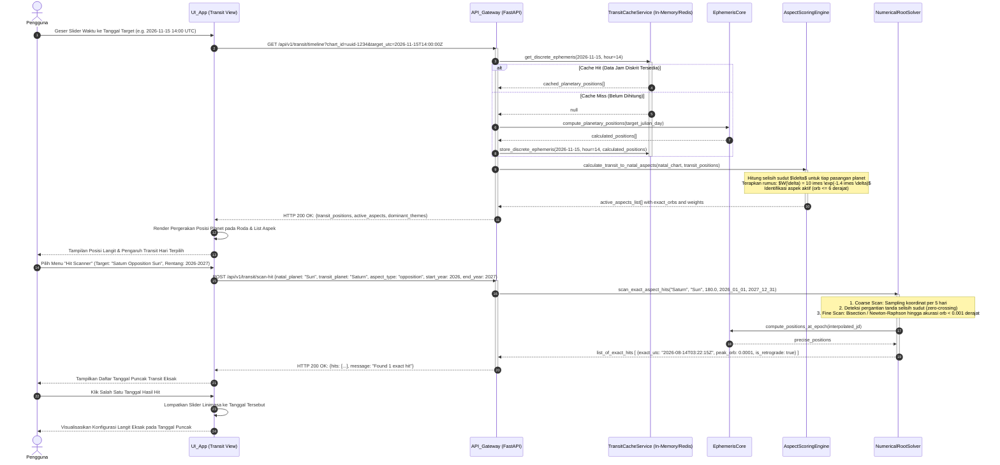

# Sequence Diagram 02: Mesin Transit Bolak-Balik Waktu & Aspect Hit Scanner

**ID Dokumen:** SD-ASTRO-002  
**Fitur Terkait:** Fitur 5 (Mesin Transit Bolak-Balik Waktu: Slider, Kalender, Aspect Hit Scanner)  
**Status:** Disetujui  

---

## 1. Deskripsi Skenario

Diagram ini memodelkan dua interaksi utama pada mesin transit:
1. **Navigasi Waktu Bolak-Balik (Slider & Kalender):** Pengguna menggeser tanggal/jam ke masa lalu atau masa depan. Sistem mengecek *Hourly Discrete Transit Cache* (ADR-0006) untuk mengembalikan koordinat transit secara instan tanpa re-komputasi CPU berlebih, lalu membandingkannya terhadap bagan natal pengguna menggunakan fungsi peluruhan eksponensial (ADR-0005).
2. **Pencari Momen Kritis (*Aspect Hit Scanner*):** Pengguna memilih target transit spesifik (misal: *"Saturnus Oposisi Matahari Natal"*). Sistem mengeksekusi algoritma pencarian akar numerik (*root-finding bisection / Newton-Raphson*) untuk melacak tanggal dan jam eksak saat orb bernilai $0.000^\circ$, lalu membawa linimasa antarmuka langsung ke momen puncak tersebut.

---

## 2. Partisipan Sistem

* **Pengguna (User):** Aktor akhir yang menavigasi linimasa waktu atau mencari momen transit.
* **UI_App (Expo React Native):** Komponen `TransitController` (Slider harian, Kalender heatmap, Form Scanner).
* **API_Gateway (FastAPI):** Endpoint `/api/v1/transit/timeline` dan `/api/v1/transit/scan-hit`.
* **TransitCacheService:** Lapisan in-memory/Redis atau tabel DB yang menyimpan koordinat langit per jam diskrit.
* **EphemerisCore:** Solver astronomis `pyswisseph` yang menghitung bujur ekliptika dan kecepatan sesaat.
* **AspectScoringEngine:** Algoritma pembobotan orb eksponensial $W(\delta) = 10.0 	imes \exp(-1.4 	imes \delta)$.
* **NumericalRootSolver:** Algoritma interpolasi bisection untuk mencari tanggal puncak orb minimum.

---

## 3. Sequence Diagram (Mermaid)



---

## 4. Penanganan Kasus Khusus (*Edge Cases*)

| Kasus Khusus | Risiko | Mekanisme Penanganan |
| :--- | :--- | :--- |
| **Triple Hit akibat Periode Retrograde** | Planet luar (Saturnus/Jupiter) melewati titik eksak 3 kali (direct $
ightarrow$ retro $
ightarrow$ direct). | Solver mendeteksi pergantian arah kecepatan sesaat (*speed sign flip*) dan mengelompokkan 3 tanggal hit ke dalam satu siklus *"Tri-Hit Transit Cycle"*. |
| **Pencarian Rentang Waktu Terlalu Panjang (>50 tahun)** | Timeout server akibat kalkulasi loop panjang. | Batasi kueri scanner maksimal rentang 5 tahun per request dengan penanda paginasi (*pagination token*). |
| **Ketidaksinambungan Sudut ($360^\circ \leftrightarrow 0^\circ$)** | Selisih sudut melompat dari $359.9^\circ$ ke $0.1^\circ$ (*modular wrap-around*). | Gunakan fungsi selisih sudut sirkular minimum: $\Delta	heta = \min(|	heta_1 - 	heta_2|, 360^\circ - |	heta_1 - 	heta_2|)$. |

---

## 5. Struktur Kontrak Data (Contoh Ringkas)

### Request: `POST /api/v1/transit/scan-hit`
```json
{
  "chart_id": "c7a84091-28cf-4351-b8d1-580a6b7d532a",
  "transit_body": "Saturn",
  "natal_body": "Sun",
  "aspect_angle": 180.0,
  "date_range": {
    "start_utc": "2026-01-01T00:00:00Z",
    "end_utc": "2027-12-31T23:59:59Z"
  }
}
```

### Response: `HTTP 200 OK`
```json
{
  "status": "success",
  "total_hits_found": 1,
  "hits": [
    {
      "hit_number": 1,
      "exact_utc": "2026-08-14T03:22:15Z",
      "transit_body_longitude": 335.1204,
      "natal_body_longitude": 155.1200,
      "exact_aspect_angle": 180.0004,
      "orb": 0.0004,
      "is_retrograde": true,
      "weight_score": 10.0,
      "affected_domains": ["Career/Situational", "Mental/Cognitive"]
    }
  ]
}
```
