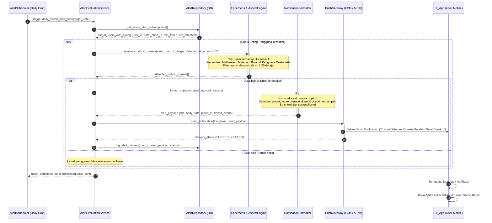

# Sequence Diagram 03: Evaluasi & Pengiriman Smart Transit Alerts

**ID Dokumen:** SD-ASTRO-003  
**Fitur Terkait:** Fitur 6 (Notifikasi Transit Kritis / Smart Alerts)  
**Status:** Disetujui  

---

## 1. Deskripsi Skenario

Diagram ini memodelkan alur evaluasi latar belakang (*background worker*) harian yang mendeteksi transit penting:
1. *Alert Scheduler* terjadwal secara periodik mengevaluasi konfigurasi notifikasi pengguna aktif.
2. *TransitEngine* mendeteksi transit yang memiliki orb sangat ketat ($\le 0.25^\circ$) terhadap titik-titik sensitif bagan natal (Matahari, Bulan, Ascendant, atau penguasa Dasha aktif).
3. Sistem menyusun pesan objektif berbasis fakta astronomis dan area hidup yang dipengaruhi (tanpa ramalan sensasional).
4. Notifikasi dikirimkan ke perangkat pengguna melalui *Push Notification Gateway* (FCM/APNs).

---

## 2. Partisipan Sistem

* **AlertScheduler (Cron / Celery Beat):** Worker latar belakang yang memicu evaluasi batch.
* **AlertEvaluationService:** Orkestrator pengecekan kriteria notifikasi pengguna.
* **AlertRepository (PostgreSQL):** Penyedia data pengguna aktif dan preferensi alert (`alert_rules`).
* **EphemerisService & AspectEngine:** Penyedia data posisi transit harian dan pembanding orb.
* **NotificationFormatter:** Penyusun teks notifikasi objektif bebas sensasionalisme.
* **PushGateway (FCM / APNs):** Layanan pengirim push notification ke perangkat bergerak.
* **UI_App (Mobile Device):** Aplikasi pada ponsel pengguna yang menerima notifikasi.

---

## 3. Sequence Diagram (Mermaid)



---

## 4. Penanganan Kasus Khusus (*Edge Cases*)

| Kasus Khusus | Risiko | Mekanisme Penanganan |
| :--- | :--- | :--- |
| **Token Push Kedaluwarsa (*Invalid Device Token*)** | Kegagalan berulang saat pengiriman via FCM/APNs. | Worker menangkap kode error `UNREGISTERED` / `INVALID_TOKEN` dan otomatis menandai token sebagai nonaktif di database. |
| **Banjir Transit Bersamaan (*Alert Fatigue*)** | Pengguna menerima lebih dari 3 notifikasi dalam sehari. | *Rate Limiter Notification*: Batasi maksimal 1 notifikasi terpenting per 24 jam dengan mengagregasi transit paling berbobot. |
| **Peralihan Zona Waktu Pengguna** | Notifikasi masuk pada tengah malam waktu lokal pengguna. | Notifikasi dijadwalkan berdasarkan `iana_timezone` lokal pengguna (dikirimkan pukul 07:00 pagi waktu lokal). |

---

## 5. Struktur Kontrak Payload Notifikasi

```json
{
  "to": "fcm_token_device_abc123",
  "notification": {
    "title": "Transit Kritis: Saturnus Oposisi Matahari",
    "body": "Puncak eksak (orb 0.04°). Fokus tema: Disiplin struktural, pengujian batas fisik, dan restrukturisasi energi kerja."
  },
  "data": {
    "type": "TRANSIT_ALERT",
    "chart_id": "c7a84091-28cf-4351-b8d1-580a6b7d532a",
    "transit_planet": "Saturn",
    "natal_point": "Sun",
    "aspect_type": "opposition",
    "exact_orb": 0.041,
    "timestamp_utc": "2026-08-14T03:22:15Z"
  }
}
```
